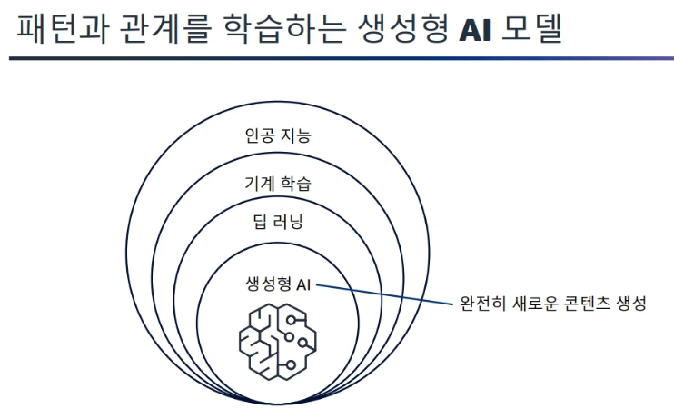
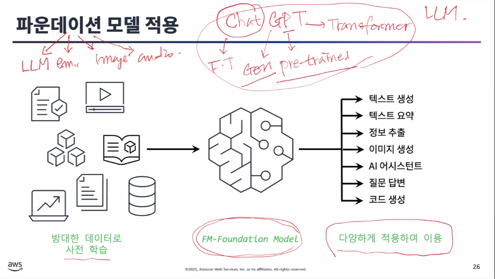
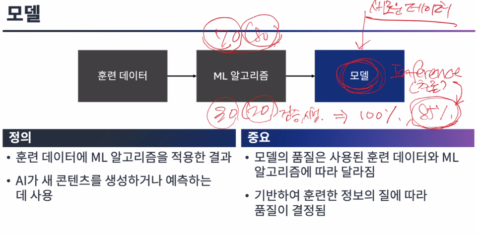
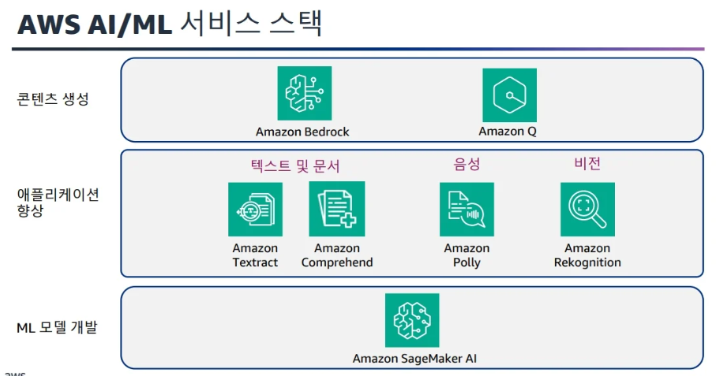
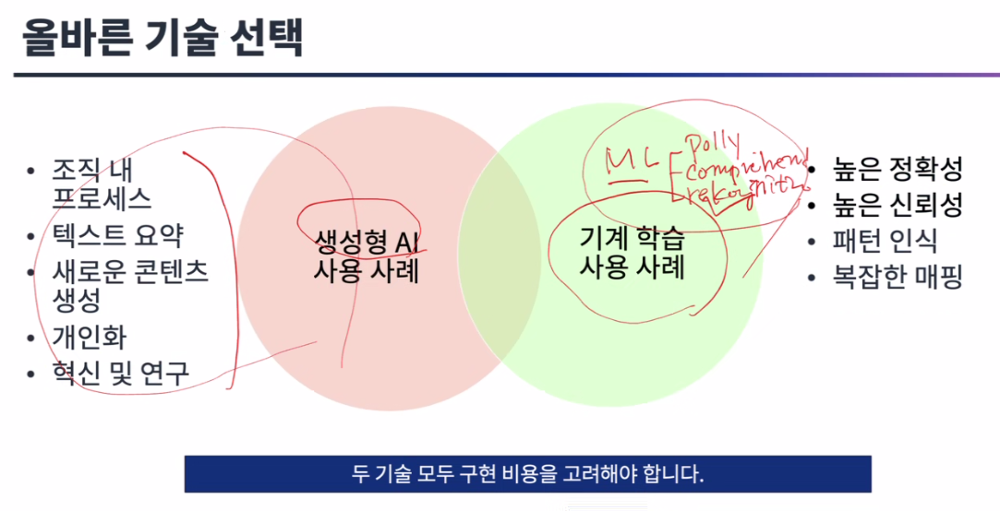

# 생성형 AI

# 생성형 AI 소개 [모듈1]
- 생성형 AI 설명
- 파운데이션 모델(FM)
- AWS 생성형 AI 서비스

### 고려해야 할 당면 과제

- 할루시네이션(작화증) : AI 모델은 때때로 허위 또는 오해의 소지가 있는 정보를 생성하여 신뢰성에 위협이 될 수 있습니다. 이러한 위험을 완화하기 위해 사실 확인 메커니즘을 구현하고 사람이 항상 감독하도록 할 수 있다.
- 지식재산권 문제
- 데이터 보안 및 개인 정보 보호
- 편향 및 공정성
- 해석 가능성
- 윤리 및 의사 결정

---

### 파운데이션 모델 적용
> 크게 3가지가 있음

- LLM
- Text-to-embeddings
- Multimodel : text+사진 -> text.. 이런식

### 모델의 학습 방법 : LLM
> 백터화하는게 중점

흐름 : 자연어 -> 인코딩 -> 토큰화 -> 임베딩 -> 백터화 표현

### 훈련 흐름
> 훈련데이터가 가장 중요하다.

품질이 높은 데이터를 사용해야한다.

---

### AWS AI/ML 서비스 스택
> Amazon Bedrock에서 100개가 넘는 Foundation 모델들을 제공함

각 서비스들은 가격이나 학습된 품질등이 다름

---

### 생성형 AI 사용사례 [모듈2]

### 생성형 AI 애플리케이션 수명 주기 -> 절차
> 사실상 생성형 AI를 사용한다는것은 애플리케이션을 만든다고 생각하면되고
애플리케이션을 사용하는 절차를 보는것

### 생성형 AI가 적절한 솔루션인 경우

- 콘텐츠 제작 시
- 개인화를 통한 제안 
- 자동화
- 혁신
- 효율성

각 사용자의 상황에 맞게 사용하는게 가장 좋다.

### AI가 적절한 솔루 션이 아닌 경우

- 높은 정확성과 신뢰성이 매우 중요한경우 -> 환각 현상 유발 가능
- 설명 가능성과 투명성이 필수인 경우 -> 논란이 있는 모델 출력 결과를 이해하고 개선하기 어려움
- 문제가 잘못정의 되어있거나 지속적으로 변화하고 있는 경우 -> 최신 데이터를 기반으로 답변 부족
- 구현 비용이 이점보다 큰 경우 -> 고가의 개발/유지관리/업데이트 비용
- 고품질 데이터가 부족한경우 -> 부족한 답변 결과, 낮은 품질
- 윤리적 고려 사항으로 인해 AI 사용이 금지된경우 -> 저작권 및 논문 도용 및 평가문제

### 올바른 기술 선택

---

### 프롬프트 엔지니어링의 필수 사항

### 프롬프트 엔지니어링인란?
> 낮은 품질의 AI일지라도 명확하고 좋은 프롬프트(지침)을 사용하면 
그에 대한 정확한 답변이 나온다

### 프롬프트 모범 사례
- 명확하고 간결하게 작성합니다.
- 관련 컨텍스트를 포함합니다.
- 특정 명령을 사용합니다.
- 결과 요구 사항을 명시합니다. 
- 응답 예시를 제공합니다

### 프롬프트 구성요소(componetes)
> 큰틀임

테스크,지침,입력,출력,어조와 스타일,제약조건

### 프롬프트 요소(elements)
> 세부적으로 12개가 있음

-> 그러나 위 구성요소들은 사실 모든걸 다 지켜주면서 하기에는 힘들다.

`그나마 이것만 지키자`
-> 역할(세부요소), 구성요소(테스크, 지침, 출력)

---

### 고급 프롬프트 전략

- 제로샷 및 퓨샷 -> example(예시)가 없는것 또는 몇개의 예시로 충분하다.

- 검색 증각 생성(RAG)

- 지식기반
- 도구 사용 프롬프팅 및 행동 지향적 프롬프팅

- 사고의 사슬(CoT)
    - 사고의 방식을 모델이 요구하는것. 즉, 모델이 생각을 하는것처럼 유도하는것

- 사고의 트리(ToT)
    - 답을 찾는데 있어 답이 여러개 있을 때, 여러가지 가능성 등의 상황에서 사용

- 제약기법 : 부정적인 프롬프팅

#### 추론 파라미터
> top3를 가져오는? 것

---

### 생성형 AI 솔루션에 대한 보안 규정 및 준수
> 8개의 원칙이 있음

그중 하나가 투명성과 보안의 상충으로
답변을 하면 안되는 의학이나 등 이런 보안관련된 

---

### OWAPS
> 보안관련 지원을 해주는 비영리 단체

### 베드락이 뭐지?