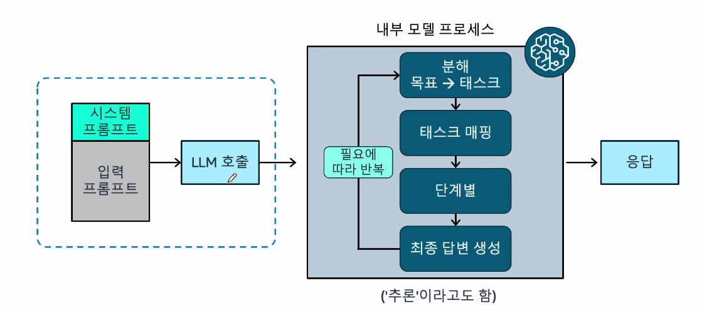
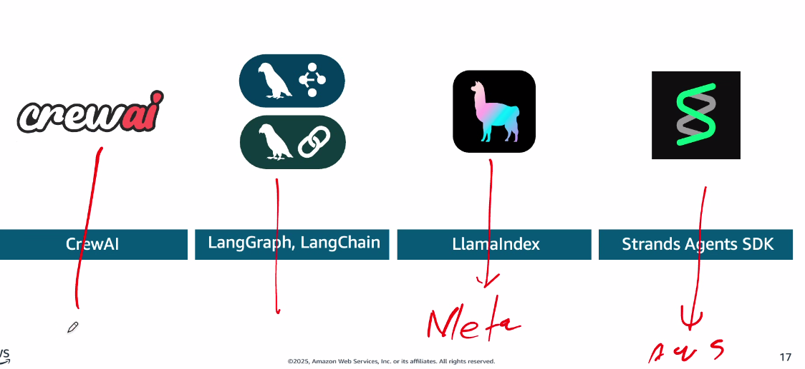
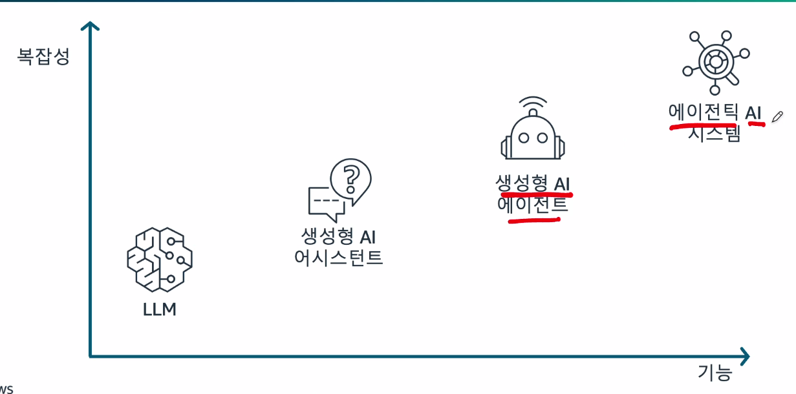
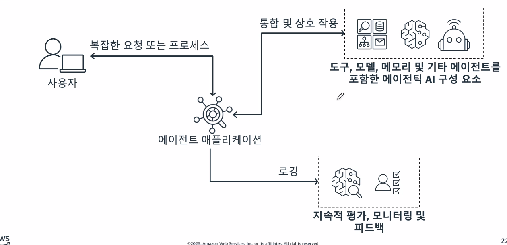
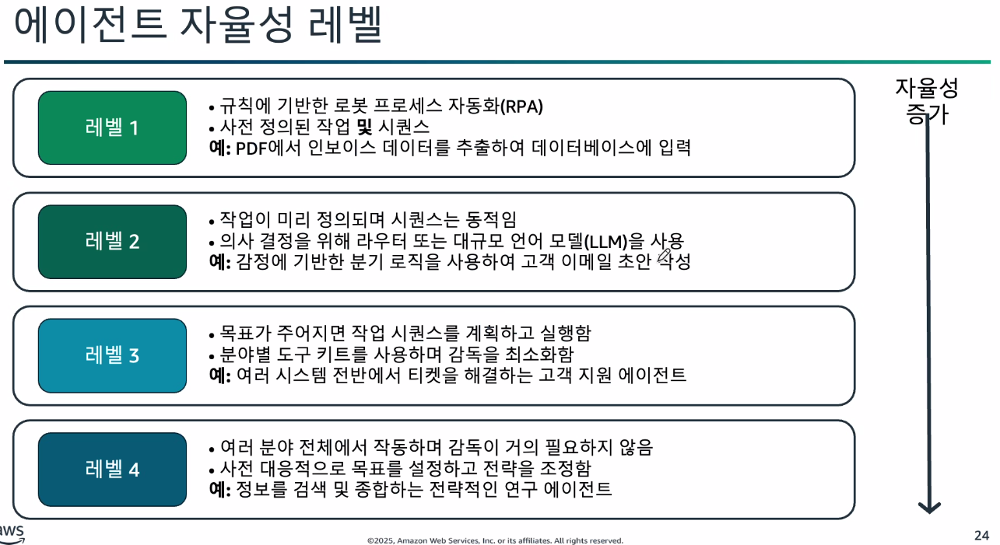

### Agentic
> 하나의 로봇을 만드는 것으로 스스로 작업을 결정하고 수행할 수 있는 소프트웨어 프로그램

### Agentic의 큰 차이 

코딩을 대표적으로 보면
Agentic은 도구를 활용해서 직접 실행을 한다.

다른 생성형 AI는 단순히 코드만 제공을 하지만 Agentic은 실행까지되는 도구를 활용하여 동작을 한다.

### 실제 사례

- 바이브 코딩
- 보험 청구
- 복잡한 비지니스 프로세스

### LLM의 기능

- 콘텐츠 제작
- 자연어 이해
- 대화형 AI

### 에이전트 개발을 주도하는 주요 혁신

- AI 소프트웨어 통합
- 생각의 사슬(CoT) 통합
- 멀티모달 추론
- 에이전트용 개발 프레임 워크

### AI 소프트웨어 통합
> 기본적으로 LLM은 소프트웨어와 통신 할 수 없고 LLM에 입력되는 내용은 
소프트웨어가 가로채서 소프트웨어를 통해 LLM에 전달 된다.

### 생각의 사슬 추론의 작동 원리

### 멀티모달
> 말 그대로 여러 LLM모델을 사용

그게 아니라면

> 단일 멀티모달을 사용

### 에이전트용 개발 프레임 워크

### AI 운영의 발전

여기서 `생성형 AI 에이전트` -> `에이전틱 AI 시스템`으로 발전 하고 있는데
이 두 차이점은 무엇이냐 
- `생성형 AI 에이전트`는 하나의 로봇 시스템
- `에이전틱 AI 시스템`은 여러 로봇들의 모음 즉 여러 에이전트

에이전틱 AI 예시 : 나의 개인 에이전트가 있는데 건강이상 시 병원에이전트에 알리는것이아닌 개인 에이전트가 병원에이전트에 알림

### 에이전트 자율성 레벨
> 에이전트의 자율성을 설정할 수 있음

### 자율성 증가로 프레임워크의 필요성 발생

- 구현 관련 당면 과제
    - 추론 루프 문제 : 에이전트가 행동하는 대신 생각에 갇히게 됨 -> 잘못된 루프로 토큰사용량이 많아짐
    - 도구 관리 복잡성 : 여러 API 및 시스템을 조정해야함 -> 비효율적인 API사용, 지연시간 증가
    - 오류 복구 : 에이전트가 예상치 못한 결과를 처리할 수 없음 -> 결제시스템 오류시 에이전트가 환불 완료 안됨 

### Amazone Agent QuickSuite

