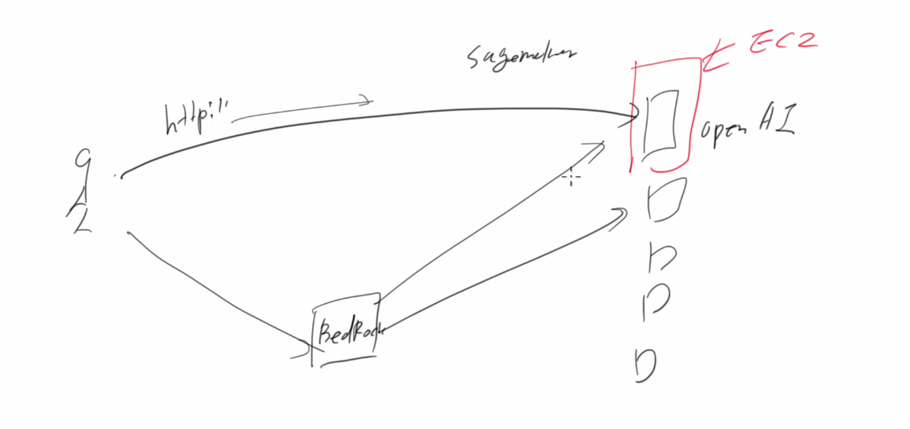
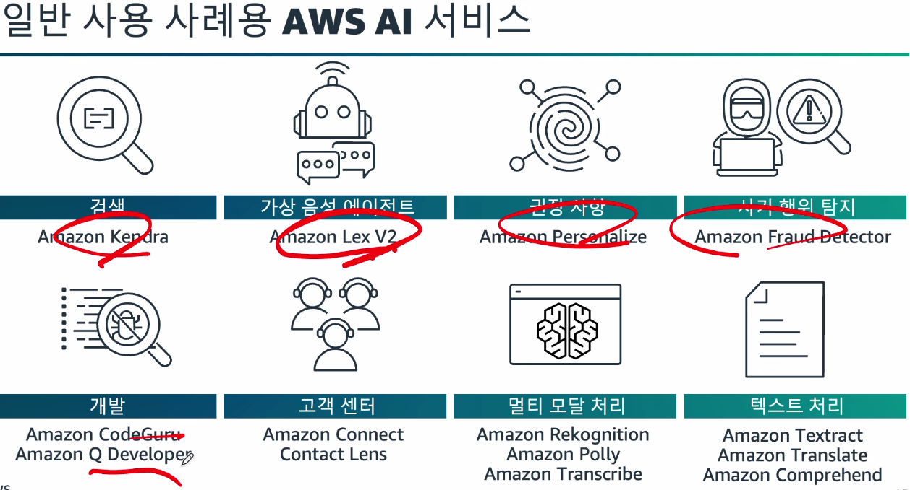
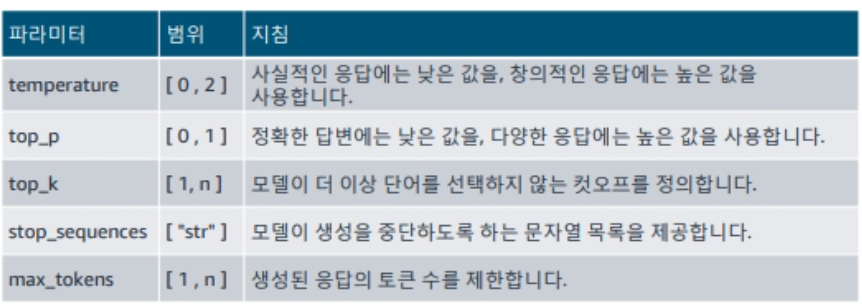

# Developing Generative AI Applications on AWS 1일차

### BedRock 약간 어제 복습
> 이는 AWS에서 제공하는 AI 활용 서비스

실상 사용자가 어떠한 API 요청을 하면 바로 그 모델에 접근할 수 있는것이 아닌
무조건 BedRock을 통해 사용된다.

-> 약간 API GateWay같은 역할을 함

[그러나]
`Sagemaker` 을 사용하면 OpenAI를 바로 사용가능함

물론 둘다 https를 통해 호출을 하는 것

### FM(Foundation Model) 사전 훈련

흐름 : 대량의 레이블 미지정 데이터 -> 훈련 알고리즘 -> 파운데이션 모델

### 추론 및 컨택스트
> 대화의 흐름을 이어가는 기능

대화의 흐름을 기억하여 이어나가게 하기 위해 제공되는 기능이 컨텍스트
모델이 추론 및 컨택스트를 잘 하도록 해야함

---

### 일반 사용 AWS AI 서비스 사례용

### Amazon BedRock의 주요 이점

- API를 기반으로 수백개의 FM에 액세스하여 효율적 에이전트 구축 가능
- 생성형 AI 애플리케이션을 안전하게 구축
- 조직의 데이터를 사용하여 맞춤형 경험 제공

### 종합적인 데이터 보호 및 개인 정보 보호 기능을 갖춘 시스템 구축

AWS는 엔드포인트를 통해 서비스 접근이 가능하고
또는 API GateWay를 통해서 접근하도록 할 수 있는데

베드락도 같은 맥락으로 사용이 가능하다
-> 이걸 좀 더 도와주는게 가드레일 기능

### 파운데이션 모델의 특징
기본적인 모델은 과거의 데이터에 의존하는 특징이 있음

-> 이에 따라 기억저장소가 필요 메모리 기반

---

### BedRock을 이용한 프로그래밍 [모듈2]

### 흔히 사용되는 텍스트 생성 추론 파라미터
> 앞서 말했듯 추론 파라미터를 이용해 좀 더 정교한 응답을 조절 할 수 있음

### Bedrock과의 상호 작용
> 무조건 https로 요청을 해야한다.

다만 요청시 다양한 방법이 있다.

---

레그시스템?