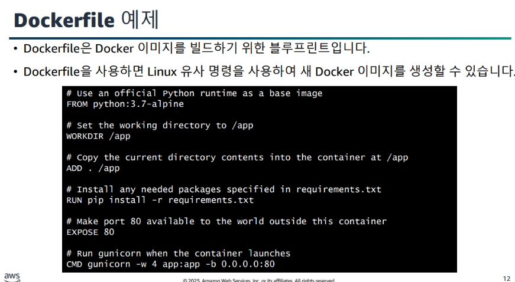
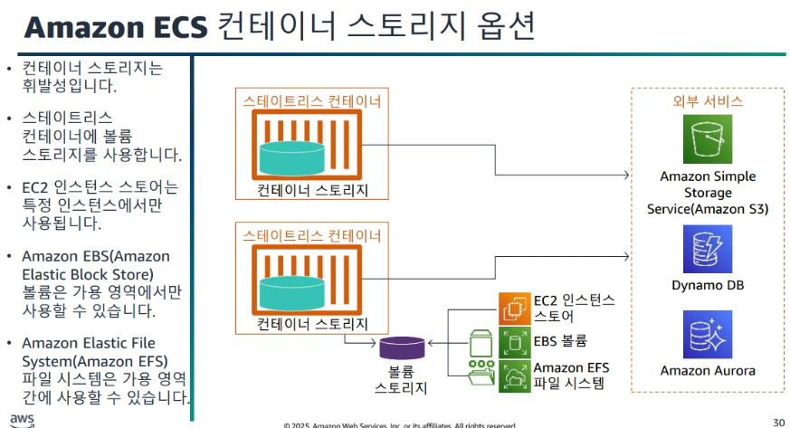
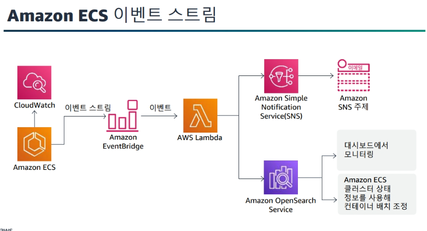

# 2일차

## contatiner
- AWS에서의 컨테이너 호스팅
- ECS(Elastic Container Service)
    - EKS가 너무 어려울 때
    - 간단하게 올리는 방법
- EKS(Elastic Kubernetes Serivce)
    - EKS는 너무 어려움

### 컨테이너와 가상머신 비교

> ex) 게임을 돌리면 excel이나 다른 프로그램을 돌리지 못함

-> 그래서 나온 기능이 리소스 즉, 자원관리를함
이에 따라 게임 cpu는 40%만쓰고 나머지는 게임에 쓰는 이런 자원관리가 나옴

운영체제 별로 나누는게 : 가상머신 - HW 가상화
앱과 라이브러리 os를 하나로 이미지를 만들어 또 가상머신을 만들 수 있음

여기도 물리적인 논리적인 개념이 나옴 장비로

근데 이 가상머신의 이미지가 몇백개씩 운영되고 이미지를 가상화(부팅) 하는데 시간이 몇분걸리는데 오래걸리다 보니
아예 부팅자체를 없애버림

그래서 `컨테이너`가 나옴 - OS 가상화
운영체제를 빼고 이미지화하여 몇초밖에 안나옴

### 컨테이너 장점

- 속도 매우 향상
- 스테이트리스
- 변경불가능한 단일 아티팩트
- 마이크로서비스 아키텍쳐에 이상적

### 컨테이너를 만드는 솔루션
> 대표적 도커(docker)

### dockerfile

- dockerfile은 Docker 이미지를 빌드하기 위한 `블루프린트`이다.
- Dokerfile을 사용하면 Linux유사 명령을 사용하여 새 docker 이미지를 생성할 수 있습니다.

이미지는 file디렉토리처럼 차곡차곡 쌓인다.

### 버전관리
> 생성된 이미지를 관리하기 위해 버저닝을 한다.

- 태그를 이용하여 버전 지정
- docker tag를 사ㅏ용
- 아무것도 사용하지 않은 latest
- 버전은 블루/그린 배포 지원을 간소화합니다.

### ECR
> 앞서만든 이미지를 저장하는 AWS 서비스

보통 private에 저장

### AWS 컨테이너 서비스 환경

- 이미지 레지스트리 : 컨테이너 이미지 리포지토리
    - ECR
- 오케스트레이션 : 컨테이너화된 애플리케이션의 배포,스케줄링,크기 조정, 관리
    - ECS
    - EKS
- 호스팅 : 컨테이너가 실행되는 위치
    - EC2
    - Fagate : Lambda처럼 서버리스

### ECS의 EC2 시작 유형

- 컨테이너 인스턴스
    - 표준 EC2 가상 머신. 태스크는 클러스터에 등록된 이 컴퓨팅 리소스에서 실행됨
- 서비스 
    - loadBalance가 가능
    - 하나(또는 그 이상)의 복제된 태스크로 추상화, 로드 밸런싱, 크기 조정, 검색의 기본 대상

- 태스크
    - 이미지를 어떻게 실행하고 어떻게 복구하고하는지에 대한 json코드

### Fagte
> 완전관리형 ECS 용 컴퓨팅 엔진

- Fagte는 인스턴스가 없고
- 서비스와,태스크만 관리하면 됨
- 관리는 심플하다.

### Fagte 단점

- 모니터링이나 튜닝등을 못함
- Fagte를 시작할때 미리 만들어지고 앱이 실행되는 구조
- Clode start가 심하다

-> 그래서 보통 애플리케이션마다 Fagte할지 Ec2할지 고민한다.

### ECS
> Ec2와 Fagte관리 하는 오케스트레이션

- 컨테이너 스토리지를 사용한다.

### 스케줄링 기능

- 어떤 노드, 즉, EC2 Fagte에 접근하는지 정의

### 태스크 정의

- 어떤 Docker를 사용하는지
- 컨테이너당 cpu메모리
등 여러가지 Json으로 정의

걍 태스크로 거의 모든 로드밸런싱 가용영역 배분 등 모든걸 관리 할 수 있음

### ECS 이벤트 스트림

- 이벤트 스트림을 통해(예로 중단되었을떄)
    - SNS나
    - OpenSearch Service를 통해
    - 모니터링이 가능하다.

---

### Kubernetes란?

- 오픈소스 컨테이너 관리 플랫폼 (이게 단점이 될 수 있음)
    - 오픈소스임으로 지원체계를 받아야함

- 대규모로 컨테이너를 실행하도록 도와줌
- 현대호된 애플리케이션 구축을 위한 기본 요소 제공

### EKS Distro(EKS-D)
> 도와주는거?

### EKS AutoMode
> 변천사 : app -> container -> Kub -> EKS -> EKSAuto

---

### DDOS
> 대량 공격

이에 따른 방어법을 생각해야함

1차 방어 : lodbalance

2차 : CloudFormaition

### Shield Standard 가능
> 7계층 전체를 방어해줌

- 4계층 까지는 무료임

WAF는 7계층중 7부분에 적용

