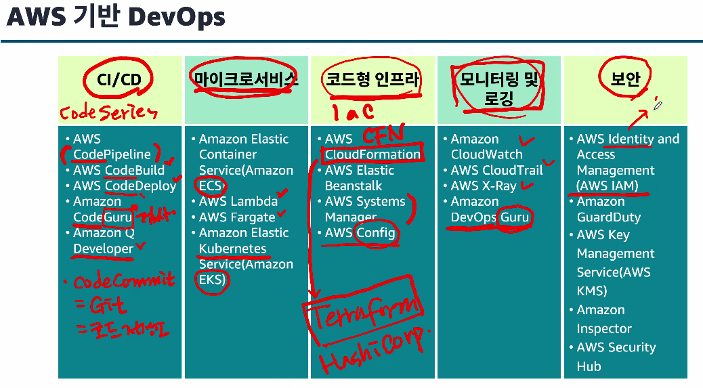
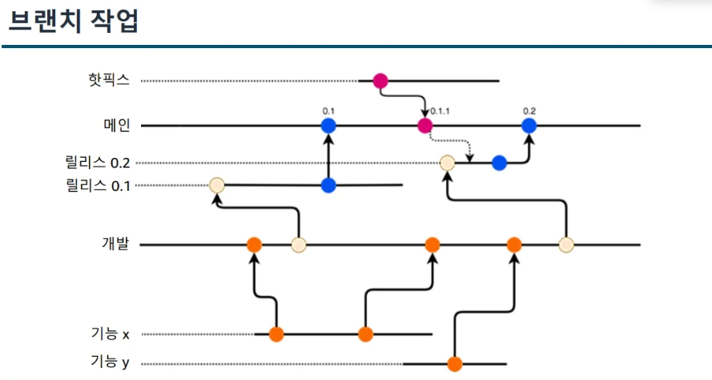
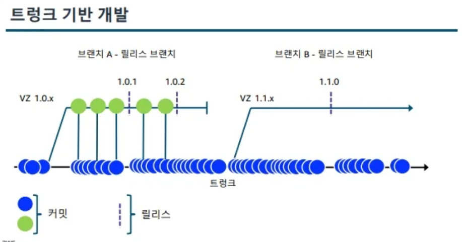
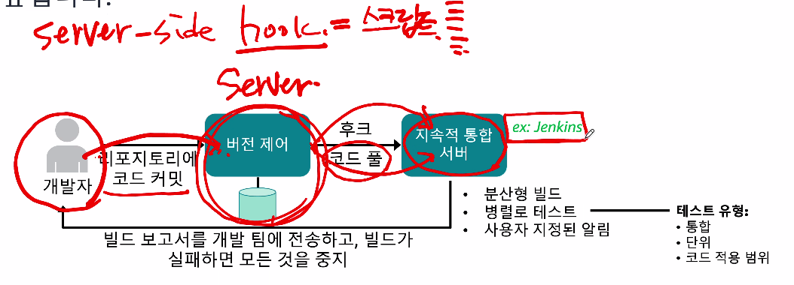
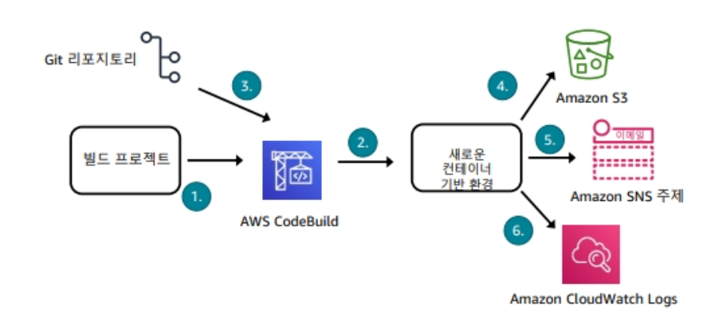
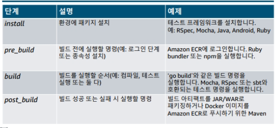
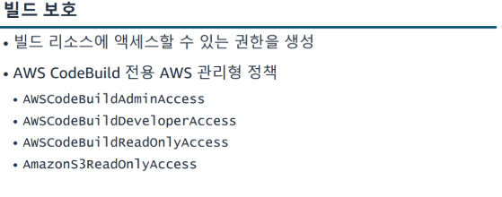
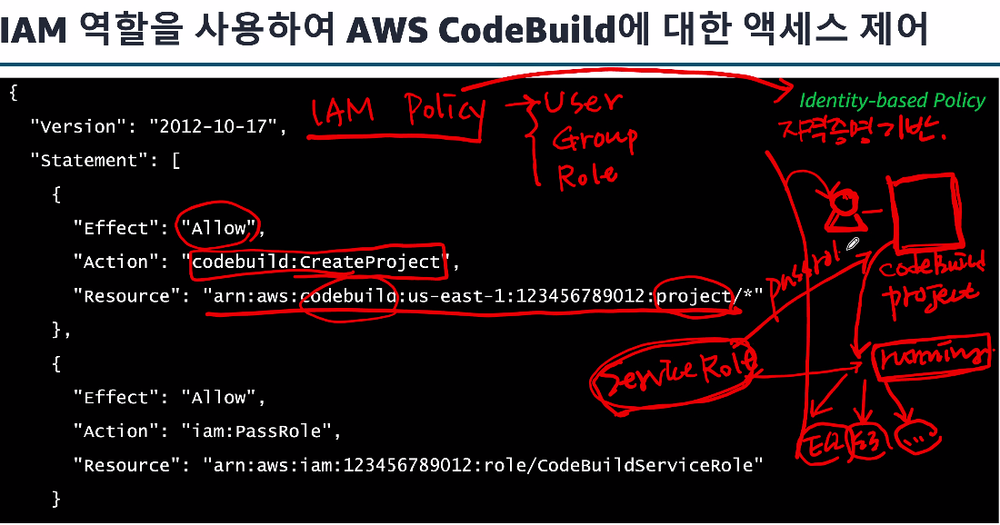
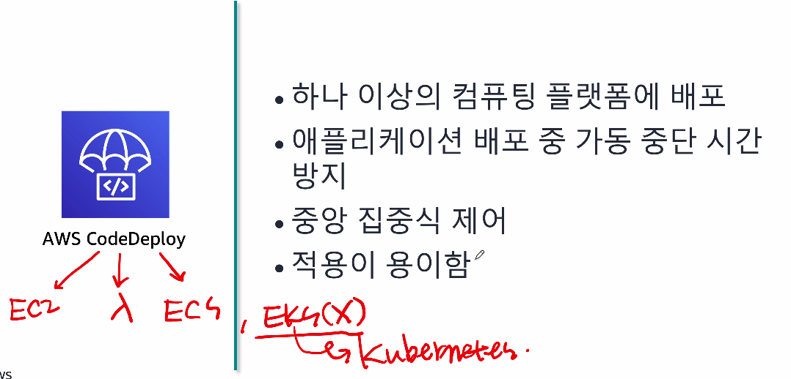

# DevOps Engineering on AWS 1일차

### 과정 목표
> 이 과정을 마치면 다음을 수행할 수 있습니다.

- DevOps 방법론의 기본 개념 및 사례 적용: 지속적 통합(CI), 지속적 전달(CD), 코드형 인프라(IaC), 모니터링 및 로깅
- AWS에서 DevOps 개발 프로젝트를 지원하는 인프라 설계 및 구현
- AWS에서 CI 환경을 구축하는 데 사용할 수 있는 옵션 식별
- AWS에서 다양한 컴퓨팅 환경을 위한 CI/CD 파이프라인 설계 및 구현
- 다양한 배포 전략을 사용하여 보호되는 애플리케이션의 지속적 배포 및 전달 수행
- CI/CD 파이프라인의 여러 단계에서 자동화된 테스트 활용
- AWS 도구 및 기술을 사용하여 애플리케이션 환경 모니터링 및 유지 관리

### DevOps 소개 [모듈1]
> 이 모듈을 마치면 다음을 수행할 수 있습니다.

- DevOps 구현의 이점 나열 
- Amazon의 자체 DevOps 트랜스포메이션 설명
- DevOps를 통한 AWS의 팀 지원 방식 설명

### Amazon의 개발 트랜스포메이션(변화)
> 처음에는 (모놀리스,밀결합된 애플리케이션 사일로화(개발팀/운영팀이 나뉨) 된 팀)

시간이 지나며 MSA형태로 변경이됨

### DevOps 문화

- 중요한것은 `장벽제거`
- `함께 협력`하여 생산성과 신뢰성을 최적화
- 도구보다 프로세스, 프로세스보다 사람

### DevOps 방식
- 지속적 통합
- 지속적 전달
- 마이크로 서비스
- 코드형 인프라
- 모니터링 및 로깅
- 커뮤니케이션 및 협업 | tool을 활용하여

### 지속적 통합 [CI]

- 흐름
    - 개발자 -> git에 코드 -> 코드 검사 -> 검사 자동화 -> 피드백 제공 -> 개발자

-> 이 흐름을 AWS Code로 실행한다.

### CI/CD 파이프라인

코드 -> 빌드 -> 테스트 -> 프로비저닝 -> 배포 -> 모니터링

### AWS 기반 DevOps

---

### 인프라 자동화 [모듈2]

### 인프라 자동화란?
> 구성 파일 같은 코드를 통해 인프라(운영환경) 정의

코드형 인프라(Iac)
- 셸 스크립트
- 애플리케이션 코드
- AWS CloudFormation
- 서드파티 도구

### 자동화가 필요한 이유
- 인적 오류 감소 / 백인 백색? -> 사람마다 다르다
- 보다 빠른 릴리스 및 응답시간
- 코드형 정책으로 규정 준수 유지
    - 추적,검증,재구성 가능 (모두 자동화를 위해)

-> 좀만 찾아보기

---

### AWS 도구 세트 [모듈 3]

### CDK에 대해 설명

---

### 개발도구를 통한 지속적 통합 및 전달[모듈4]
> 현재 모듈에서 직접적인 CI/CD를 다룸

- 릴리스 워크플로의 지속적 통합, 지속적 배포 및 전달 설명
- 소스 코드 제어 모범 사례 설명
- 지속적 통합 태스크를 구현하도록 AWS CodeBuild 구성
- 다양한 컴퓨팅 환경에서 애플리케이션 배포를 수행하도록 AWS CodeDeploy 구성

모듈의 목표이지만 해당 모듈에서는 git에 대해 자세히 본다.

### CI/CD 모범사례

- 릴리스 빈도
- 반복을 통한 효율성
- 개발 일관성 
- 자동화 - 모든 것을 자동화
- 테스트 자동화
- 팀 역량 강화
- 배치 로드 축소 
- 더 빠른 전달로 소프트웨어 개발 방식 개선

### 소스제어 모범 사례
> 코드 변경 내용을 추적 및 관리하는 방식

대표적인 예로 git을 사용하는것

- 기본 사항
    - 변경 내용을 추적하고, 개정 버전 기록을 확인하고, 이전 버전으로 되돌리고, 변경 내용을 협업, 격리 및 신속하게 식별합니다.
- 소스 코드 관리 시스템 예
    - Git, Mercurial, Apache Subversion
- 도구
    - GitLab, GitHub 및 기타 

### 브랜치 전략

- 메인에서 분리 

- 브랜치 작업

> 팀이 여러 브랜치에서 작업하는 경우 메인 브랜치로의 병합은 복잡한 프로세스가 될 수 있습니다. 다이어그램에 표시된 대로 프로젝트에는 핫픽스, 기능, 하위 릴리스, 반복 및 기타 개발을 나타내는 많은 브랜치가 있을 수 있습니다. 분기와 코드 커밋 때문에 복잡성이 증가합니다. Amazon 팀은 개발자가 정기적으로, 
이상적으로는 하루에 여러 번 코드 변경 내용을 중앙 리포지토리에 병합하는 
'트렁크 기반 개발'을 통해 지속적 통합(CI)을 실천하는 것이 좋습니다. 팀이 소규모 변경 내용을 정기적으로 병합할 수 있으면 병합의 복잡성, 결과적으로 필요한 노력을 최소화할 수 있습니다. 트렁크 기반 지속적 통합(CI)과 지속적 전달(CD)을 결합하면 프로덕션에 변경 내용을 적용하는 리드 타임이 단축됩니다

- 트렁크 기반 개발 (이걸 추천함!)

> 트렁크 기반 개발은 많은 개발자가 트렁크라고 하는 단일 공유 브랜치를 통합하거나 여기로 커밋하는 또 다른 분기 모델입니다. 이 브랜치는 일반적으로 소스 제어되므로 대부분의 커밋이 트렁크에서 발생합니다. 생성되는 다른 브랜치는 릴리스용이며 다른 브랜치가 생성된 후에는 일반적으로 이전 브랜치가 삭제됩니다. 릴리스 브랜치는 단시간 유지되며 커밋은 팀의 특정 개인 또는 역할에 의해 제어됩니다. 대부분의 조정/수정/커밋은 트렁크에서 발생하고 그런 다음 릴리스 브랜치에 병합됩

### pull request
> 코드 리뷰하는 작업 -> 널리 아는거

### Amazon CodeGuru Reviewer
> AWs 에서 제공하는 자동화 검증 서비스

### 서버 측 후크를 사용하여 자동화
> 서버 측 후크를 CI서버와 함께 사용하여 저항을 줄이고 통합 속도를 높인다.

---

### AWS CodeBuild
> 서버리스 환경으로 위 브랜치 전략부터 자동화 하는 모든걸 완전 자동화를 해준다.

- 소스 코드를 컴파일하고 테스트를 실행하며 소프트웨어 패키지를 생성하는 완전관리형 빌드 서비스 
- 이점
    - 완전관리형 
    - 지속적으로 크기를 조정
    - 모니터링 제공
    - 확장성
    - AWS 콘솔 및 CLI를 통해 액세스 가능

### AWS CodeBuild 작동 방식 -> AWS 서비스이고
> 그림의 흐름을 보면됨

### 빌드 환경을 위한 추가 도구

- Jenkins
- Qick starts

### 빌드 계획 방법 = 프로젝트

- 소스가 배치되는 위치 식별
- 실행해야하는 빌드 명령 및 실행 순서 식별
- 런타임 및 도구 식별
- 자동으로 제공되지 않을 경우 리소스 식별
- CodeBuild instance -> 하나의 프로그램

### Buildspec 수행 단계 -> 실제 build하는단계

### build 보호
> CodeBuild를 마치고 정책을 따로 부여해주어야한다

실제 배포하는데에도 따로 정책을 주어야함

-> 이는 마찬가지로 `IAM 역할`에서 역할을 부여한다.

### CodeBuild 제품 통합

- jenkins가 코드빌드 코드deploy를 잘함

---

### code Deploy

### CodeDeploy를 사용하여 배포
- 각 라이프사이클 이벤트 후크와 함께 실행할 명령을 지정합니다.

(APPSpec 구성파일)
- 다중 코드 배포
- 배포 유형 옵션
- 이전 개정 버전으로 롤백 및 재배포
- 로컬 테스트 및 디버깅

---

