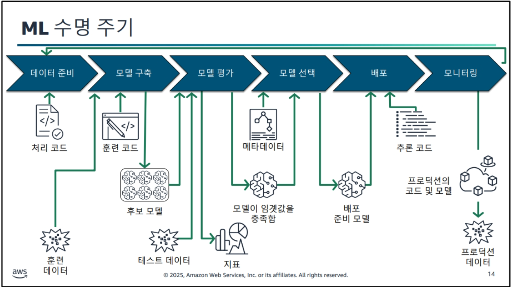

# MLOps_Engineering_1일차

### ML 프로젝트 수명 주기

비지니스 목표 > ML프레이밍 > 데이터처리 > 모델 개발 > 배포 > 모니터링
(전체과정에 보안 및 거버넌스)

- 데이터처리 : 과적합 방지로 | 데이터를 훈련,검증,테스트로 나눈다.

    - 이진분류 -> 혼동정렬을씀
    - 회귀분류 -> 함수활용 MSE

---

### 각 단계에 따른 데이터 활용

- 데이터 준비, 모델 구축, 모델 평가
    - 훈련데이터,검증데이터 활용
- 모델평가
    - 테스트데이터 

---

### ML에 대한 구현 고려 사항

- 설명 가능성
    - 모델이 복잡하면 할수록 정확한데 그 결과 같이 나오는 과정을 블랙박스로 알수없는데 이걸 설명할 수 있어야함
    ex) 은행 대출 떄 안되면 은행원이 안된다고만 말하는것이 아닌 왜 안되는지에 대한설명을 해주는것
    - 도구는 : 클레럽파일?
- 감사가능성
- 확장성
- 재현가능성
- 유연성
- 일관성

DataLake Glue

### 차세대 Amazon SageMaker
> 모든데이터,분석 및 AI를 위한 중심
즉, 데이터 분석

- Unified studio
    - 통합된 데이터부터 분석까지 모든걸 하겠다. SageMaker에서
- 데이터 및 AI 거버넌스
- 레이크하우스(DataLake+Warehouse)
    - 정형 비정형 반정형 데이터 통합

### ML인프라 : 도구 선택
> 위와 같은 작업을 하려면 인프라가 필요함

- 관리형 서비스 사용 : SageMakerAI
    - 완전관리형(훈련,구축,배포)
- 자체구축 : EC2,ECS,EKS
    - 고객관리형 인프라

ex) 수업을 듣는데 필요한 환경이나 이런걸 원래는 단계별로 준비해야하는데
이 앞과정을 `SageMaker는 다 준비해주고 머신러닝 훈련만 할 수 있게해줌`

-> 완전관리형 단점 : 자유도가 낮아짐

### MLOps 성숙도 수준이해
1. 초기
2. 반복가능 
    - CI/CD 까지
3. 안전성 
    - 모니터링, 자동화 테스트, Multiaccount
4. 확장성 

---

