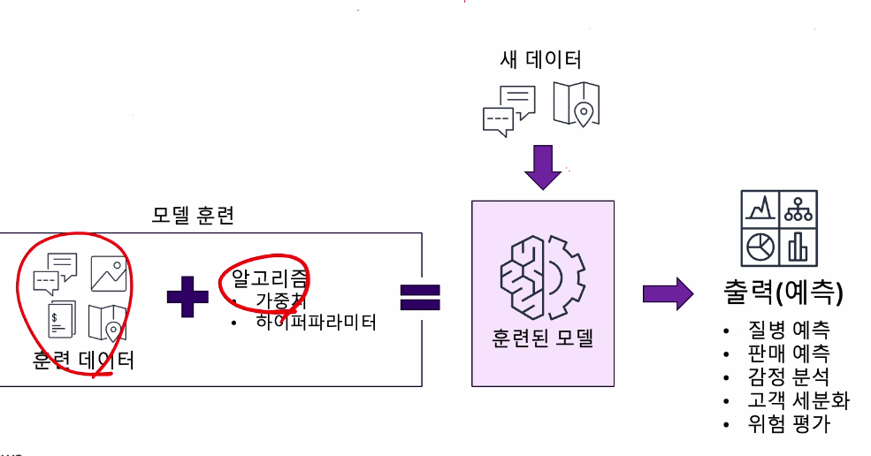
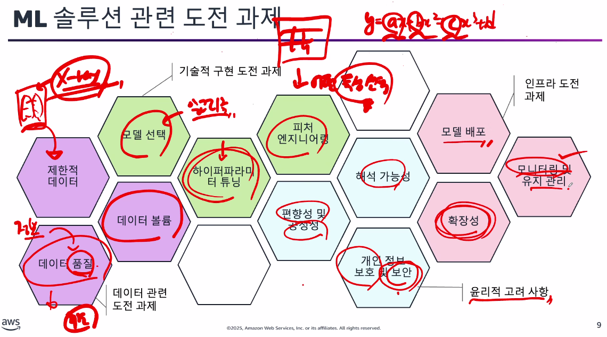
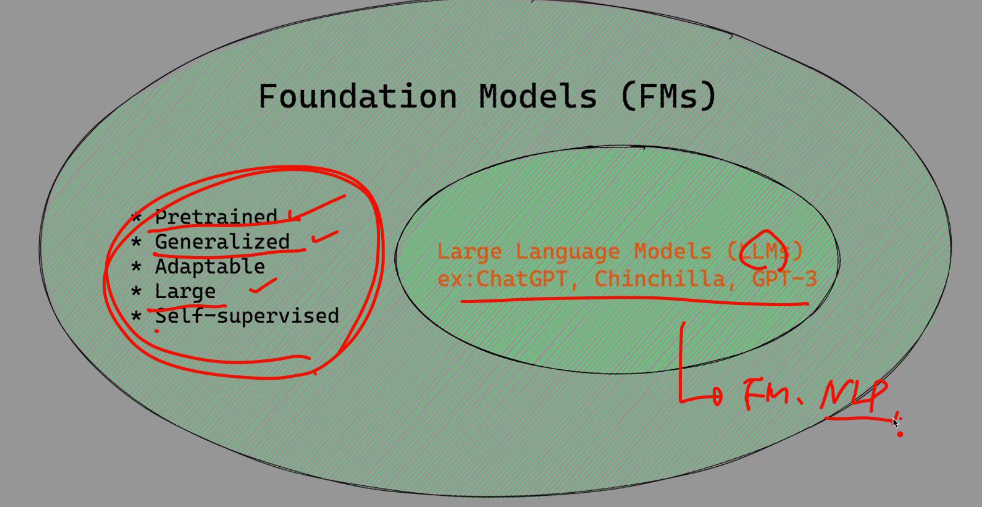
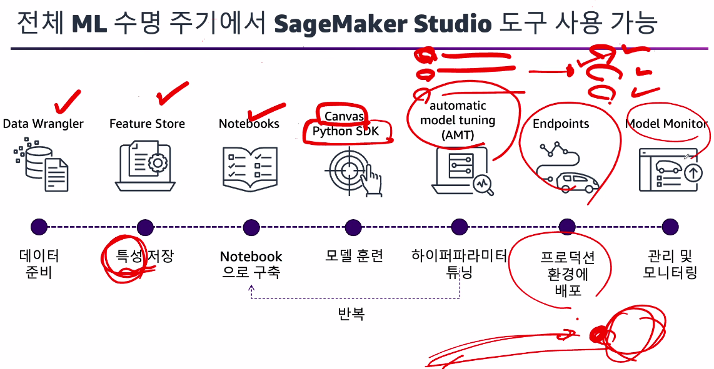
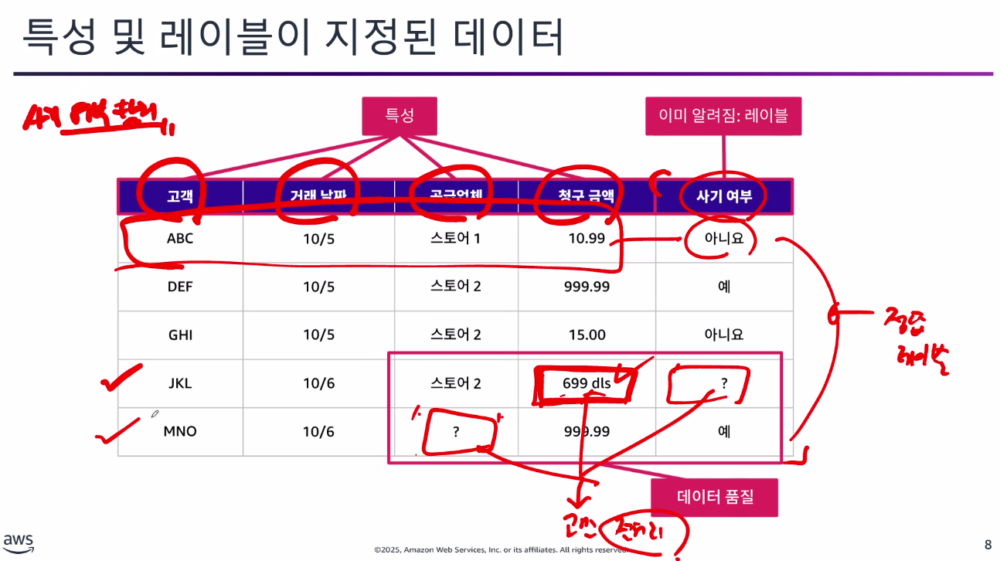
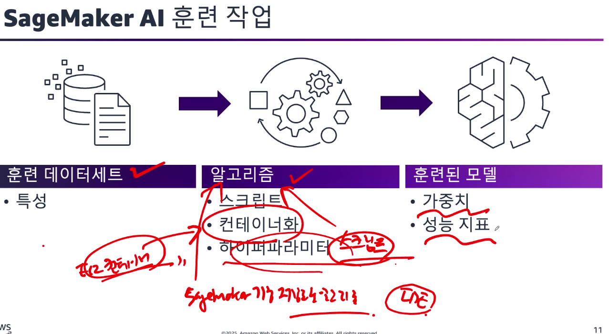
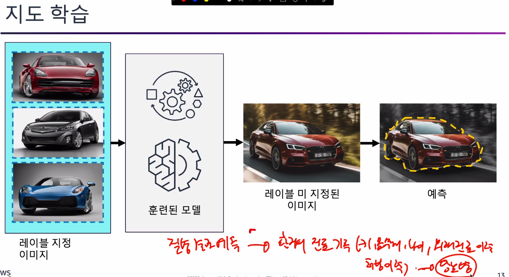
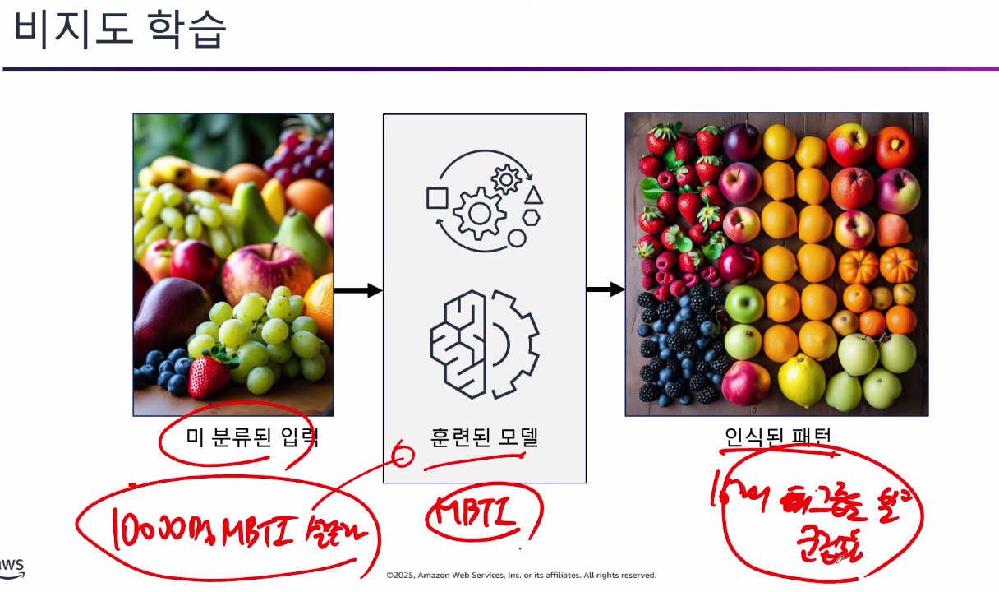
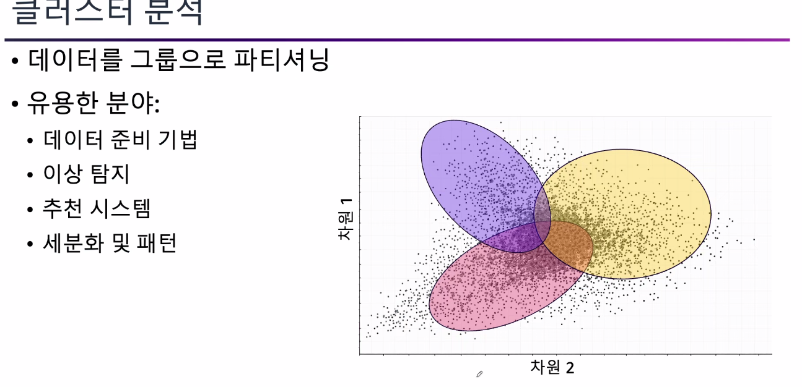

# Machine_Learning_Engineering 1일차

### 과정 목표
> 어떻게하면 AWS에서 머신러닝을 구현할 수 있을까?의 전체 과정

### ML기계학습 소개
> 사실상 SageMaker AI만 이야기함

### ML 프로젝트 수명 주기

---

[들어가기전 질문]

> 일반적인 프로그램과 머신러닝의 차이점이란?

ex) 단순한 일반함수, 함수의 아파트값 예측을 한다면

`개발자` -> `y=2x+1` 이런식으로 1차함수를 짠다.(규칙이 포함되어있는 함수)

`머신러닝` -> `데이터`가 주어지면 그걸 통해 -> `y=2x+1` 이런함수가 있는데 -> `패턴`을 통해 아파트값을 예측해봐 

---

### AI 기술의 발전 및 계층 구조 

인공지능 < 기계학습 < 딥 러닝 < 생성형 AI

- 인공지능 : 인간의 지능 모방
    - 전문가 시스템 
    - AI 냉장고
    - 항생제 처방

-> 인공지능에서 기계학습으로 넘어가기까지 시간이 걸렸는데
이유는 `데이터`의 부족

- 기계학습 : 데이터의 패턴을 토대로 모델 구축
    - 예측
    - 분류

-> 인간과 비슷한 수준의 판단을 할 수 있지 않을까?
또한, 인터넷의 발전으로 `데이터`의 양이 매우매우 많아짐

- 딥러닝 : 다계층 모델용 신경만 사용
    - 인간의 지능을 흉내 냄
    - 알파고

-> 그러나 여기까지도 판별형 모델
데이터가 있으면 그걸 판단하는 거였음

- `생성형 AI` : 콘텐츠 모델 사용
    - 새로운 콘텐츠를 만든다

---

### 기계학습이란?
> 프로그래밍 방식에서 구현하기 어려운것을 더 효율적인 머신러닝하는것

즉, 모델을 훈련 시키고
> 이 훈련된 모델에서 `새로운 데이터`가 들어왔을때 예측과 분류를 하는것

### ML 훈련방식의 카테고리

- 지도학습 : 정답레이블 데이터를 수동으로 붙임

- 비지도 학습 : 정답이없는 데이터를 붙인다
    - 은닉 패턴이나 구조를 찾는다

- 강화학습(RL) : 주위환경과 상호작용하고, 결정을 내리고 피드백을 수신하는 방식으로 학습
    - 게임
    - 로보틱스 등..

### ML 솔루션 관련 도전 과제
> 고려해야할 사항들

### 기계학습 역할 -> 각 전문가

- 데이터 시스템 : 데이터 엔지니어
    - 파이프라인, 인프라 구축, 고정
- ML모델 구축 : 데이터 과학자
    - 데이터 수집
    - 정처리
    - 모델 구축
- 모델 배포 코드 : MLOps 엔지니어
    - 실제 모델 배포
    - 운영
    - 유지관리 에대해 자동화

-> 위 모든걸 다하는게 <u>`ML엔지니어`</u>

### ML 모델 비교
> 생성형 AI vs 기계학습

- 생성형 AI -> Foundation 기반 모델
    - 그렇다면 Foundation 기반 모델은 `LLM`일까? 
    - 
    - 포함이다

> 즉, 생성형 AI는 자연어처리를 통한 소통이 필요할때
> 어떠한 새로운 결과물을 만들어야할 때

- 기계학습 
> 특정 테스크, 특정 분야에 대해서 필요할때 사용

---

### Amazon SageMaker AI 
> 얘는 인프라영역이다.

- Kiro, Amazon Q -> 서비스
- Amazon BedRock -> 플랫폼
- GPUs, SageMaker AI -> 인프라

### 컴퓨터 비전, 음성, 텍스트 사용 사례용 AI 서비스
> 각 분야에 대해서 필요한 AI를 아마존에서 서비스로 제공하는게 있다.

- 컴퓨터비전
    - Amazon Rekognition
- 음성 
    - Amazon Polly
- 텍스트 
    - Amazon Comprehend
    - Amazon Translate
    - Amazon Textract

등등등.... 검색,챗봇,추천,사기탐지,개발,고객센터,`생성형AI`,예측에 제공하는 서비스들이있음

### SageMaker Studio 생명주기

### 책임감 있는 ML
> `법적인`,`인간의 윤리` 범위안에서의 훈련이 필요하다.

### 책임감 있는 AI의 핵심 요소
> 윤리적이고 안전하며 편향 없는 방식으로 설계,개발 및 배포되는 AI시스템 구축

- 제어가능성
- 공정성
- 안전성
- 설명가능성
- 투명성
- 거버넌스
- 진실성 및 견고성
- 개인정보 및 보안

### 책임감 있는 개발을 통해 해결할 수 있는 편향
> 각 상황에서 나오는 편향을 줄이는 노력을 해야함

- 데이터 편향
- 알고리즘 편향
- 상호 작용 편향
- 편향 증폭

---

### 기계학습 도전과제 분석 [모듈2]
> ML로 비지니스 문제를 해결할 수 있을까?

-> 적합성에 대한 주요 기준에 따라
1. 패턴
2. 데이터

### ML 비지니스 도전 과제 평가
> ML 성공 기준 프레임 워크

1. 비지니스 도전과제
- 데이터 기반 및 구체성
    - 해결해야하는 `구체적` 비지니스 과제를 파악해야함

2. 정의된 목표
- 정량적이고 달성 가능 
    - 명확하고 측정 가능하며 `달성 가능한` 목표 수립

3. 성공 지표
- 구체적인 비지니스 성과 기준
    - 성공과 투자 수익률(ROI)측정을 위한 구체적인 지표를 정의한다.

4. 기계학습 솔루션?
- ML모델 협력 -> 비용, 시간 인력 < `효과`
    - ML이 솔루션에 적절한 접근 방식인지 결정합니다.

### 데이터 선택

필요한 데이터를 선택하고

-> 이걸 데이터 액세스 어디에 저장되는지
-> 다양한경으로 하나의곳으로 모야함

--- 

### ML 훈련 방식 

### SageMaker AI 훈련 작업

- 훈련 데이터 세트
    - 특성
- 알고 리즘
    - 스크립트
    - 컨테이너화
    - 하이퍼 파라미터
- 훈련된 모델
    - 가중치
    - 성능 지표

---

### 훈련 카테고리는
> 앞서말했지만 

- 지도학습
- 비지도학습
- 강화학습
이 있고

### 지도 학습
> 예측, 분류

### 비지도 학습
> 이상탐지

### 강화 학습

---

### 분류 문제

- 이진 분류
- 다중 클래스 분류

이런 방법들도 있다.

### 회귀 문제

ex)
주가데이터 + 오늘가격 -> 훈련된 모델 -> 예측

### 클러스터 분석
> 데이터를 그룹으로 파티셔닝

---

### ML용 데이터 처리 [모듈3]

### 데이터 준비 및 유형

> 기계 학습용 데이터 소스

- 데이터 레이크
    - 정형
    - 비정형
    - 반정형

- 데이터 웨어하우스
    - 정형 -> 열기반 데이터 저장 -> 성능별로
    - 분석을 위한 최적화

- 데이터베이스
    - 정형
    - 트랜잭션 사용 사례를 위한 최적화

### 고성능(=고품질) 데이터 식별
- 대표성
- 관련성
- 풍부한 특성
- 일관성

