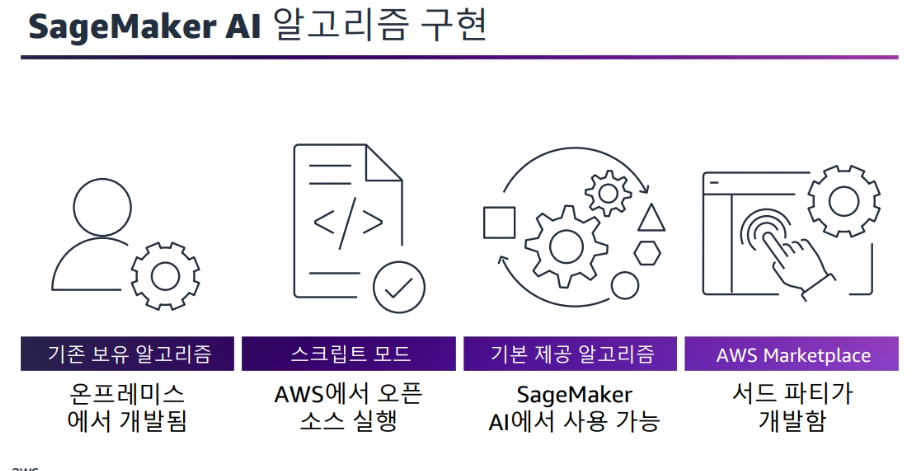

# Machine_Learning_Engineering 2일차

### 모델링 방식 선택 [모듈5]

### SageMaker에서 제공하는 알고리즘 유형

- 일반화된 선형모델
- 트리 기반 모델
- 신경망
- 클러스터링
- 행렬 인수분해
- 예측
- 컴퓨터 비전
- 시퀀스 모델

### 알고리즘 선택을 위한 고려사항

- 문제유형
- 데이터 특성 
- 성능 요구사항
- 훈련 시간 및 컴퓨팅 리소스
- 해석 가능성
- 모델 복잡성
- 확장성
- 도메인 지식

### SageMaker Autopilot (Cavac에 있는것)
> 자동 기계 학습(AutoML) 단순화/간소화

- 신속한 ML 모델 개발 진행
- 최소한의 ML 관련 전문 지식
- 투명한 ML 파이프라인 제공
- 자동화를 통해 비용 최적화 가능
- 테이블 형식 데이터로 회귀 및 분류 문제

### Autopoilot 에서 AutoML 구현 방법

1. 데이터 세트 준비
2. 모델 생성 -> 검증을 어떻게 할것인지 대략적 목표정할 수 있음
3. SageMakerAutopilot 작업 시작
4. 모델 성능 검토
5. 모델 순위표(평가지표)
6. 최적 모델 배포 및 모니터링
