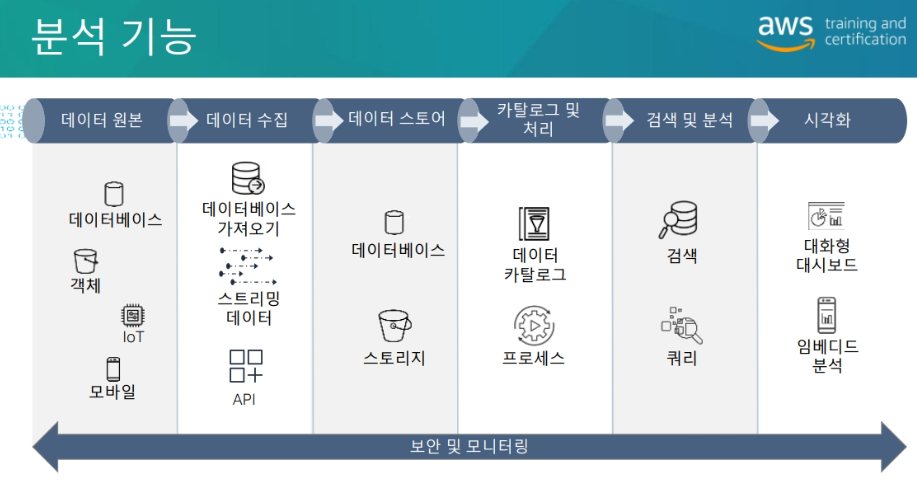
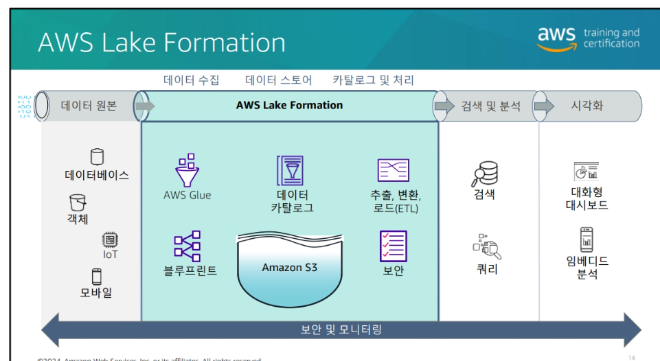
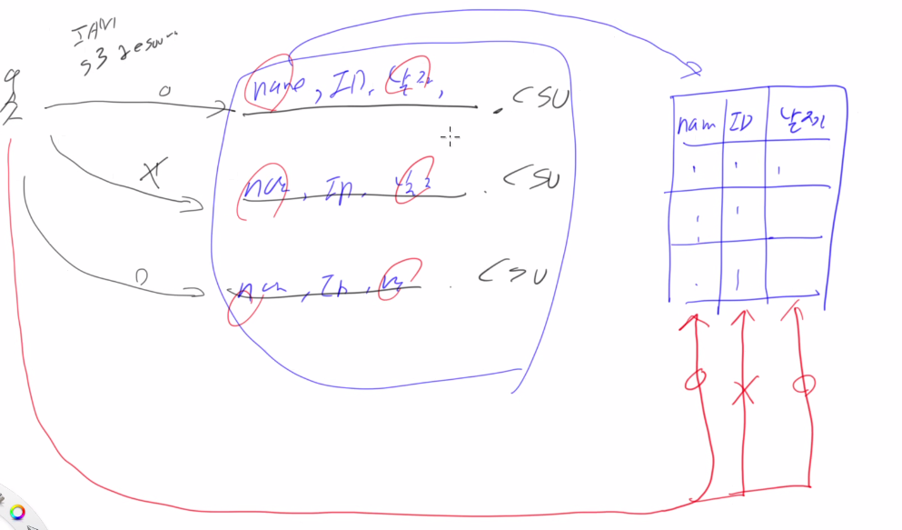

### 데이터 레이크 소개[모듈1]
> 말그대로 데이터 호수

### Data Lakes on AWS
> 정형데이터가 아닌 '비'정형 데이터를 모아 놓고 처리하는것

### 주요용어 [카탈로그]

- 비정형데이터인데 데이터구조를 가지고 있는것처럼 매핑해주는것 sql방법으로

### 구성요소 및 아키택쳐

위 과정을 LakeFormation을 통해 한번에 할 수 있음

#### Lake Formation의 권한 정책

Formation에서의 보안이라는것은 카탈로그화 된 데이터에 대해
어느 데이터에 대해 접근을 할 수 있냐를 말함
ex) name필드는 볼 수 있고, 뭐 다른 필드는 볼 수 없고를 결정

---

### 이것은 자격증 기반 수업 특강느낌이였음