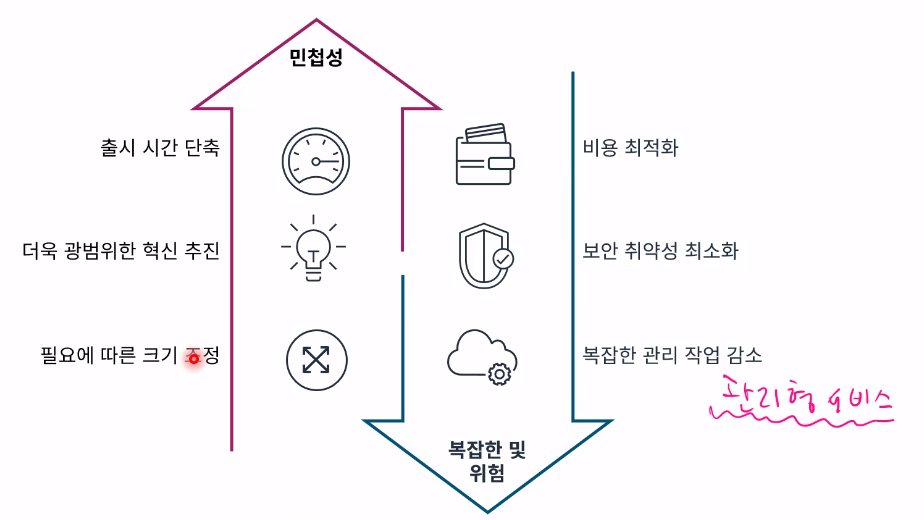
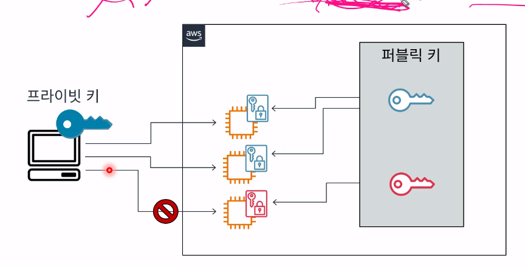
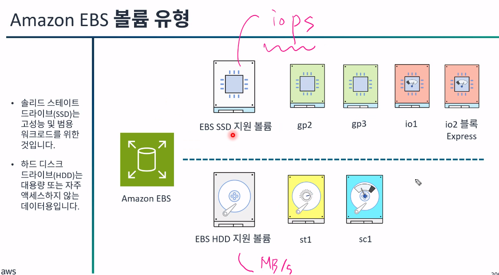
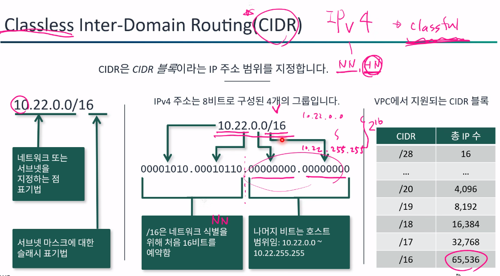
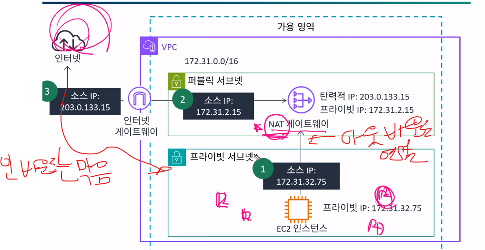
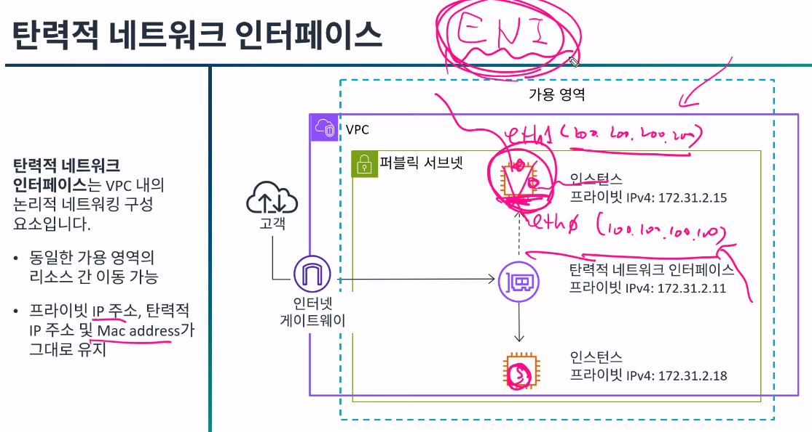
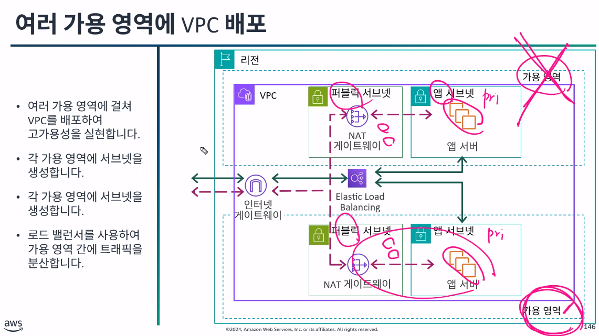
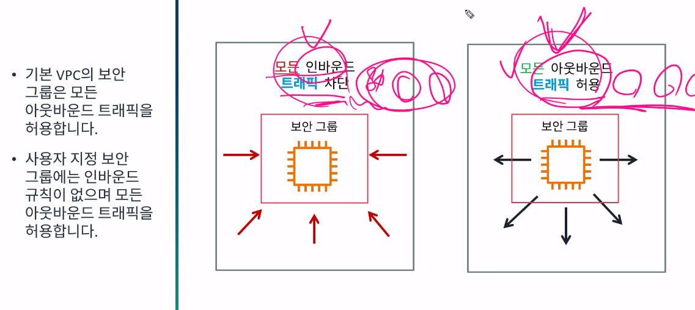

# AWS_Thechnical_essential
**:book: Contents**
* [목표](#과정-목표)

---

### 과정 목표
> AWS에 약 60개 서비스들의 특징과 개념을 배운다.
 전반적으로 시나리오 위주로 진행 됨

### AWS service [모듈1]
- 고객이 AWS 이전하는 이유



### AWS 인프라
> 전 세계 여기저기 있는 여러 데이터베이스 센터를 뜻함

- 데이터 센터
- 가용영역 : 한 지역에 있는 데이터 센터의 모임을 가용영역이라고 하고
-> 고가용성이라는 특징이 있는데 장애가 있을 경우 중복 배포가 가능한 중요 특징 존재
- 리전 : 가용영역들을 모으면 리전 이라고함(즉, 리전은 나라 단위)
- AWS Local Zones
- 엣지로케이션 : Route 53(DNS) 및 cloud Front로 데이터센터를 캐시된 정보만을 다룰 수 있도록 존재하는것 가용영역보다 빠름

### well-architected Framework 핵심요소
- 보안
- 성능 효율성
- 비용 최적화
- 운영 우수성
- 안정성
- 지속 가능성
이 항목들의 모범 권장 사례를 통해 고객의 설문을 보여주는 프레임워크임

---

#### [번외]
- AWS를 다루는 방법
    - 콘솔(버튼)
    - CLI(명령줄)
    - SDK(코드)

```
- 실습 1하면서 궁금점
EC2를 생성하고 그거 Connect에 SessionManager가 있는데 무슨 역할을 하는건지 
-> CLI를 열고 S3를 연결해서 작업을 했음
```
> 답변 : 
보통 EC2에 접속하려면 이렇게 하죠:
퍼블릭 IP + SSH 키(.pem 파일)로 접속
→ ssh -i mykey.pem ec2-user@13.xxx.xxx.xxx

Session Manager를 사용하면
SSH 키도 필요 없고,
포트 22(SSH 포트)도 열 필요가 없으며,
AWS 콘솔에서 바로 브라우저 터미널을 열거나
AWS CLI로 원격 명령을 실행할 수 있기 때문

즉, SSH에서 포트번호던 퍼플릭 IP 등을 그대로 명령어로 치지 않아도 되기 때문
```
- 궁금점 2
그러니까 결국 콘솔, CLI,SDK의 3가지 방법이있는데 배포를할때 뭘다루는건지 외냐면 뭐 콘솔이던 cLI던 EC2, S3등을 만드는데 결국 인스턴스를 만드는게 인스턴스내에 앱개발코드랑 맞는 환경 세팅을 할거고
그 코드들을 여기 인스턴스에 붙이는거 아닌가?
```
> 답변 :
1. CLI와 SSH는 완전히 다른것
```
# 🧭 AWS CLI vs SSH vs Session Manager 정리

## ✅ 1️⃣ CLI vs SSH 비교

| 구분 | CLI (Command Line Interface) | SSH (Secure Shell) |
|------|-------------------------------|--------------------|
| **목적** | AWS 리소스(EC2, S3 등)를 제어 | EC2 인스턴스 내부로 접속 |
| **접속 위치** | 로컬(내 컴퓨터 터미널)에서 AWS API 호출 | EC2 서버로 직접 로그인 |
| **명령 예시** | `aws s3 ls`, `aws ec2 describe-instances` | `ssh -i key.pem ec2-user@13.xxx.xxx.xxx` |
| **결과** | AWS 서비스의 결과 반환 (예: 버킷 리스트) | 인스턴스 내부에서 리눅스 명령어 실행 |
| **인증 방식** | Access Key / Secret Key or IAM Role | PEM 키 파일 (비공개 키) |

🟡 **정리하자면**
- CLI는 **AWS 전체 리소스를 제어하는 관리자 도구**
- SSH는 **EC2 인스턴스 안으로 들어가는 원격 접속 도구**
---

## ✅ 2️⃣ SSH vs Session Manager 비교

| 구분 | SSH | Session Manager |
|------|-----|-----------------|
| **접속 방식** | 외부에서 EC2의 IP와 키를 사용해 접속 | AWS Systems Manager를 통한 내부 연결 |
| **필요 요소** | EC2 퍼블릭 IP, 보안그룹 22번 포트 열기, PEM 키 | SSM Agent + IAM Role(AmazonSSMManagedInstanceCore) |
| **보안성** | 키 유출, 포트 개방 등의 위험 존재 | SSH 포트 불필요, 키 불필요 (보안성 높음) |
| **접속 위치** | 터미널(SSH 클라이언트) | AWS 콘솔 or AWS CLI (Session Manager 기능) |
| **사용 예시** | `ssh -i key.pem ec2-user@<Public-IP>` | 콘솔 → EC2 → 연결 → Session Manager |
| **로그 관리** | 별도 설정 필요 | 자동으로 CloudWatch, S3에 로그 저장 가능 |

🟢 **정리하자면**
- **SSH** : "문을 열고 직접 들어가는 방식" (보안 위험 있음)
- **Session Manager** : "AWS가 내부적으로 터널을 만들어서 안전하게 연결시켜주는 방식"

---

## ✅ 3️⃣ 전체 개념 구조 요약

```text
[내 로컬 PC]
  ├── AWS CLI → AWS API를 호출하여 리소스 제어
  ├── SSH → EC2 인스턴스로 직접 로그인 (외부 접속)
  └── Session Manager → AWS 내부 통로로 EC2 접속 (보안 강화)
```

---
### 궁금점 1과 2 정리
```
## ✅ 1️⃣ SDK란?

**SDK (Software Development Kit)**는  
AWS에서 제공하는 **개발용 라이브러리**로,  
**코드 안에서 AWS를 제어할 수 있게 해주는 도구**입니다.

즉, AWS 콘솔(버튼 클릭)이나 CLI(명령어 입력)를 직접 사용하지 않아도,  
**내가 작성하는 코드 내부에서 AWS 기능을 호출할 수 있도록 도와줍니다.**

---

### 💡 예시: Java 코드에서 S3 파일 업로드

```java
// Java SDK 예시
AmazonS3 s3 = AmazonS3ClientBuilder.standard()
    .withRegion("ap-northeast-2")
    .build();

s3.putObject("my-bucket", "photo.jpg", new File("photo.jpg"));

📌 즉, SDK는 AWS 콘솔이나 CLI를 대체하는 게 아니라,
애플리케이션 내부에서 AWS 기능을 호출하기 위한 프로그래밍 도구입니다.

👉 SDK는 AWS 사이트에서 사용하는 게 아니라,
내 코드(Java, Python, Node.js 등) 안에서 사용하는 것입니다.

🔹 콘솔/CLI의 역할

서버(EC2), DB(RDS), S3 같은 인프라를 세팅

예: EC2 인스턴스 생성, IAM Role 설정, 보안그룹 열기, S3 버킷 만들기

🔹 SDK의 역할

앱 코드 안에서 AWS 서비스와 상호작용

예: 사용자가 업로드한 이미지를 S3에 저장, DynamoDB에 사용자 정보 기록 등


그러나, CLI과 콘솔로도 배포가 가능하다
```

---


### 컴퓨팅 서비스[모듈2] -> 거의 EC2라고 보면됨

### EC2(=가상서버=인스턴스 라고 봐도 됨)인스턴스 시작 관련 고려사항
-> 즉, EC2 배포 시 고려사항
- 이름 및 태그
- 애플리케이션 및 OS 이미지
- 인스턴스 유형 및 크기 : ex) t3.micro
- 키 페어 : SSH
- 네트워크 및 보안 : VPC 가 필수로 필요
- 스토리지 : EBS
- 배치 및 테넌시
- 스크립트 및 메타데이터

### AMI 구성요소
- 인스턴스 볼륨 템플릿 : Linux, Window, MOS 등..
- 시작권한
- 블록 디바이스 매핑
> 앞서 thechnical_essential에서 적었듯 템플릿이기에
`재사용성 용이`,`복구가능`의 특징이 있음

[참조](./aws_thechnical_essential.md#ami-개념)

### AWS Compute Optimizer
- 오버사이즈된 인스턴스 설정을 그에 대한 리포트를 제공해주는 서비스

### Amazon Ec2 키 페어
- SSH 또는 Session Manager

> SSH를 사용하면 키페이를 반드시 설정해야한다.

### EBS
> EC2의 종속적인 file저장하는 EBS임 EC2가 없으면 아무것도 아님
- 그랬을 때 궁금증 : file을 저장하고 폴더 단위로 저장되는거라면 S3랑 뭐가 다른건지 그냥 S3가 있으면 되는거 아닌지
아니면 S3가 EC2에 붙여지면 뭐 EBS가 되는건지?
-> 답변 : 결국 EBS는 밑에서 알 수 있듯 "하드디스크" 같은 블록단위 저장소 역할을 하는것이고 |
EC2와 상관없이 언제든 조회 할 수 있는 클라우드 저장소라고 생각하면됨
### EBS 볼륨(=크기) 유형
- SSD(솔리드 스테이트 드라이브)
- HDD(하드디스크)

[참고 그림]



---

### 네트워킹[모듈3]

### IP주소
> 여기서 `CIDR`이라는 IP를 나타내는 프로토콜 형식을 알 필요가있다.
<u>`CIDR은 CIDR 블록이라는 IP 주소 범위를 지정한다.</u>

[그림]



>그렇다면 앞으로 서브넷이나 VPC를 만들 때  /를 붙이는데 CIDR과 똑같다.
또한, 그림에서 보이듯 약 65,536개의 유니크한 CIDR IP 주소를 가질 수 있는것이다.

### VPC
> VPC는 사설 네트워크이다. 따라서 보안 향상 목적을 가지고 있음

- `서브넷`은 VPC CIDR블록의 하위 집합이다.
- 서브넷 CIDR 블록은 중첩될 수 없습니다.
- 

### 인터넷 게이트웨이

[그렇다면 어떻게 인터넷과 통신을 할까?]
-> 인터넷 게이트웨이를 통해 따로 IP가 할당 된다.
요걸 퍼블릭 라우팅 테블에 지정을 해준다.
* 라우팅이란 퍼블릭/프라이빗 각 서브넷의 이정표가 되는 느낌

퍼블릭 서브넷 : 인터넷 게이트웨이와 연결이 되는 순간 퍼블릭
프라이빗 서브넷 : 기본적으로 생성되면 인터넷 게이트웨이와 연결이 안되고 이후에도 연결을 하지 않고 로컬에서만 쓰는것

### NAT 게이트웨이
> 인터넷 게이트와 비슷한 역할을 하는것
- 인바운드는 막고 대신 프라이빗 서브넷에 있는 내용이 밖으로 나가야할때 퍼블릭 서브넷으로 연결해주는것
[그림]



### 탄력적 네트워크 인터페이스 (ENI)
> 추가적인 네트워크 카드가 필요하여 연결이 필요할 때 사용

[그림]



-> ENI 구조

### 탄력적 IP 주소 (EIP) / 요거는 비용이 들어감
> Elastic Ip? 인거 같은느낌 
public ip중 안바뀌는부분말하는거

### 여러 가용 영역에 VPC 배포
> 여러 가용영역에 결쳐 VPC를 배포하여 고가용성을 실현한다.
즉, 최소 2개 이상의 가용영역을 만들어 놓자 라고 하는것 템플릿말하는듯

[그림]



---

### 서브넷 보안그룹

### 네트워크 액세스 제어 목록 (네트워크 ACL)
> 서브넷단위로 제한
- 방화벽 역할을 함
- 기본적으로 인바운드 아웃바운드 모든 트래픽 허용이다.

### 보안그룹
> 인스턴스 단위
- IP 프로토콜, 포트번호 등을 지정하고 제한함
- 기본적으로 VPC 보안 그룹은 모든 아웃 바운드 트래픽을 허용함
- 사용자 지정보안 그룹에는 인바운드 규칙이 없으며 모든 아웃바운드 트래픽을 허용함

[그림]



### 다중 방어 계층이 있는 인프라 설계
> 결국 두개가 이어져 있어야함

최종적으로 인스턴스에 접근하려면 퍼블릭서브넷에 걸려있는 ACL을 통과하고 인스턴스에 있는 보안그룹을 통과해야 접근가능하기 때문

