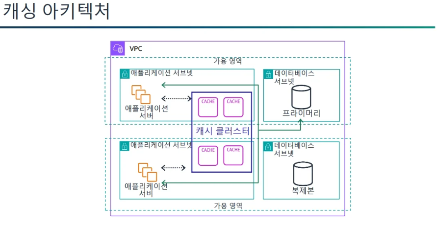
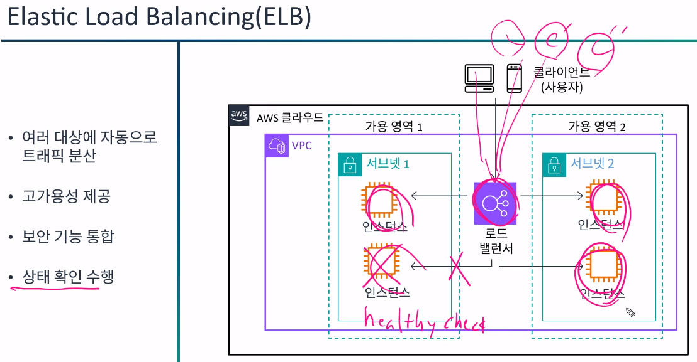
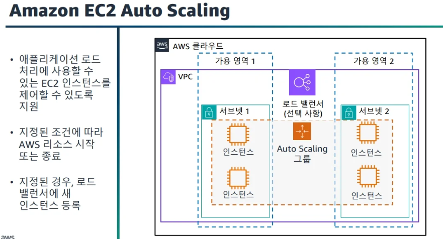
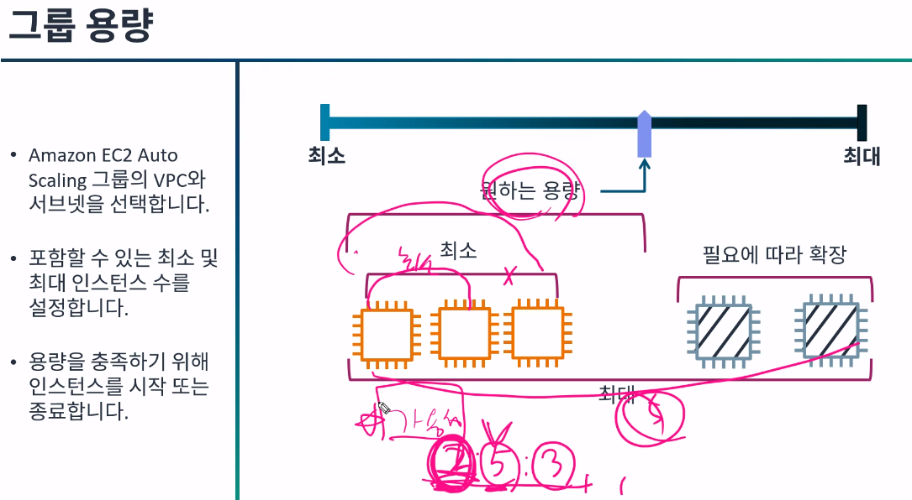
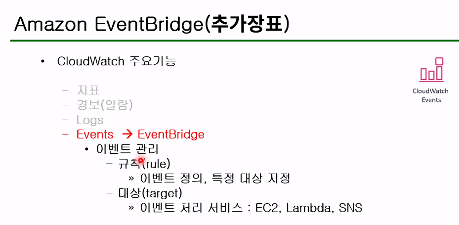
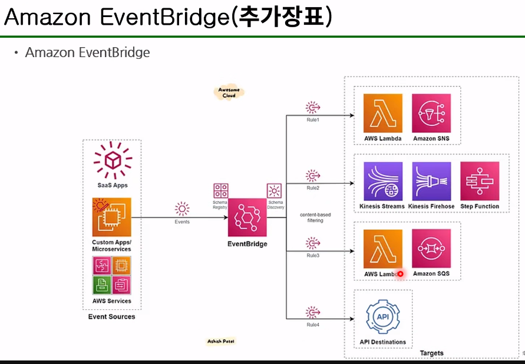

### 어제 수업 정리

### AWS
#### Cloud Compuing <-> On-premise
- Interne
- IT 리소스
- On - demand
- 종량제요금제
** 유연성 : 1회용품

#### AWS 인프라
DCs < AZs < Region
DCs' < Edge Location
DCs'' < Location Zone

#### EC2 : instance
- AMI : AWS 관리형, 고객 생성
- instance type : 사양 ex) t3.micro
- Network : VPC는 강제사항 -> 이걸쪼갠 서브넷 -> VPC와 서브넷사이에 igw와 nat 같은 게이트 웨이가 필요하고 라우팅 테이블이 필요하다.
- 보안그룹 / Nacl

---

# architecting2
**:book: Contents**
* [목표](#과정-목표)

---
### 컴퓨팅 이어서...[모듈4](./aws_architecting.md#컴퓨팅-모듈4)
### 테넌시
> **테넌시(Tenancy)**는 한마디로 가상 서버(EC2 인스턴스)가 물리적인 서버 위에서 어떻게 배치되고, 다른 사용자와 자원을 공유하는지를 의미한다.
즉, “이 물리 서버를 나 혼자 쓸 것이냐, 다른 고객과 함께 쓸 것이냐”를 결정하는 설정
```
| 테넌시 유형 | 설명 | 특징 |
|--------------|------|------|
| **Default (Shared)** | 기본값. 여러 고객의 인스턴스가 동일한 하드웨어를 공유 | 💰 저렴하고 일반적인 워크로드에 적합 |
| **Dedicated Instance** | 특정 계정 전용 물리 서버에서만 인스턴스 실행 | 🔒 물리적 격리 제공, 비용 증가 |
| **Dedicated Host** | 완전히 전용 물리 서버를 고객이 직접 제어 | 🧾 라이선스 제약 있는 소프트웨어에 유리 (예: Windows Server, Oracle) |
```

[그림]


### 인스턴스 배치 그룹 및 사용 사례
[그림]


---

### 인스턴스 스토리지 (스토어 볼륨)
> 기본적으로 EBS도 있지만 휘발성을 띄는 스토어 볼륨을 사용할 수 있다.

[그림]


-> 이건 언제 사용할 수 있냐를 바라보면 캐시에서 사용을 한다.

#### `주의 할점`
> 여기서 그렇다면 EBS라는 SSD나 HDD같은 하드웨어적 저장소가 존재하는데 왜? 인스턴스 스토어를 사용하고 이걸 사용하면 EBS는 안쓰는건가? 라는 의문이 듦 

#### 차이점
| 구분 | EBS (Elastic Block Store) | 인스턴스 스토어 (Instance Store) |
|------|-----------------------------|----------------------------------|
| 저장 위치 | **EC2 외부의 네트워크 스토리지** | **EC2 호스트(물리 서버) 내부 디스크** |
| 지속성 | 인스턴스가 중지돼도 데이터 유지 | 인스턴스가 중지/종료되면 **데이터 사라짐 (휘발성)** |
| 연결 방식 | 네트워크를 통해 연결 (Attach/Detach 가능) | 인스턴스 시작 시 자동 연결, 교체 불가 |
| 사용 목적 | 일반적인 데이터 저장 (운영체제, DB 등) | 임시 저장, 캐시, 버퍼, 임시 계산 데이터 |
| 요금 | 별도 과금 (GB·IOPS 단위) | 인스턴스 요금에 포함되어 있음 |

```
[실제구조]

EC2 인스턴스
├── 루트 볼륨 (EBS)
└── 인스턴스 스토어 (임시 디스크)
```

<u>결론 : EBS에는 OS, 애플리케이션, 중요 데이터 저장하고, 인스턴스 스토어는 /mnt나 /media 같은 경로로 마운트되어 임시 데이터 저장</u> 

---

### 서버리스 컴퓨팅

특징
- 고가용성
- AWS에서 완벽하게 관리

### Lamda
특징 :
- 서버리스 컴퓨팅
- 지원 되는 Langeage : Node.js, java 등
- 최대 15분 동안 실행
- 최대 10GB 메모리 지원
- 이벤트 트리거 기능이 있음 (제한된 서비스에대해서)


---

### 계정보안 [모듈2]

### 보안 주체 자격 증명

### 계정루트사용자
- 모든 AWS 서비스에 대한 전체 엑세스 권한 보유
- 단일 계정 모델에서는 권한을 제어할 수 없음
- AWS와의 일상적인 사아호 작용에 사용하면 안됨

### IAM 사용자
- 권한에 따라 작업을 수행할 수 있음
- 프로그래밍 방식 액세스는 AccessKey값이 있어야함 -> IAM에서 발급 받는것

### IAM 정책을 사용하여 권한 설정
- 사용자에게 서비스에 맞는 정책을 부여하고
- 정책 생성기를 통해 추가적인 정책을 부여할 수 있음

### IAM 사용자 그룹
> 유저를 그룹에 속하게 할 수 있음

- 그룹에 정책을 부여해놓으면 그 그룹에 100명을 속하게 하면 100명 모두 동일한 정책을 부여가 된다.
- 즉, 그룹 내 모든 사용자에게 정책 적용

### 자격 증명 기반 정책 유형
- AWS 관리형
    - 서비스 엑세스
    - 직무
- 고객 관리형
    - 사용자 정의 정책

### AWS 서비스 권한 제어방식
- 사용자 중심 기반 : IAM 정책
- 리소스 중심기반 : S3, Glager, KMS, Sas 와 같은 몇몇 서비스는 해당 리소스에 들어가 제어할 수 있다.
-> 리소스 정책 JSon은 "Principal" 이 존재 함

### IAM 정책 평가 방법
[그림]


결국 명시적(effect)으로 권한 지정을 하지 않는 이상 암시적 거부가 된다.
따라서 초기 정책은 아무것도 설정되지 않기에 모두 거부가 되는것

---

### IAM 역할(role)
> 역할은 정책을 유저한테도 할당할수 있고, 그룹에도 할수 있고, 역할(role)에도 할 수 있음 -> 이때 최소권한 원칙이 있음

[그림]


그렇다면 역할은 무엇이냐

- 사용자에게 잠시 다른 권한을 위임할때
- EC2와 같은 서비스가 다른 서비스에서의 권한을 사용해야 할 때
- 자격증명 연동 시 : 즉 한 사용자나 그룹이 권한을 가지고 있는데 다른 계정에있는 권한을 건드려야할 때 잠시 role의 권한을 건드릴 수 있음

`결국 role에 권한을 부여해 놓으면 임시로 권한을 사용할 수 있다.`

### 심층 방어


---

### 다중 계정 관리

계정이 많아지면 관리해야하는 계정이 많아지고 결제나 이런 부분에서 문제를 겪음

[해결 방법]
### AWS Oragnizations 사용


```
Oraganizations란 여러 AWS 계정을 하나의 그룹(조직)으로 묶어서 중앙에서 관리할 수 있게 해주는 서비스입니다.

예를 들어,

본사 계정 (관리 계정)

개발용 계정

테스트용 계정

운영용 계정
이렇게 여러 개의 계정을 하나로 묶어 관리할 수 있습니다.

즉,
👉 Organizations = 계정 단위의 통합 관리 도구
```
이 중 SCP라는게 존재 함
: 이 조직(또는 하위 계정)에서 어떤 AWS 서비스를 사용할 수 있는지”를 제어하는 상위 제한 정책

약간 IAM이랑 좀 헷갈렸는데 
>IAM 정책은 개별 사용자·역할 단위,
>SCP는 계정 전체 단위로 적용됩니다
---

### AWS Storage service [모듈5]
> 대표적으로 S3가 있다.
 
// TODO : 스토리지 좀 더 보기 주말에 생각보다 내용 많음

### Amazon S3
> 내구성이 뛰어난 개체 스토리지 솔루션 입니다.
- 혁신 가속화
- 민첩성 향상
- 비용절감
- 보안 강화
- 내구성 설계를 한다

---

### 데이터베이스 [모듈6]
> AWS에는 다양한 데이터베이스서비스가 존재하는데
`관계형`, `비관계형` 데이터베이스로 크게 나뉜다.

- 관계형은 : Amazon RDS, Aurora
- 비관계형 : DynamoDB, ElastiCahe

### 관리형 서비스와 비관리형 서비스
[그림]


### RDS 데이터 베이스 엔진
>Amazon RDS는 메모리, 성능 또는 I/O에 최적화된 7개의 데이터베이스 엔진에서 사용할 수 있습니다.
데이터베이스 엔진에는 다음 항목이 포함됩니다.

- Amazon Aurora
- PostgreSQL
- MySQL
- MariaDB
- Oracle Database
- SQL Server
- IBM Db2

### RDS 다중 AZ(Multi-AZ)배포
> 다중 배포
- 다른 가용영역의 대기 DB 인스턴스에 데이터 복제
- 읽기 전용 목적으로 사용되지 않음

-> 이에 따라 만약 하나의 DB가 장애가 생겼을 시 자동으로 대기 DB가 프라이머리 DB로 승격이 됨

### 읽기 전용 복제본
> 읽기 전용 복제본을 사용하여 다음을 수행할수 있다.


-> 읽기 전용 복제본이 문제가 생겨도 마스터로 승격을 시킬 수 있다.

### 저장데이터 암호화

[Aurora]는 AWS 자체 기능이다보니 
보안이나 여러 기능에 대해서 완전 관리형 DB이다.
-> MySql이나 Postgre를 호환한다.

---

### DB 캐싱

### 캐싱 아키텍쳐
> AWS에서는 Amazon ElastiChahe이다.



캐싱을 하고 이걸 어떻게 접근할꺼냐 했을 때 접근 방법
- 레이지 로딩 (Lazy loading)
1. 애플리케이션이 캐시에 데이터 요청
2. 캐시 미스
3. 애플리케이션이 데이터베이스에서 누락된 데이터 요청
4. 데이터베이스에서 데이터 반환
5. 애플리케이션이 번환된 값을 캐시에 작성

- 라이트 스루(Write-through)
1. 애플리케이션이 데이터베이스에 데이터 기록
2. 애플리케이션이 캐시에도 데이터 기록

앞선 두개의 캐시방법을 사용하는데 있어 TTL을 사용하게 되면 
어느정도 뮤효화 하는데 있어 효율적임

- Amazon DynamoDB Accelerator(DAX)
> dynamoDB 앞단에 캐시를 다는 전략

• DynamoDB를 위한 완전관리형 고가용성 캐시
• 마이크로초 응답 시간을 제공
• 초당 수백만 건의 읽기 요청에 대해 크기 조정 가능

---

## 모니터링 및 규모 조정 [모듈7]
- 운영관리자는 AWS 계정 활동을 모니터링하고 로깅하는데 필요한 서비스를 알라야한다.
- 임계값을 설정하고 인프라 변경에 대한 알림을 받아야한다

### 로드 밸런싱
### Elastic Load Balancing(ELB)


### ELB 로드 밸런서 유형
- Application Load Balancer Http 및 HTTPs
• 유연한 애플리케이션 관리
• 트래픽의 고급 로드 밸런싱
• 애플리케이션 계층(계층 7)에서 작동
• 내부적으로 인스턴스형태로 구성되어있어 보안그룹을 설정할 수 있다.

- Network Load Balancer TCP 및 UDP
• 탁월한 성능 및 고정 IP
• TCP 트래픽의 로드 밸런싱
• 전송 계층(계층 4)에서 작동

- Gateway Load Balancer IP
• 유연한 애플리케이션 관리
• 트래픽의 고급 로드 밸런싱
• 네트워크 계층(계층 3)에서 작동

### 자동 규모 조정 (Auto Scaling)


```
규모 조정 정책을 지정하면 Amazon EC2 Auto Scaling이 애플리케이션의 늘어나거나 줄어드는 수요에 따라 인스턴스를 시작하거나 종료할 수 있습니다. Amazon EC2 Auto Scaling은 ELB와 통합되므로 하나 이상의 로드 밸런서를 기존 Amazon EC2 Auto Scaling 그룹에 연결할 수 있습니다. 로드 밸런서를 연결하면 그룹의 인스턴스를 자동으로 등록하고 수신 트래픽이 인스턴스 전체에 분산됩니다.
예제의 VPC 하나에는 2개의 별도의 가용 영역에 2개의 서브넷이 있습니다. 
각 서브넷에서 2개의 EC2 인스턴스가 하나의 Auto Scaling 그룹의 일부로 시작됩니다. 로드 밸런서는 표시되어 있지만 이 로드 밸런서에 Auto Scaling 
그룹을 반드시 등록할 필요는 없습니다.
```

### EC2 오토 스케일링 구성요소

- 그룹 용량
> 최대와 최소 인스턴스 수를 설정해야한다
- 최소는 가용성 기준으로 최소를 정하고
- 최대는 사용자가 부담할 수 있는 비용 기준으로 설정


- 규모조정 방법 (오토스케일링 방법)
> 가장 중요한건 동적 조정
-> Cloud Watch와 같이하는것 Cpu 조정

- 고정 유지
> 고정된 인스턴스 수 유지 관리 - 
지정된 실행 인스턴스 수가 항상 유지 관리되도록 그룹을 구성할 수 있습니다. 인스턴스가 비정상 상태가 되면 그룹에서는 비정상 인스턴스를 종료하고 이를 대체할 다른 인스턴스를 시작합니다.

- 수동 조정
> 수요에 따라 동적으로 규모 조정 - 
규모 조정 정책에서는 특정 CloudWatch 지표를 추적하도록 Amazon EC2 Auto Scaling에 지시합니다. 이 정책은 연결된 CloudWatch 경보가 ALARM 상태일 때 수행할 작업을 정의합니다.

- 예약 조정
> 일정을 기반으로 규모 조정 - 
일정에 따라 규모를 조정할 수 있습니다. 그러면 크기 조정 작업이 시간 및 날짜의 함수로 자동으로 수행됩니다. 일정에 따른 크기 조정은 그룹의 인스턴스 수를 늘리거나 줄여야 할 때를 정확히 파악하고 있는 경우에 유용합니다.

- 동적 조정 -> Cloud Watch
> 수동으로 규모 조정 - 
수동 규모 조정은 리소스 규모를 조정하는 가장 기본적인 방법입니다. 그룹의 최대, 최소 또는 원하는 용량의 변경만 지정합니다. Amazon EC2 Auto Scaling은 인스턴스를 생성 또는 종료하는 프로세스를 관리하여 업데이트된 용량을 유지합니다.

- 예측 조정
> 사전 예방적으로 규모 조정 - 
예측 크기 조정과 동적 크기 조정(각각 사전 및 사후 접근 방식)을 결합하여 더 빠르게 EC2 용량의 규모를 조정할 수 있습니다. 예측 크기 조정을 사용하여 트래픽 흐름의 일별 및 주별 패턴에 앞서 Auto Scaling 그룹의 EC2 인스턴스 수를 늘립니다

-> 이후에 CloudWatch 모듈7 처음부분으로
### CloudWatch의 경보

[추가장표]



---

// TODO : 주말 10/26일 일요일 까지 스토리지 ~ 모니터링 및 크기조정 모듈[5~7] 까지 좀 더 자세히 공부 후 실습 3,4 완료 하기 
예상 소요 시간 : 진짜 집중하면 2시간? + 실습 30분? -> 아니면 약 3시간 정도 예상

`지금 바로 안하는 이유` : 일단 내가 안함.. 너무 늦게까지 안함 ㅋ + 수업동안 복습을 해줌 강사님이
