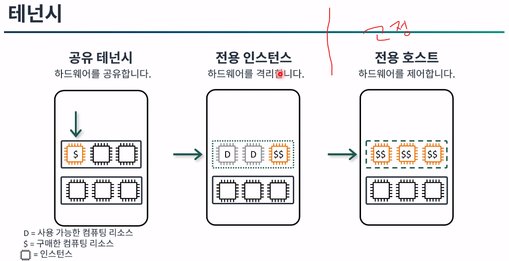

### 어제 수업 정리

### AWS
#### Cloud Compuing <-> On-premise
- Interne
- IT 리소스
- On - demand
- 종량제요금제
** 유연성 : 1회용품

#### AWS 인프라
DCs < AZs < Region
DCs' < Edge Location
DCs'' < Location Zone

#### EC2 : instance
- AMI : AWS 관리형, 고객 생성
- instance type : 사양 ex) t3.micro
- Network : VPC는 강제사항 -> 이걸쪼갠 서브넷 -> VPC와 서브넷사이에 igw와 nat 같은 게이트 웨이가 필요하고 라우팅 테이블이 필요하다.
- 보안그룹 / Nacl

---

# architecting2
**:book: Contents**
* [목표](#과정-목표)

---
### 컴퓨팅 이어서...[모듈4](./aws_architecting.md#컴퓨팅-모듈4)
### 테넌시
[그림]

### 인스턴스 배치 그룹 및 사용 사례
[그림]

### 인스턴스 스토리지 (스토어 볼륨)
> 기본적으로 EBS도 있지만 휘발성을 띄는 스토어 볼륨을 사용할 수 있다.
[그림]

-> 이건 언제 사용할 수 있냐를 바라보면 캐시에서 사용을 한다.

### 서버리스 컴퓨팅

특징
- 고가용성
- AWS에서 완벽하게 관리

### Lamda
특징 :
- 서버리스 컴퓨팅
- 지원 되는 Langeage : Node.js, java 등
- 최대 15분 동안 실행
- 최대 10GB 메모리 지원
- 이벤트 트리거 기능이 있음 (제한된 서비스에대해서)

---

### 계정보안 [모듈2]

### 보안 주체 자격 증명

### 계정루트사용자
- 모든 AWS 서비스에 대한 전체 엑세스 권한 보유
- 단일 계정 모델에서는 권한을 제어할 수 없음
- AWS와의 일상적인 사아호 작용에 사용하면 안됨

### IAM 사용자
- 권한에 따라 작업을 수행할 수 있음
- 프로그래밍 방식 액세스는 AccessKey값이 있어야함 -> IAM에서 발급 받는것

### IAM 정책을 사용하여 권한 설정
- 사용자에게 서비스에 맞는 정책을 부여하고
- 정책 생성기를 통해 추가적인 정책을 부여할 수 있음

### IAM 사용자 그룹
> 유저를 그룹에 속하게 할 수 있음

- 그룹에 정책을 부여해놓으면 그 그룹에 100명을 속하게 하면 100명 모두 동일한 정책을 부여가 된다.
- 즉, 그룹 내 모든 사용자에게 정책 적용

### 자격 증명 기반 정책 유형
- AWS 관리형
    - 서비스 엑세스
    - 직무
- 고객 관리형
    - 사용자 정의 정책

### AWS 서비스 권한 제어방식
- 사용자 중심 기반 : IAM 정책
- 리소스 중심기반 : S3, Glager, KMS, Sas 와 같은 몇몇 서비스는 해당 리소스에 들어가 제어할 수 있다.
-> 리소스 정책 JSon은 "Principal" 이 존재 함

### IAM 정책 평가 방법
[그림]

결국 명시적(effect)으로 권한 지정을 하지 않는 이상 암시적 거부가 된다.
따라서 초기 정책은 아무것도 설정되지 않기에 모두 거부가 되는것

---

### IAM 역할(role)
> 역할은 정책을 유저한테도 할당할수 있고, 그룹에도 할수 있고, 역할(role)에도 할 수 있음 -> 이때 최소권한 원칙이 있음

[그림]

그렇다면 역할은 무엇이냐

- 사용자에게 잠시 다른 권한을 위임할때
- EC2와 같은 서비스가 다른 서비스에서의 권한을 사용해야 할 때
- 자격증명 연동 시 : 즉 한 사용자나 그룹이 권한을 가지고 있는데 다른 계정에있는 권한을 건드려야할 때 잠시 role의 권한을 건드릴 수 있음

`결국 role에 권한을 부여해 놓으면 임시로 권한을 사용할 수 있다.`

### 심층 방어

---

### 다중 계정 관리

계정이 많아지면 관리해야하는 계정이 많아지고 결제나 이런 부분에서 문제를 겪음

[해결 방법]
### AWS Oragnizations 사용

---

### AWS Storage service [모듈5]
> 대표적으로 S3가 있다.

### Amazon S3
> 내구성이 뛰어난 개체 스토리지 솔루션 입니다.
- 혁신 가속화
- 민첩성 향상
- 비용절감
- 보안 강화
- 내구성 설계를 한다

---

### 데이터베이스 [모듈6]
> AWS에는 다양한 데이터베이스서비스가 존재하는데
`관계형`, `비관계형` 데이터베이스로 크게 나뉜다.

- 관계형은 : Amazon RDS, Aurora
- 비관계형 : DynamoDB, ElastiCahe

### 관리형 서비스와 비관리형 서비스
[그림]

### RDS 데이터 베이스 엔진
>Amazon RDS는 메모리, 성능 또는 I/O에 최적화된 7개의 데이터베이스 엔진에서 사용할 수 있습니다.
데이터베이스 엔진에는 다음 항목이 포함됩니다.

- Amazon Aurora
- PostgreSQL
- MySQL
- MariaDB
- Oracle Database
- SQL Server
- IBM Db2

### RDS 다중 AZ(Multi-AZ)배포
> 다중 배포
- 다른 가용영역의 대기 DB 인스턴스에 데이터 복제
- 읽기 전용 목적으로 사용되지 않음

-> 이에 따라 만약 하나의 DB가 장애가 생겼을 시 자동으로 대기 DB가 프라이머리 DB로 승격이 됨

### 읽기 전용 복제본
> 읽기 전용 복제본을 사용하여 다음을 수행할수 있다.

-> 읽기 전용 복제본이 문제가 생겨도 마스터로 승격을 시킬 수 있다.

### 저장데이터 암호화

[Aurora]는 AWS 자체 기능이다보니 
보안이나 여러 기능에 대해서 완전 관리형 DB이다.
-> MySql이나 Postgre를 호환한다.

