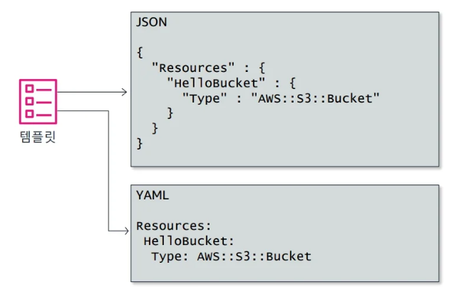
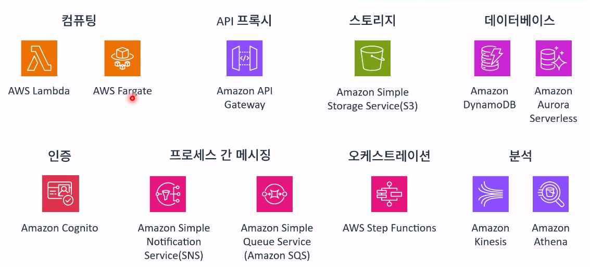

### AWS architecting 3

### 자동화 [모듈8]
 
### AWS CloudFormation 개요와 이해
> AWS에서 제공하는 대표적인 IaC 도구입니다.
CloudFormation은 위처럼 YAML 또는 JSON으로 작성된 템플릿 파일을 읽어서
EC2, S3, RDS 등 AWS 리소스 전체를 자동으로 생성·삭제·관리해줍니다.

[템플릿(포멧)]

- JSON이나 YAML로 작성
- 생성하거나 수정할 리소스를 기술
- 소스코드로 처리됨 
    - 코드 검토
    - 버전 제어

### 인프라(Infrastructure)
> 서비스가 돌아가기 위한 기반 시스템
즉, 앱만든게 돌아가려면 "서버,네트워크,스토리지,보안설정 등"이 필요한데 이걸 통틀어 `인프라`라고 부름

### 코드형 인프라(IaC)
> 콘솔에 들어가서 하나하나 EC2를 만들고 보안그룹 설정하고 등... 이런 GUI로 수동하지 않고
`YAML/JSON`을 통해 코드처럼 정의 한 후 자동으로 생성 삭제하는 방식

- 복제, 재배포, 용도 변경이 가능합니다.
- 인프라와 애플리케이션의 버전 관리를 제어할 수 있습니다.(업데이트)
- 드리프트를 탐지할 수 있습니다.
- 서비스를 마지막 정상 상태로 롤백할 수 있습니다.
-> 환경버전관리에 대해 유리하다.

### 인프라 도구

- IaC 자동화 
    - 클라우드포메이션 -> 얘는 모든 전체적인것
    - AWS Elatic Beanstalk -> 심플하게말하면 WAS를 만들어주는 것 -> 자동으로 배포하게 해준다는데 그럼 CD역할 하는건가? -> CD에 가깝다
    - AWS 솔루션 라이브러리
    - AWS SDK
    - Amazon Q -> 코딩챗봇

- 관리 
    - Systems Manager - EC2에대해서 다룰 때

### Systems Manager
> 여러 EC2들을 한꺼번에 관리할 수 있도록 하는 서비스

## 핵심 결론
> IaC (Infrastructure as Code) 는 “인프라를 코드로 관리하는 방식”이라는 개념이고,
CloudFormation 은 그 IaC 방식을 구현한 도구(서비스) 중 하나이다!

---

### 컨테이너 [모듈9]
> 지금까지는 가상머신 방법으로 배포 설정을 배웠던것이고 컨테이너 개념을 배우면서
MSA 환경으로 올릴 수 있다는것을 배움

* [참조](#가상화-및-추상화-수준) 

-> 여기서 가상머신 방법이였음

### 개요
- 비즈니스 요청 사항

: 애플리케이션 구성요소를 독립적으로 올리면 다른 서비스에대해 영향을 받지않게하고싶다.

- 마이크로서비스
- 컨테이너
- 컨테이너 서비스
- 솔루션 제시
- 지식 확인

### 마이크로 서비스
> 얘는 보니까 MSA 말하는 듯

### 컨테이너
> 결국 얘는 애플리케이션임

### 컨테이너 특징
- 반복 가능
- 독립적 환경
- VM보다 더 빠른 가동/중단 속도
- 이식성
- 확장성

### 가상화 및 추상화 수준

### 컨테이너 서비스
> AWS에 존재하는 컨테이너 서비스 종류들

- `각 기능들 확인 해봐야함` | 근데 각 내용이 매우 많은 듯 EKS같은 경우에는 3일짜리 강의도 있다함
- 여기서는 이런 서비스가 있다 정도만 설명한다.

근데 ECS를 통해 모놀리식에서 컨테이너 기반 마이크로서비스로 변경할 수 있게 됨

### [모듈9] 정리
이 모듈은 마이크로서비스를 지향하는 방식에 대해 설명한것
AWS도 이런게 있다를 소개하는 정도

---

### 네트워킹2 [모듈10]
> 여기서는 프라이빗 통신을 해야할 때 어떤 서비스를 사용할 수 있는지를 배우는 모듈

-> 네트워킹2를 들어가기전 이전 네트워크를 배운 내용과 + 앞으로 배울 내용을 한번 정리한 내용

### 이 모듈에서는..
> 어떻게 VPC간 프라이빗 상태로 연결할 수 있을까? 가 관건
- VPC 엔드포인트
- VPC 피어링
- 하이브리드 네트워킹
- AWS Transit Gateway
- 솔루션 제시
- 지식 확인

-> 에 대해 학습

### 하이브리드 네트워킹
> 온프레미스(On-premises) 환경과 AWS 클라우드를
하나의 네트워크처럼 연결하는 구조를 말한다.
`즉, 회사 내부망 + AWS를 하나의 네트워크처럼 사용`

### AWS Direct Connect
> AWS Direct Connect는
“AWS와 온프레미스를 전용선(Private Line)으로 직접 연결하는 서비스”
`즉, 인터넷을 거치지 않고 전용 회선(Private Connection) 으로 AWS 네트워크에 접속할 수 있게 해준다.`

-> `온프레미스 → 전용선(Direct Connect) → AWS VPC` 이 구조가 됨

### VPN 또는 Direct Connect 중 선택
> VPN이나 DC 모두 결국 온프레미스 환경과 AWS를 직접 연결하기 위한 수단임
그러나 둘의 차이점은 단순히 연결 방식의 차이가 있는 것이고
비용,속도,보안,규모가 다르기 때문이다. 더 큰 기업일 수록 DC가 필요

| 구분            | **VPN (Virtual Private Network)** | **Direct Connect (DC)**           |
| ------------- | --------------------------------- | --------------------------------- |
| **연결 방식**     | 인터넷 위에 **암호화 터널** 생성              | AWS와 **물리적 전용선(Private Line)** 연결 |
| **속도 / 지연시간** | 인터넷 품질에 따라 변동                     | 일정하고 빠름 (전용 회선)                   |
| **보안성**       | 암호화로 보호 (인터넷 사용)                  | 인터넷 자체를 거치지 않음                    |
| **비용**        | 저렴                                | 고가 (회선 설치비 + 유지비)                 |
| **구축 속도**     | 빠름 (설정만 하면 됨)                     | 느림 (물리적 연결 필요)                    |
| **적합한 환경**    | 테스트, 소규모 기업, 단기 연결                | 대기업, 금융권, 대용량 전송, 장기 연결           |

### VPC 피어링
> VPC간 프라이빗한 네트워크 통신

- 리전 내/리전 간 지원
- 교차 계정 지원
- 전이적 피어링을 지원하지 않음 

* 참고 : IP 공간은 중복 될 수 없음

### 다중 VPC 피어링 연결

> VPC를 중개역할로 다른 VPC랑 연결을 지원하지 않기 때문에 VPC의 수가 많아지면 
역려하는게 힘들기 때문에 

그걸 보안하기 위해 나온것이 `Transit GateWay`

### Transit GateWay
> 실제 VPC 중개 역할을 하는것

[특징]
- 최대 5,000개의 
- VPC와 온프레미스 환경 연결
- 모든 트래픽의 허브 역할 담당
- 멀티캐스트 및 리전 간 피어링 허용

[네트워크 통신 격리]
> 라우팅 테이블을 통해 VPC 간 통신 격리를 통제할 수 있다.

-> 여기서 궁금점 그렇다면 피어링 방식일 때 각자 가지고있던 라우팅테이블은 어떻게 되는걸까? 
> TGW를 사용하면 각 VPC간 라우팅 테이블이 사라지는게 아니라,
`TGW의 라우팅 테이블이 중앙에서 대신 관리`한다,

즉, 각 VPC의 라우팅 테이블에는 단 하나만 있고 :모든 외부 트래픽은 TGW로 보낸다"
[기존방식]
- 10.0.0.0/16 → 로컬 (자기 자신)
- 0.0.0.0/0 → 인터넷 게이트웨이(IGW)
- 172.16.0.0/16 → 다른 VPC로 (피어링 시 추가)

[TGW방식 적용]
- Destination: 외부 VPC CIDR (예: 0.0.0.0/0)
- Target: Transit Gateway
단순화가 됨

### VPC 엔드포인트
> 프라이빗 서브넷 인스턴스가 AWS 서비스를 사용하려면
(인터넷 게이트웨이, NAT게이트 웨이,퍼블릭 IP주소) 가 필요한데
모든 VPC가 인터넷 게이트웨이가 존재하지 않는 경우도 있는데(왜냐 VPC끼라도 연결되니(=피어링) 대표 VPC만 인터넷 게이트웨이하면 되니까)
이럴 경우 `VPC 엔드포인트`를 통해 통신한다.

- 인터페이스와 같은 역할로 연결되어 앤드포인트 수행
-> //TODO 요 부분은 좀 더 찾아보기 (일요일까지)

| 잠시 화장실 다녀왔는데 약 5분 동영상 저장했으니 확인하기
왔을 때는 그냥 모듈 복습 즉 끝났을 때였음

---

### 서버리스 [모듈11]
> 계속 나오지만 대표적으로 Lamda 존재

#### 서버리스란
- EC2를 만들지 않아도 된다 

즉, 프로비저닝 하거나 관리할 인프라가 없다.

- 소비 단위별 자동크기 조정
- 종량제 요금
- 내장된 보안,고가용성 컴퓨팅

### 서버리스 각 서비스 별 종류

- API GateWay
- Amazon SQS : 메세지 비동기 처리
- Amazon SNS : 게시 구독 유형

만약 이메일보내지지 않는 이런 오류가 발생 시 이런것도 CLoudWatch로 로그를 확인 할 수 있는걸까요?

- Amazon Kinesis : 
- AWS Step Functions : 이게 SQS에서 작용됨

// TODO : 갑자기 비동기, 트랜잭션, 스레드 등 개념 헷갈림, 동시성에 대한 정리를 한거 같은데 이거 다시 확인 필요

### API Gateway
> TODO 서버리스에서 어떻게 적용하는지

### API Gateway 아키텍쳐

### Amazone SQS

# 여기 까지 [실습5]가 진행되어야함 어제는 실습2까지 했음

---

### 엣지 서비스 [모둘12]
>

### 엣지 기본 사항

### 엣지의 AWS 클라우드
> 고객이 중점으로 필요로 하는 모든 위치에서 클라우드 제공

- AWS 리전
- 엣지 로케이션
- AWS 로컬 영역
- AWS Outposts
- AWS Snow 패밀리 : 오프라인상 프라이빗으로 데이터 연결

### 엣지 서비스 아키텍쳐
> 이번 모듈에서는 그림과 같은 AWS 서비스에 대해 설명한다.

[그림]

### Amazon Rout 53
> 사용자가 모든 IP를 다룰 수 없을 때 
`NameServer? -> 관리 -> 연결노드가 많아짐에 따라 -> 나누어서 단위별로 제공하는것이 -> 도메인(kr,amzon, ...) -> DNS다`
AWS에서는 이 DNS를 관리하는게 Rout53

-> 그래서 DNS가 뭔데

### Rout 53 퍼블릭 및 프라이빗 DNS

### 라우팅 정책
- 단순 : IP 개수가 정해져있고 그걸 순차적으로 단순히 돌아가면서 제공
- 장애조치 : primary나 secound IP를 생성하고 primary가 안될 때 secound 선택 (언제나 대기하고있음) -> 따라서 리전간 장애조치도 되나 -> 비용이 2배가 되는 문제가 있다.
- 지리적 위치 : 사용자의 정확한 거리보다, 국가나 지역을 사전에 `지정해져있는` 노드 IP 이동함
- 지리적 근접성 : 거리상 가까운곳
- 지연 시간 기반 : 도달하는 시간이 가까운곳
- 다중값 응답 : 여러개의 IP를 던져주고 클라이언트 앱로직에서 어떤걸 선택할지 선택
- 가중치 : IP 요청 서비스 횟수를 정함 ex) 하나는 3번 하나는 2번 이런식으로

---

### Amazon CloudFront(CDN)
> 분산 캐싱 서비스 : 엣지 로케이션 기반으로 PoP 구성된 네트워크 사용

- 글로벌 콘텐츠 전송 네트워크
- WAF및 AWS Shield와 통합 -> 이후에 자세히 봄
- 정적(이미지나 동영상) 또는 동적 콘텐츠
- 내장된 보안 기능

### 엣지 캐싱
- 엣지 로케이션에서 데이터를 캐시하여 지연 시간 단축
- 보안 강화

### CloudFront 캐싱
> 엣지 캐싱과 동일

---

### DDos 보호

#### DDos 공격
> 감염된 각 호스타가 공격에 참여하여 목표 대상을 압도하기 위한 대량 요청을 생성

-> 합법적인 요청을 수 많은 요청 폭주시켜 처리하지 못하게 함

`이런 공격이 있는데 이걸 어떻게 완화할 수 있냐를 AWS어떻게 적용하는지 알아보는것`

[복원력 참조 아키텍쳐]

[추가]
ELB를 통해서도 DDos 공격을 막을 수 있음

### AWS Shield
> AWS에서 애플리케이션을 보호하는 관리형 DDos 보호 서비스

- 두가지 보호 유형 제공 :
    - AWS Shield Standard -> 무료
    - AWS Shield Advanced -> 좀 비쌈(상시로 방어해줌)

### AWS WAF
> AWS 웹애플리케이션 전용 방화벽 서비스

-> WAF 안에 ACL이 있고

#### ACL 규칙 구문을 사용하여 트래픽 제어
- 공격방지
- 트래픽 필터링
- 패턴 일치
- 논리적 연산

---

### AWS Outposts
> 지연시간을 빠르게 AWS 쓰고싶다. 또한 기업의 전산실이 따로 있어야한다 할 때 AWS를 쓰게끔 도와주는것
즉, 사무실의 온프레미스 환경이나 데이터 센터에서 AWS 서비스를 호스트할 수 있게 도와주는것

그림으로 표현하자면 

-> 사실상 이렇게 했을 때 AWS의 모든 서비스를 사용할 수는 없음
제한적인 목록의 것들만 사용할 수 있음

---

