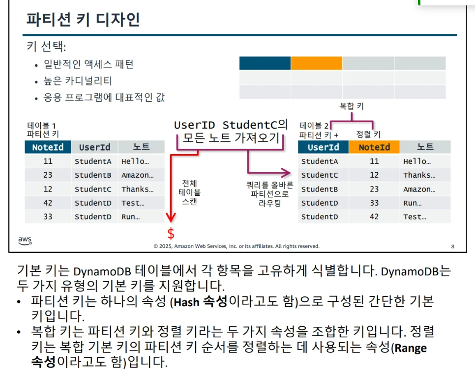
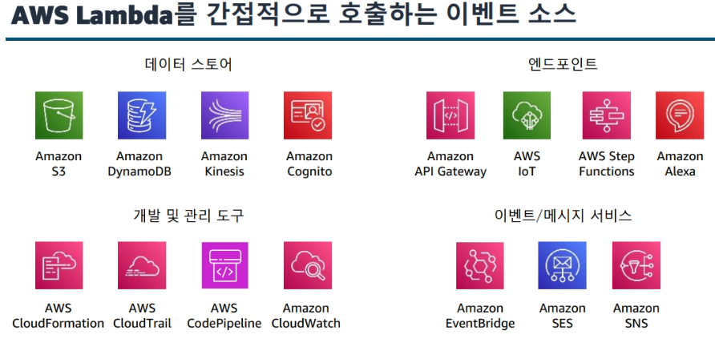
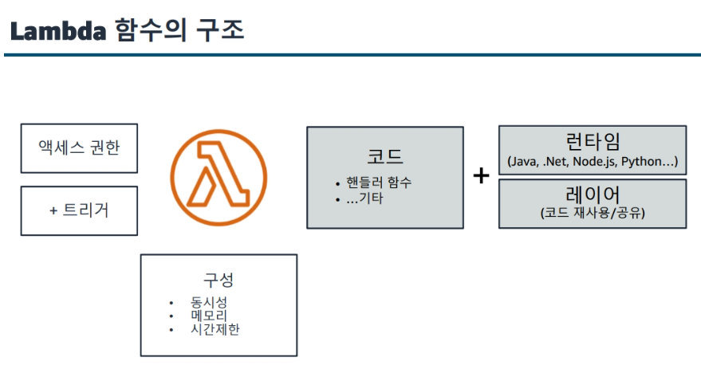
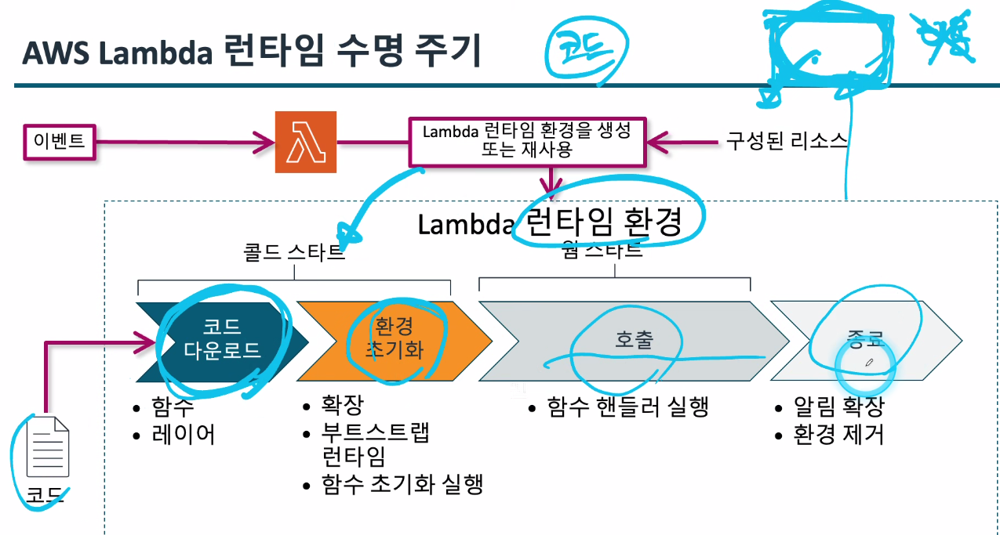

### Developing 2일차

### 데이터베이스 시작 및 옵션 [모듈7]

### AWS 데이터베이스 서비스 비교
- 관계형 : Amazon Relational Database Service(Amazon RDS),Amazon Redshift
    - 관계형 테이블
- 비관계형  : DynamoDB, Neptune, ElastiCache
    - 키 | value - DynamoDB
    - 그래프 - Neptune
    - 인메모리 캐싱 - ElastiCache

### NoSQL에 관하여
> DynamoDB가 대표적으로 DynamoDB에 대해 설명

-> TODO : 여기부분 수업 안들어서 찾아봐야함

### DynamoDB 엑세스하기
- NoSQL Workbench 가 있음 -> https://docs.aws.amazon.com/ko_kr/amazondynamodb/latest/developerguide/workbench.settingup.html 여기서 다운
- partiQL -요건 관계형 DB와 비슷한 문법을 사용해서 익숙함
- Dynamo Local
- CLI
- SDK

---

### 데이터베이스 작업 처리 [모듈8]

### 제어영역 및 데이터 영역 작업
- 제어영역
    - create
    - update
    - delete
    - describe
    - list
- 데이터 영역 작업
    - put
    - update
    - get
    - delete

### NoSQL 설계 주요 개념
> 개발자는 모든 액세스 패턴을 식별할 때까지 테이블 생성을 시작하면 안 됩니다. 
데이터가 액세스되는 방식을 이해하는 것이 테이블 설계의 관건

- 고려사항
    - 데이터 크기
    - 데이터 형태
    - 데이터 속도

### 파티션 키 디자인
> 키는 파티션 키랑 정렬 키 두가지를 사용한다.

### 인덱스 설계

- 보조 인덱스를 사용 
    - 보조 인덱스를 사용하면 기본 테이블이 지원할 수 있는 것보다 다양한 쿼리가 가능해집니다. 이러한 쿼리는 여전히 속도가 빠르고 상대적으로 저렴합니다.
- 관련 데이터를 함께 유지 
    - 이 원칙은 쿼리에 대한 시기적절한 응답을 보장하는 데 가장 중요한 요소로 간주됩니다. 
- 정렬 순서를 사용 
    - 핵심 설계가 함께 정렬할 것을 요구하는 경우, 관련 항목을 그룹으로 묶어 효율적으로 쿼리할 수 있습니다.
- 쿼리를 분산 
    - 많은 볼륨의 쿼리를 데이터베이스의 특정 부분에 몰리도록 하지 않는 것이 중요합니다. 
    I/O 용량을 초과할 수 있기 때문입니다. 대신 트래픽을 가능한 여러 파티션으로 분산시켜 핫 스팟이 방지되도록 데이터 키를 설계

-> 쿼리를 분산 
> 관계형 DB에서 테이블을 쪼개는 이유 -> 정규화 -> 이걸 하는 이유 -> 데이터 중복을 없애게 하기 위해 -> 겹치는 데이터를 테이블을 쪼개서 나눔 -> 공간이 줄어든다

### 초기 처리량 선택
> 비용까지도 고려를 해야한다.

- 초기 처리량 설정
    - 항목 크기
    - 예상 읽기 및 쓰기 속도
    - 읽기 일관성 요구 사항
- `프로비저닝 용량 모드` (!!중요!!)
    - 예측 가능한 트래픽
    - 알려진 워크로드
    - 사용 가능한 예약 용량
- 온디맨드 용량 모드
    - 알 수 없는 워크로드
    - 예측 불가능한 트래픽

> 이후 모듈 8은 읽기만 하면됨

### DynamoDB 캐싱
> // TODO 일단 데이터를 캐싱을 하면 로그인 같은거 세션에 저장한다고 했을 때 보안 위험이 있는데 
아 잠만 그냥 캐싱에 대해서 다시 봐야할듯

[옵션]
?? 

---

### 애플리케이션 로직 처리 [모듈9]
> 이 모듈에서 얻어 갈것
- Lamda 작동방식
- SDK를 통한 함수개발
- Lambda 함수를 위한 트리거 및 권한 구성 
- Lambda 함수테스트, 배포, 모니터링

### 컴퓨팅 서비스 개요
> 추상화 수준

인스턴스(EC2) < 컨테이너(ECS/EKS) < 서버리스(Lambda)

### Lambda를 간접적으로 호출하는 이벤트 소스
> 그림에 나오는 것들과 함께 연결되어 람다가 올라간다고 보면 됨

### Lambda 함수의 구조 

### 람다의 호출 방법
- 동기식(직접 호출) 
    - ex) 음식점 줄을 스는것

- 비동기식(푸시)
    - ex) 음식점 대기표 뽑고 다른데 돌아 다니는거

- ESM - 이벤트 소스 매핑(폴링)
    - ex) 일이 있어요? 뭐 잇어요? 하면서 물어보는것

### 람다의 런타임 수명주기
> 람다는 코드를 만들어 놔도 비용이 나가지 않음
실제 비용이 나가는건 호출 이후 실행이 될 때 나감

- 람다는 호출이 되어 실행이 될때 런타임환경으로 사용이 됨

-> 여기서 콜드 스타트 즉 호출되기전 대기 시간이 있는데 이때 시간이 좀 많이 걸림
그걸 해결하기 위해 콜드 스타트를 최소화 하는 방법을 구상한다.

### 콜드 스타트 최소화 하기

- Lambda 함수 예약
    - 특정 주기로 실행하기 위한 규칙 생성

- 웜스타트 (미리 배포해놓는것)
    - 프로비저닝된 동시성
    - 지정된 개수만큼 함수 런타임 환경을 최기화

---

### 권한

- 호출 권한
    - 이벤트 소스에 Lambda를 호출할 권한을 부여합니다.
    - Lambda 함수와 관련된 리소스 정책을 업데이트합니다.
    - Lambda AddPermission API를 사용합니다.
- 실행 권한
    - AWS Lambda에 스트림에서 읽을 수 있는 권한을 부여합니다.
    - 실행 역할을 업데이트합니다

** 스테이트리스 **
: 원래는 세션 정보로 저장을 해야하는데 저장하지 않고 외부 스토리지를 사용하여 유지하는것을 스테이트리스 라고 함

---

### 테스트 
애플리케이션을 만들어서 배포를 하고 로그인을 해야하는데 

--- 

### api게이트웨이

api 실습까지