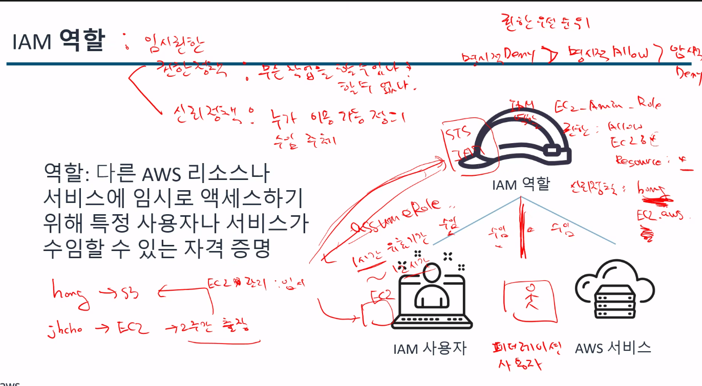

# AWS
**:book: Contents**
* [Cloud](#클라우드-컴퓨팅)
* [이점](#클라우드-컴퓨팅의-이점)

---
### 클라우드 컴퓨팅
> 클라우드 컴퓨틩은 종량제 요금으로 인터넷을 통해 IT 리소스를 온디맨드로 제공하는것
조금 더 쉽게 이야기하자면 사용자가 EC2를 통해 여러가지 방법(ex)콘솔(GUI),명령어)을 가지고 Data Center에 접근하여 프로비저닝(=배포)하여 그 사용한 만큼만 요금을 지불하는것

이런 클라우드 컴퓨팅 서비스중 하나는 `AWS`가 있는 것

* 찾아보기 : 온프레미스 환경, 온디맨드 / 솔직히 걍 클라우드 컴퓨팅에 대한 블로그글 찾아봐야할듯..

### 클라우드 컴퓨팅의 이점
- 종량제 : 내가 사용한 만큼만 비용지불
- 거대한 규모의 경제로 얻게 되는 이점
- 용량 추정 불필요
- 속도 및 민첩성 향상
- 비용 절감 목표 실현
- 몇 분 만에 전 세계에 배포

### AWS의 다양한 서비스
> 클라우드 컴퓨팅 서비스중 AWS는 광범위한 서비스를 제공해준다.

---

###  AWS GLobal Infrastructure
> 데이터 센터, 네트워킹 연결 등의 인프라는 모든 클라우드 애플리케이션의 기초가 되는요소입니다. 이러한 물리적 인프라로 구성되어 있는 AWS의 인프라가 AWS Global Infrastructure입니다. 여기에는 `리전,가용 영역, 엣지 로케이션이` 포함됩니다.

### 보충자료

### 배포시 리전 선택
- 지연시간 : 가능한 고객의 위치와 가까운 리전을 선택 -> 빠르게 컨텐츠 제공
- 요금 : 나라마다 비용이 다르기때문에 리전별로 비용이 상이
- 서비스 가용성 : 일부 리전에서만 사용 가능한 AWS 서비스도 존재
- 데이터 규정 준수 : 법적요건, 나라,회사의 규정등을 따라야한다.

`위 항목들을 고려하여 리전을 선택하여야한다.`

### 가용영역

### 엣지 로케이션
CDN 서비스 -> cloud Front
DNS -> Route53
보안(Ant:DDos) -> shield

---
### AWS 접근 방법
- AWS Management Console (AWS 관리 콘솔) - Id/Password
- AWS Command Line Interface (AWS 명령줄 인터페이스, AWS CLI) - Access Key ID/ secret AccessKey
- AWS software development kit (AWS 소프트웨어 캐발 키트, AWS SDK) - Java,파이썬

### 공동 책임 모델 다이어그램
> 고객이 AWS 제품 및 서비스를 사용할 때 보안을 책임지는 주체는
AWS회사와 고객 둘다인데 관련하여 아래 사진을 참고 하면 좋을것 같다.

### IAM(AWS Identiy and Access Management)
* [참고]

### IAM 기능
- 전세계에서 사용가능
- AWS서비스와 통합됨
- AWS 계정에 대한 공유 엑세스 (멀티 계정)
- Multi-Factor Authentication(MFA)
- 자격 증명 연동
- 무료로 사용

### IAM 역할

### EC2의 개념
- 인스턴스
- 컨테이너
- 서버리스
-> //TODO : 인스턴스와 컨테이너의 관계 확인 필요 

- AMI 개념
1) AWS 제공 : Quick Start
2) Marketplace
3) 사용자가 만든 

- EC2 인스턴스 유형
- 범용 : 인스턴스는 컴퓨팅, 메모리, 네트워킹 리소스를 균형 있게 제공하며 
웹 애플리케이션 서버, 컨테이너식 마이크로서비스, 분산 데이터 저장소, 개발 환경 등의 워크로드에 사용할 수 있습니다
- 컴퓨팅 최적화 : 인스턴스는 고성능 프로세서를 활용하는 컴퓨팅 집약적인 애플리케이션에 적합합니다. 과학 모델링, 배치 프로세싱, 분산 분석, 고성능 컴퓨팅(HPC), 기계 학습 등의 워크로드에 이러한 인스턴스를 사용할 수 있습니다.
- 메모리 최적화 : 인스턴스는 메모리에서 대규모 데이터 집합을 처리하는 워크로드를 위한 빠른 성능을 제공합니다. 이러한 인스턴스는 고성능 데이터베이스, 웹 규모의 분산 인 메모리 캐시, 실시간 빅 데이터 분석 등의 메모리 집약적인 애플리케이션에 사용됩니다.
- 가속 컴퓨팅 : 인스턴스는 하드웨어 액셀러레이터 또는 코프로세서(coprocessor)를 사용하여 부동 소수점 수 계산이나 그래픽 처리,데이터 패턴 일치 등의 기능을 기존 CPU를 사용할 때보다 더 효율적으로 수행합니다. 이러한 기능의 예로는 3D 시각화, 그래픽 집약적 원격 워크스테이션, 3D 렌더링, 애플리케이션 스트리밍, 비디오 인코딩 등이 있습니다
- 스토리지 최적화 : 인스턴스는 로컬 스토리지의 대규모 데이터 집합에 대한 순차적 읽기 및 쓰기 액세스 권한이 필요한 워크로드용으로 설계되었습니다. 스토리지 최적화 인스턴스에 적합한 워크로드의 예로는 NoSQL 데이터베이스, 인 메모리 데이터베이스, 확장 트랜잭션 데이터베이스, 데이터 웨어하우징, Elasticsearch, 분석 등이 있습니다. 
- [참고]