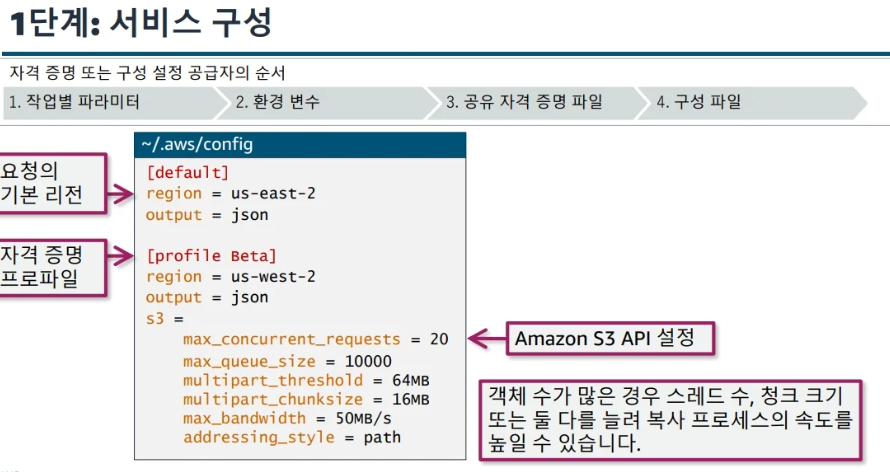
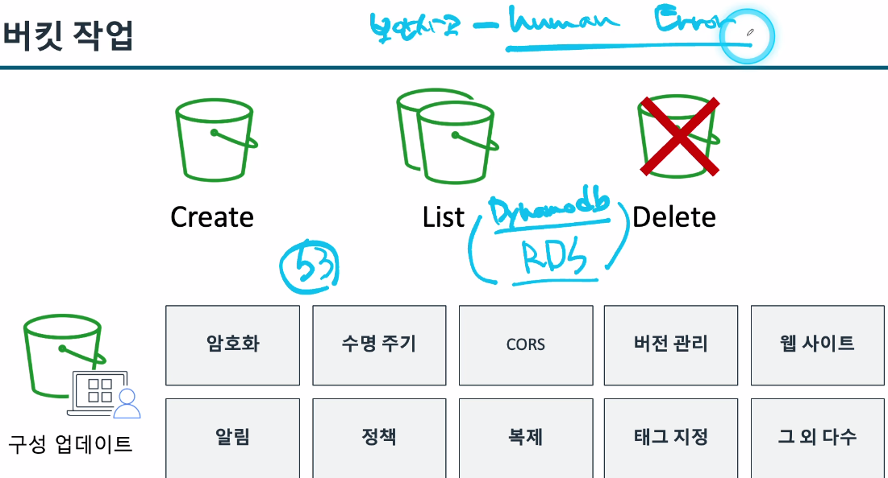
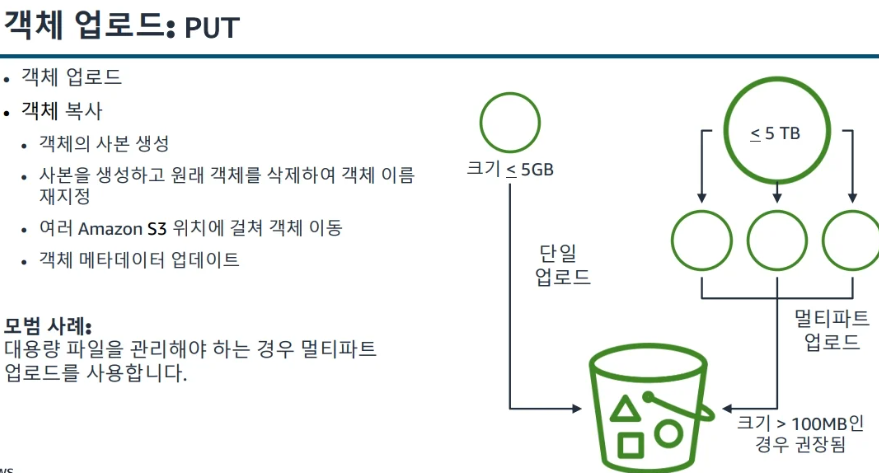

### Developing on AWS 1일차

### 수업 개요
- python을 통해 진행
- 3일 이론 4일 실습
- Jam을 통해 문제 상황 접했을 시 해결하는 수업
- 5일차에 Jam이 한번 더 있음
- 수업은 서버리스 위주로 진행이 됨
- 수업은 게시판을 목표로 진행될꺼고 백,프론트엔드 코드는 제공해줌 | 그 사이사이 코드만 함
 
---

### 애플리케이션 구축 [모듈1]


---

### AWS에서 개발 시작하기 [모듈3]

### AWS 서비스에 프로그래밍 방식으로 액세스

[AWS REST API]
> Rest API 방식에서 요청과 응답을 하는데 AWS도 마찬가지로 HTTP를 통해 소통한다.

HTTP 상태 코드
- 100 시리즈
    - Informational
- 200 시리즈
    - Success
- 300 시리즈
    - Redirection
- 400 시리즈
    - Client error
- 500 시리즈
    - Server error

> 또한 SDK 방식으로 진행이 된다. 즉 코드로 진행이 됨 (콘솔은 거의 사용하지 않는다.)

### SDK를 사용하는 이유
- 언어 바인딩
- HTTP 요청 서명
- 기본 탑재하고 있는 복원력 관련 기능
- 재시도/오류/시간 제한 로직
- 페이지 매김(Pagination) 지원

### SDK를 사용하는데 고려사항
[사용할 SDK API 결정]
- 하위 수준 API
    - 서비스 작업당 메서드가 1개있음
- 상위 수준
    - 개념적 리소스당 1개의 클래스가 있음
    - 서비스 리소스와 개별 리소스를 정의

=>  둘을 거의 같이 사용하긴함

### CLI 문법
> AWS CLI는 Botocore라는 Python 라이브러리를 사용합니다. AWS Python SDK 
Boto3 라이브러리는 Botocore를 기반으로 합니다. AWS 명령줄 호출의 기본 구조는 aws 명령과 그 뒤에 오는 다음 부분으로 구성됩니다. 


### SDK 및 프로그래밍 패턴
> 사실 실습으로 진행하는게 좋음

- 서비스 작업
    - JSON 형태로 진행이됨
- 비동기식 작업 : 요청 바로 진행
    - 동기식으로도 진행이 됨 : 요청 끝날때까지 기다림 -> 보통은 동기식으로 진행

### 통합 개발 환경 (IDE)
> IDE 도구 키트

- Eclipse 
- Rider
- WebStorm
- Visual Studio Code
- Intellij
- Azure DevOps
등등등

-> 이런 툴들을 사용하여 AwS 를 사용해 애플리케이션의 생성, 배포, 디버깅이 쉬워짐

---

### Amazon Q
> 생성형  AI 기반 어시스턴트

- 소프트웨어 개발 수명 주기 (SDLC)를 전체적으로 지원
    - 계획
    - 생성
    - 테스트 및 보안
    - 운영
    - 유지 관리 및 현대화

---

### 권한 부여 [모듈4]
- role에 대한 너무너무 헷갈린 부분
> “Role 사용은 AWS 서비스가 자동으로 수행하지만,
그 Role을 서비스에 부여하고 작동시키는 시작점은 항상 로그인한 IAM 사용자다.”


---
### Storage 사용하기[모듈5]
> 여기서도 대부분 S3 사용

### 스토리지의 유형
- 블록 스토리지 : 노트북에있는게 보통 블록임
    -  범용 SSD
    - 프로비저닝된 IOPS SSD
    -  처리량 최적화 HDD
    - 콜드 HDD
- 파일 스토리지
    - EFS Standard
    - EFS Infrequent Access
    - FSx for Lustre
    - Amazon FSx for NetApp ONTAP
    - Amazon FSx for OpenZFS
- 객체 스토리지 : 얘는 하나 올리고 변경이 안되고 다시 올려야함 | 사실이걸 쓰는건 안좋음
    - S3 Standard
    - S3 Standard-IA
    - S3 One Zone-IA
    - S3 Intelligent-Tiering
    - S3 Glacier Flexible Retrieval 
    - S3 Glacier Deep Archive

### S3 구성요소
https://notes-bucket.s3.us-west-2.amazonaws.com/awsservice/notes.txt  으로

- S3 버킷이름 : notes-bucket
- 키 : awsservice/notes.txt (url스타일)
    - 접두사 : /awsservice
    - 이름 : /notes.txt
---

### 버전 관리
> 객체의 버전 ID는 시스템에서 정의한 메타데이터의 일부입니다. 기본값으로 S3 버킷에는 버전 관리가 비활성화되어 있습니다. 
- 버전 관리가 비활성화된 버킷에서는 객체의 버전 ID 값이 null입니다.
- 버전 관리가 활성화된 버킷에서는 객체의 버전별로 고유한 버전 ID가 있습니다. 
-> 덮어쓰기나 삭제가 될 수 있어 객체를 잠구는 설정을 한다.

### 버전 삭제
- DELETE 
    - 버킷에 삭제 마커를 삽입하고 이를 객체의 현재 버전으로 설정합니다.
- DELETE Object versionId 
    - 특정 객체 버전을 영구적으로 삭제합니다.

### S3의 권한
> 권한만 150개가 됨
- 사용자 기반 제어에서 -> 리소스 기반으로 바꾸는게 좋다.

### 엑세스 포인트
> 다른 부서마다 권한을 나누어주는데 각 부서마다 필요한 권한이 
그 각 필요 권한을 엑세스 포인트를 통해 공유한다.

### 앤드포인트
> 엑세스 포인트를 통해 앤드포인트 주소를 다룬다.

### 하위수준 명령어 & 상위 수준 명령어
> 앞서 이야기 하였지만 다시 한번
- 하위수준
    - 세부수준 제어
    - S3 API와 일대일 매핑
- 상위 수준 
    - 큰 범위의 명령어
    - 더 많은 값이 나옴
    - 더 빠르지만 한계가 있음

### SDK를 통한 S3작업
> 즉 프로그래밍을 통해 다룬다.

- 1단계



-> 노트북 같은 경우에는 무조건 해주어야함

- 2단계
> 각 언어에 맡는 라이브러리를 추가해준다


- 3단계
> 실제 코드를 통해 사용하는것

- 5단계
> 모든걸 마치고 close()를 하는 버릇이 있어야함

---

### 버킷 작업 [모듈6]
> AWS SDK 또는 AWS Command Line Interface(AWS CLI)가 구성되면 애플리케이션을 통해 Amazon S3에서 작업할 준비가 된 것입니다. 적절한 권한이 있으면 버킷을 생성, 나열, 삭제 그리고 구성할 수 있습니다. 



### 버킷 생성
> 버킷의 이름은 중복이 되면안되기 때문에 생각보다 오류많이남

1. 버킷 이름 및 AWS리전
2. 버킷 생성
    - head-bucket정보 확인 -> 함수로 이름 확인하는것
    - 버킷 생성 -> headbucket으로 문제 없으면 create
3. 버킷 정보를 검색하여 버킷생성을 확인

-> 보통 버킷을 만들자마자 무엇인가 업로드하는데
-> 버킷이 만들어질때까지 `동기식`으로 기다리는 코드가 있어야함
- s3Client.get.waiter('bucket_exists')

### 객체 작업
> 대량 작업이 필요할 때

#### 객체 업로드 : PUT
> 멀티파트가 핵심



### 하위 수준 명령을 사용한 멀티파트 업로드
1. 파일을 5GB이하로 분할
2. create-multipart-upload 명령어를 통해 업로드 시작하고 ID검색
3. upload-part 명령을 통해 각 파트를 업로드하고 ETag 값을 받음
4. list-parts 기능을 이용해 모든 부분이 업로드되었는지 확인하기 위해 업로드된 부분을 모두 나열
5. ETag를 단일 파일로 컴파일
6. complete-multipart-upload 명령을 통해 업로드 완료

#### 데이터 검색 : GET 및 HEAD
> 단일 GET요청으로 완전한 객체를 받을 수 있습니다. 
  또한, 필요한 바이트 범위를 지정하여 객체의 일부분을 검색할 수도 있습니다. 
  이는 네트워크 연결 상태가 안 좋거나 애플리케이션이 객체 데이터의 하위 집합만 처리할 수 있거나 처리해야 하는 경우에 유용합니다.
기본값으로 GET 작업은 객체의 현재 버전을 반환합니다. 다른 버전을 반환하려면 versionId 하위 리소스를 사용합니다. 
경우에 따라 객체의 내용이 아닌 메타데이터에만 관심이 있을 수 있습니다. 
HEAD 요청은 GET 요청과 동일한 방식으로 객체의 메타데이터가 포함된 헤더를 반환합니다. 그러나 HEAD 는 객체의 본문을 반환하지 않습니다.

-> Head는 데이터를 다운 받지는 않음

### 임시권한 부여 : Presigned URL
> 누군가가 다운을 받아야한다면. 기본적으로 버킷에 객체를 올리면 public access로 다운을 받아야함
또한 S3는 버킷의 권한과 object 권한이 다름

-> 그렇기에 두 권한 모두 허용을 해주어야함

ex) 유료이미지 다운받기 사이트 -> 이미지 다운 주소를 통해 다운받음 -> 그러면 이 링크를 공유하면 모든 사람이 다 다운 받을 수 있음
그래서 일정 시간만 다운 받을 수 있도록 시간 설정을 함 -> 이 작업이 Presigned URL임

---

### 정적 웹사이트 호스팅
> 원래 EC2로 url 배포를 하면 장애가 발생 되는데
S3로 하면 장애가 없음

// TODO : S3로 서버를 올린다? 이게 뭔소리?
-> 이건 `정적 웹사이트`를 S3에 배포한다는 뜻

```
S3는 EC2처럼 서버가 아니다.
코드를 실행하거나 API 요청을 처리하지 않는다

하지만 HTML, CSS, JS 같은 정적 파일을 저장하고 제공할 수 있습니다.
즉, “서버가 없는 웹서버 역할”을 대신해주는 거예요.
또한, HTTPS 또는 엑세스포인트를 지원하지 않기때문에 Https를 사용할 경우 CloudFornt를 사용하여 호스팅된 웹사이틀를 사용하면됨
```

🌐 2️⃣ 그래서 "S3로 서버를 올린다"의 진짜 의미는?

→ "정적 웹사이트를 S3에 업로드해서 사용자에게 웹페이지를 제공한다"는
뜻이에요.

예를 들어:

  역할     예시 파일
  -------- ------------
  HTML     index.html
  CSS      style.css
  JS       script.js
  이미지   logo.png

이런 파일들을 S3 버킷에 넣고,\
버킷을 'Static Website Hosting' 모드로 설정하면\
S3가 웹 서버처럼 파일을 인터넷에 공개합니다 🌐

즉, 사용자가\
👉 https://my-bucket.s3-website.ap-northeast-2.amazonaws.com\
으로 접속하면 S3가 HTML 페이지를 직접 보여주는 거예요.

------------------------------------------------------------------------

🧱 **3️⃣ 구조적으로 보면**

    [사용자 브라우저]
          │
          ▼
    [Amazon S3 버킷 (정적 웹사이트 호스팅)]
          │
          └── index.html, style.css, script.js 등 제공

즉, S3가 서버 역할이라기보다\
"정적 파일을 제공하는 CDN(콘텐츠 서버)" 역할을 하는 겁니다.

------------------------------------------------------------------------

⚙️ **4️⃣ 만약 동적 기능(API 호출 등)이 필요하다면?**

그건 **API Gateway + Lambda** 조합으로 처리합니다.\
즉, 서버리스 환경에서는 다음처럼 나뉩니다 👇

  기능                                        담당 서비스
  ------------------------------------------- ----------------------
  웹 페이지 보여주기                          S3 (정적 호스팅)
  사용자 요청 처리 (로그인, 데이터 조회 등)   API Gateway + Lambda
  데이터 저장                                 DynamoDB, S3 등

------------------------------------------------------------------------

🔄 **예시 흐름**

    사용자 ─▶ S3(HTML, JS, CSS)
              │
              ▼
          JS에서 호출
              ▼
         API Gateway → Lambda → DynamoDB

즉,\
- **S3 = 프론트엔드 웹호스팅**\
- **Lambda/API Gateway = 백엔드 로직**\
- **DynamoDB = 데이터베이스**

이렇게 합쳐진 구조가 **"서버리스 풀스택(Serverless Full Stack)"**입니다.

------------------------------------------------------------------------

✨ **요약** \| 항목 \| 설명 \| \|------\|------\| \| S3의 본래 역할 \|
파일(이미지, HTML, JS 등) 저장소 \| \| 서버리스에서의 역할 \| "정적
웹사이트 호스팅 서버"로 동작 \| \| 실제 의미 \| EC2처럼 서버를 띄우는 게
아니라, 정적 페이지를 배포하는 것 \| \| 백엔드 역할 \| API Gateway +
Lambda가 담당 \|

### 교차 오리진 리소스 공유(CORS)
```
Amazon S3에서는 CORS를 지원하므로 Amazon S3로 웹 애플리케이션을 구축하고 
개별적으로 Amazon S3 리소스에 대한 교차 오리진 액세스를 허용할 수 있습니다. 
CORS를 활성화하려면 CORS 구성 XML 파일을 생성하십시오. 
이 파일에는 버킷에 액세스할 수 있는 오리진, 각 오리진에 대해 지원하는 작업(HTTP 메서드), 기타 작업별 정보를 식별하는 규칙이 포함되어 있습니다. 
구성당 최대 100개의 규칙을 추가할 수 있습니다. AWS SDK를 사용하여 S3 버킷에 CORS 구성을 적용할 수 있습니다
```

ex) S3 버킷에 웹 글꼴을 호스트하려고한다. 대체 도메인의 웹페이지가 이 웹글꼴을 사용할 수도 있는데
브라우저는 이 웹페이지를 로드하기 전에 로딩할 페이지가 있는 도메인에서 s3버킷 리소스에 액세스 할 수 있는지 확인하기 위해
CORS 검사를 수행한다.

[추가] -> 이게 좀 더 정확

1. 먼저 오리진(Origin)이란?
> 오리진 = `도메인 + 프로토콜 + 포트` 조합

즉, 조금이라도 다르면 다른 오리진
| 주소 | 오리진 |
|------|---------|
| `https://myapp.com` | `https://myapp.com` |
| `http://myapp.com` | ⚠️ 오리진 다름 (프로토콜 다름) |
| `https://api.myapp.com` | ⚠️ 오리진 다름 (서브도메인 다름) |
| `https://myapp.com:8080` | ⚠️ 오리진 다름 (포트 다름) |

2. CORS 문제는 왜 생길까?
> 기본적으로 "브라우저는 보안상" `같은 오리진끼리만 요청을 허용`한다.
이걸 Same-Origin Policy(동일 출처 정책) 이라고 함

3. 그래서 나온게 CORS(교차 출처 리소스 공유)
> 서버가 명시적으로 "이 출처는 접근해도 괜찮다" 라고 허락 해주는 방식

즉, 서버가 이런 헤더를 응답에 포함 시키면 됨
```
Access-Control-Allow-Origin: https://myapp.com
```

이러면 브라우저는 아 허락했네? 라고 함

### CORS 정리
> CORS = "서로 다른 출처 간 리소스 공유를 허용해주는 규칙"