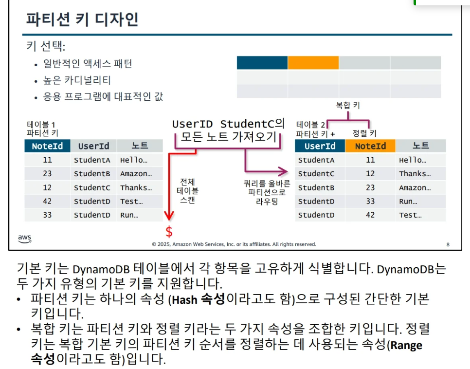
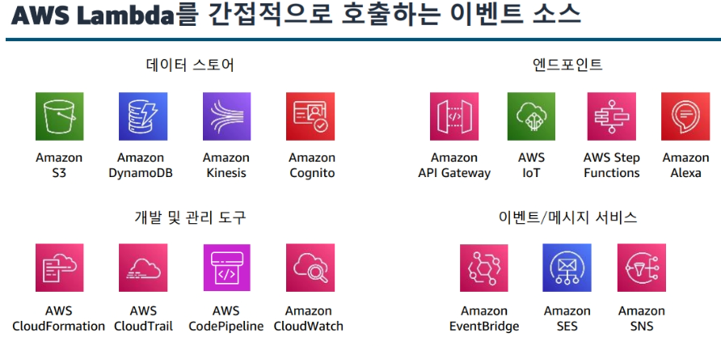
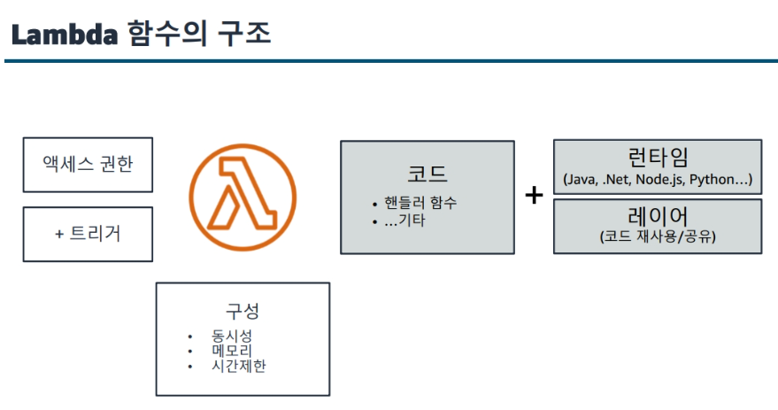
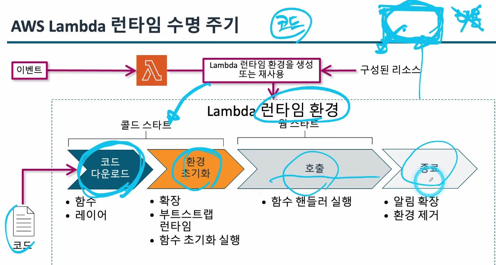

### Developing 2일차

### 데이터베이스 시작 및 옵션 [모듈7]

### AWS 데이터베이스 서비스 비교
- 관계형 : Amazon Relational Database Service(Amazon RDS),Amazon Redshift
    - 관계형 테이블
- 비관계형  : DynamoDB, Neptune, ElastiCache
    - 키 | value - DynamoDB
    - 그래프 - Neptune
    - 인메모리 캐싱 - ElastiCache


### Dynamo DB 기본 사항
> Dynamo는 데이터를 테이블에 저장한다. 테이블에는 `속성`이 있는 `항목`이 포함되어있고
항목은 관계형 데이터베이스의 행 또는 튜블로 속성은 `열`로 간주할 수 있다


- 파티션 키 
    - SSD로 백업되는 테이블용 스토리지 할당으로, 하나의 AWS 리전 내의 여러 가용 영역에 자동으로 복제된다. 파티션 관리는 전적으로 DynamoDB에서 처리하고 항목의 파티션 키를 `Hash 속성`이라고도 한다

- 정렬 키  
    - 파티션 키 값이 동일한 모든 항목을 서로 `물리적`으로 가까이 저장할 수 있도록 정의할 수 있다.그런다음 다음 항목을 파티션 의 정렬 키 값을 기준으로 정렬 할 수 있다.
    - 파티션 키를 기준으로 일대다 관계를 나타내며 정렬 키속성에 대한 쿼리를 활성화 한다. 항목의 정렬키를 `Range 속성`이라고도 한다.

### 기본 키
> 테이블에는 테이블의 각 항목을 고유하게 식별하는 기본 키가 있는데

- 파티션 기본키 
    - 기본키가 파티션 단일 속성으로 구성되어 DynamoDB는 이 기본키 속성을 기반으로 정렬 되지 않는 인덱스를 생성한다.데이블의 각 항목은 파티션 키값에 따라 고유하게 식별한다.

- 파티션 및 정렬 기본 키 - `기본 키가 두가지 속성으로 구성` 
    - 첫번째는 파티션 키 속성, 두번쨰 속성은 정렬키 속성
    - 파티션 키 속성을 기반으로 정렬되지 않는 인덱스를 정렬키 속성을 기반으로 정렬하여 인덱스 생성한다.

### 읽기 및 쓰기 작업

- 읽기 요청 단위(RRU) : 최대 4KB 강력한 읽기 일관성

- 쓰기 요청 단위(WRU) : 최대 1KB의 항목에 대한 쓰기

### 요금 옵션

- 온디맨드
    - 오토스케일링
    - `요청당 지불`
    - 용량 관리 `불필요`
- 프로비저닝
    - 초당 읽기 및 쓰기 횟수 지정
    - 프로비저닝된 용량에 대한 비용 지불
    - 예측 가능한 비용

** 용어 **
[프로비저닝이란?] - 서버를 사용할 수 있도록 준비 하는 과정
- 즉 빈 컴퓨터를 실제 서비스 가능한 상태로 세팅하는 행위
- 이건 온디맨드, 온프레미스 모두에서 일어나는 과정
    - 서버 생성,OS설치,네트워크설정,패키지설치,코드배포,서비스 실행 이 모든 과정을 `서버 프로비저닝`이라함

### 보조 인덱스
> 기본키가 아닌 키 속성을 기반으로 데이터를 쿼리할 수 있는 것

- 즉 파티션 키로 정렬하지 않고 정렬키나 테이블의 컬럼으로 정렬하는것
- <u>대신 데이터의 복사본(정렬된 포인터 목록)을 만들어 추가 검색 경로를 제공하는것</u>

---

### DynamoDB 엑세스하기
- NoSQL Workbench 가 있음 -> https://docs.aws.amazon.com/ko_kr/amazondynamodb/latest/developerguide/workbench.settingup.html 여기서 다운
- partiQL -요건 관계형 DB와 비슷한 문법을 사용해서 익숙함 -> 대신 이건 복잡해짐
- Dynamo Local
- CLI
- SDK

---

### 데이터베이스 작업 처리 [모듈8]

### 제어영역 및 데이터 영역 작업
- 제어영역
    - create
    - update
    - delete
    - describe
    - list
- 데이터 영역 작업
    - put
    - update
    - get
    - delete

### NoSQL 설계 주요 개념
> 개발자는 모든 액세스 패턴을 식별할 때까지 테이블 생성을 시작하면 안 됩니다. 
데이터가 액세스되는 방식을 이해하는 것이 테이블 설계의 관건

- 고려사항
    - 데이터 크기
    - 데이터 형태
    - 데이터 속도

### 파티션 키 디자인
> 키는 파티션 키랑 정렬 키 두가지를 사용한다.



### 인덱스 설계

- 보조 인덱스를 사용 
    - 보조 인덱스를 사용하면 기본 테이블이 지원할 수 있는 것보다 다양한 쿼리가 가능해집니다. 이러한 쿼리는 여전히 속도가 빠르고 상대적으로 저렴합니다.
- 관련 데이터를 함께 유지 
    - 이 원칙은 쿼리에 대한 시기적절한 응답을 보장하는 데 가장 중요한 요소로 간주됩니다. 
- 정렬 순서를 사용 
    - 핵심 설계가 함께 정렬할 것을 요구하는 경우, 관련 항목을 그룹으로 묶어 효율적으로 쿼리할 수 있습니다.
- 쿼리를 분산 
    - 많은 볼륨의 쿼리를 데이터베이스의 특정 부분에 몰리도록 하지 않는 것이 중요합니다. 
    I/O 용량을 초과할 수 있기 때문입니다. 대신 트래픽을 가능한 여러 파티션으로 분산시켜 핫 스팟이 방지되도록 데이터 키를 설계

-> 쿼리를 분산 
> 관계형 DB에서 테이블을 쪼개는 이유 -> 정규화 -> 이걸 하는 이유 -> 데이터 중복을 없애게 하기 위해 -> 겹치는 데이터를 테이블을 쪼개서 나눔 -> 공간이 줄어든다

### 초기 처리량 선택
> 비용까지도 고려를 해야한다.

- 초기 처리량 설정
    - 항목 크기
    - 예상 읽기 및 쓰기 속도
    - 읽기 일관성 요구 사항
- `프로비저닝 용량 모드` (!!중요!!)
    - 예측 가능한 트래픽
    - 알려진 워크로드
    - 사용 가능한 예약 용량
- 온디맨드 용량 모드
    - 알 수 없는 워크로드
    - 예측 불가능한 트래픽

> 이후 모듈 8은 읽기만 하면됨

### DynamoDB 캐싱
> 일단 데이터를 캐싱을 하면 로그인 같은거 세션에 저장한다고 했을 때 보안 위험이 있는데 
아 잠만 그냥 캐싱에 대해서 다시 봐야할듯

-> 위 내용에 대하여 
- 캐싱이란 : 성능 최적화를 위한 임시데이터 저장 -> Redis 이런거
- 세션은 인증상태를 유지하기 위한 로그인 정보 보관 -> 이게 보안상 위험 -> 서버세션,쿠키세션 이런거

### DynamoDB 캐싱 옵션
> 캐싱을 하는데 제공하는 서비스는 크게 DAX(Amazon DynamoDb Accelerator), Amazon ElastiCache로 두가지가 있음

- DAX : 클라우드에서 Memcached 또는 Redis 프로토콜을 준수하는 서버 노드를 배포 및 실행하는데 사용할 수 있는 웹서비스
- ElastiCahe : 웹애플리케이션의 성능개선목적, 느린 디스크 기반 데이터베이스에 전적으로 의존하는 대신 빠른 관리형 인 메모리 시스템에서 정보를 검색 가능하다.

-> 강의에서는 DAX에 중점

### DAX
> 최종 읽기 일관성 워크로드를 줄여준다.

- 읽기 응답 시간을 밀리초에서 마이크로초단위로 줄여줌
- API 와 호환되는 관리형 서비스를 제공하여 앱의 복잡성을 줄여준다.

---

### 애플리케이션 로직 처리 [모듈9]
> 이 모듈에서 얻어 갈것
- Lamda 작동방식
- SDK를 통한 함수개발
- Lambda 함수를 위한 트리거 및 권한 구성 
- Lambda 함수테스트, 배포, 모니터링

### 컴퓨팅 서비스 개요
> 추상화 수준

인스턴스(EC2) < 컨테이너(ECS/EKS) < 서버리스(Lambda)

### Lambda를 간접적으로 호출하는 이벤트 소스
> 그림에 나오는 것들과 함께 연결되어 람다가 올라간다고 보면 됨



### Lambda 함수의 구조 


### 람다의 호출 방법
> Lambda는 이벤트가 트리거하면 실행이됨

- 동기식(직접 호출) 
    - ex) 음식점 줄을 스는것

- 비동기식(푸시)
    - ex) 음식점 대기표 뽑고 다른데 돌아 다니는거

- ESM - 이벤트 소스 매핑(폴링)
    - ex) 일이 있어요? 뭐 잇어요? 하면서 물어보는것

### 람다의 런타임 수명주기
> 람다는 코드를 만들어 놔도 비용이 나가지 않음
실제 비용이 나가는건 호출 이후 실행이 될 때 나감

- 람다는 호출이 되어 실행이 될때 런타임환경으로 사용이 됨



-> 여기서 콜드 스타트 즉 호출되기전 대기 시간이 있는데 이때 시간이 좀 많이 걸림
그걸 해결하기 위해 콜드 스타트를 최소화 하는 방법을 구상한다.

### 콜드 스타트 최소화 하기

- Lambda 함수 예약
    - 특정 주기로 실행하기 위한 규칙 생성

- 웜스타트 (미리 배포해놓는것)
    - 프로비저닝된 동시성
    - 지정된 개수만큼 함수 런타임 환경을 최기화

---

### 권한

- 호출 권한
    - 이벤트 소스에 Lambda를 호출할 권한을 부여합니다.
    - Lambda 함수와 관련된 리소스 정책을 업데이트합니다.
    - Lambda AddPermission API를 사용합니다.
- 실행 권한
    - AWS Lambda에 스트림에서 읽을 수 있는 권한을 부여합니다.
    - 실행 역할을 업데이트합니다

** 스테이트리스 **
: 원래는 세션 정보로 저장을 해야하는데 저장하지 않고 외부 스토리지를 사용하여 유지하는것을 스테이트리스 라고 함

---

### 테스트 
> 배포 패키지를 업로드하는데 공유할 종속성을 분리 하여 레이어로 업로드를 하면
보다 효과적으로 함수 코드를 테스트 할 수 있다.

### 테스트 목표(기본적으로 Lambda의)
- 메모리에 대한 성능 테스트 -> CloudWatch Logs에서 볼 수 있다.
- 시간 초과에 대한 로드 테스트
- 한도를 이해

### 테스트 방법
- Management Console
    - 이벤트 템플릿
    - 사용자 지정 페이로드 (요청 응답)
    - CloudWatch Logs 사용

- AWS CLI
    - 함수 또는 특정 함수 버전을 호출
    - 똑같이 Watch를 통해 모니터링함

- 소프트웨어 개발 키트
    - ToolKit 및 IDE
    - 함수를 로컬 또는 원격에서 실행 (로컬에서 실행하려면 런타임 환경 구성)

- SAM(AWS Serverless Application Model) -> 수업에서는 이걸 다룸
    - SAM을 ToolKit 및 디버거와 함께 사용 하여 로컬로 테스트하고 디버그함
    - 여러 환경에서 일관되게 리소스를 프로비저닝(준비)함

### 함수의 호출
> 호출할 때 일부 정보를 제공합니다. 최소한 함수 이름, 함수의 ARN 또는 함수의 부분 ARN이 필요합니다. 
특정 버전 번호를 호출하는 경우 버전 접두부(prefix)를 사용하여 ARN을 정규화한다.

[그림이해 참고]


### 오류 처리
> 오류의 유형은 두가지로

- 호출 오류 : 응답 코드 400 또는 500 시리즈
    - 호출 요청이 함수가 수신하기 전에 거부되면 발생

- 함수 오류 : 응답 헤더 X-Amz-Function-Error
    - 함수코드 또는 런타임 때문에 발생

--- 

### 배포

### 배포시 패키지 고려사항
> Lambda는 컨테이너 이미지와 .zip파일 아카이브라는 두가지 유형의 배포 패키지를 지원한다.

- 함수의 배포 패키지에 있는 종속성을 제어한다.
- 배포 패키지 크기를 런타임 필요에 맞춰 최소화 한다.
- 종속성의 복잡성을 최소화 한다.

[흐름] 컨테이너이미지/zip패키지 -> Lambda함수 생성

** 용어 **
[종속성](Dependency)
- 결국 내 코드가 동작하기 위해 함게 포함되어야 하는 외부 구성요소들을의미
- 다른 코드들을 종속성이라고 함 즉, `의존하는` 외부 구성요소

- 함수에서 python이던 java던 import를 해 사용할 때 외부 라이브러리가 필요함 이를 종속성이라고함

[종속성을 제어한다의 뜻]
> Lambda는 클라우드에서 자동으로 실행되기 때문에
로컬 환경에 있는 라이브러리나 설정을 가져오지 않습니다.

>그래서 배포할 때 종속성을 함께 포함시켜야 하는데,
이걸 어떻게 포함시킬지, 얼마나 포함시킬지를 신중히 조정하라는 뜻

ex)
```
project/
├─ app.py
├─ requirements.txt   ← 여기에 종속성 명시
├─ venv/lib/...       ← 실제 설치된 패키지
```
Lambda는 배포 시 이걸 .zip파일에 묶어 올리거나
컨테이너 이미지(docker)로 묶어 올리는 것

### API 관리[모듈10]
> 주로 api 게이트웨이에 대한 설명

### API 게이트웨이란?
> REST, HTTP 및 WebSocket API를 생성, 게시, 유지 관리, 모니터링 및 보호하는 AWS 서비스

-  API Gateway를 사용하여 AWS 서비스나 타사 서비스에 액세스 할 수 있다.

### HTTP 및 REST API 작업
> HTTP API를 사용하여 REST API보다 대기 시간이 짧고 비용이 저렴한 RESTful API를 만든다.

-> 이를 통해 클라이언트가 api 호출하면 게이트웨이는 요청을 Lambda로 보내고 그 응답을 전달한다.


### Websocket api 작업
> 게이트웨이를 통해 WebsScoket api 또한 만들 수 있다.


### api게이트웨이 및 애플리케이션
> API Gateway의 REST API는 백엔드 HTTP 엔드포인트, Lambda 함수 또는 기타 AWS 
서비스와 통합된 HTTP 리소스와 메서드의 모음

이 모음을 하나 이상의 스테이지로 배포 할 수 있다.

** 용어 **
[스테이지] = API Gateway에서 배포된 API의 버전 또는 환경(Environment)을 구분하기 위한 `이름표`
- 즉, 하나의 API를 만들어도 그것에 대한 개발,테스트,운영 환경이 따로 있을 수 도 있는데 이걸 게이트웨이에서는 각 스테이지로 구분해서 관리함

eX) 테스트용 dev 실제 서비스 prod의 각 스테이지이름을 정하면 같은 api라도 URL 끝에 /dev,/prod가 붙어 다른 스테이지로 접근한다.

### 애플리케이션에서의 API Gateway 작동방식
> API 메서드를 만들 때는 메서드를 `백엔드에 있는 엔드포인트와 통합`해야 합니다. 
백엔드 엔드포인트는 `통합 엔드포인트라`고도 합니다. 
통합 엔드포인트는 Lambda 함수, HTTP 웹페이지 또는 AWS 서비스 작업일 수 있습니다

-> 각각의 통합 요청설정, 통합 응답설정을 한다.

### REST API의 구성요서
> API Gateway REST API는 리소스와 메서드로 구성됩니다. 
리소스는 애플리케이션이 리소스 경로를 통해 액세스할 수 있는 논리적 엔터티입니다. 
메서드는 API 사용자가 제출하고 응답이 사용자에게 반환하는 REST API에 해당합니다. 


그림에서 보았듯이 get 이후 url에 리소스가 있는걸 볼 수 있다.

---

### 코드형 API 설계
> 여기에는 Swagger를 사용한 설계가 있다

#### Swagger를 사용한 API 설계
- API 설계 가져오기
- API 설계 내보내기
- 개발 속도 향상
- 복잡한 구성
- 저장 및 재사용

---

### API 테스트
> Rest API 는 다양한 방식을 테스트 할 수 있다.

- AWS 관리 콘솔 방법
- AWS CLI 방법
- PostMan 방법

### API GateWay 콘솔을 사용한 테스트
> Method Execution창의 Client 상자에서 Test를 통해 한다.

### Mock 통합
> API 개발자는 통합 백엔드 없이 API Gateway에서 바로 API 응답을 생성할 수 있습니다. 이 기능을 사용하면 API 개발자는 API를 작업해야 하는 팀이 종속된 팀과 분리되어 프로젝트 개발이 완료되기 전에 작업을 할 수 있도록 합니다

- 완성된 백엔드 없이 테스트
- 프로덕션 배포 전 다양한 시나리오 테스트
- API 개발 속도 향상

---

### 배포
> 배포는 배포별 스테이지를 통해 연결하여야 한다.

### 스테이지
- 스테이지는 다음에 대한 솔루션을 제공합니다. 
    - 캐싱
    - 사용자 지정 요청 제한
    - 로깅
    - 스테이지(Stage) 변수
    - Canary 배포

### 스테이지 변수 사용
> 그림을 참고하는게 제일 좋은 듯


### Canary 릴리스
> Canary 릴리스는 API 또는 기타 소프트웨어의 새 버전을 기존 애플리케이션의 신규(또는 테스트) 버전으로 천천히 롤아웃하는 소프트웨어 배포 전략입니다. 
기본 버전은 여전히 프로덕션 릴리스로, 또는 동일한 스테이지에서의 정상적인 작업을 위한 비프로덕션 릴리스로 배포된다

> 이후 모든 트래픽 승격

- 배포 위험 감소
- 테스트 성능
- `병렬 개발`

-> 즉 딱 보니 기존 버전 살리면서 새 버전 천천히 올리는듯

