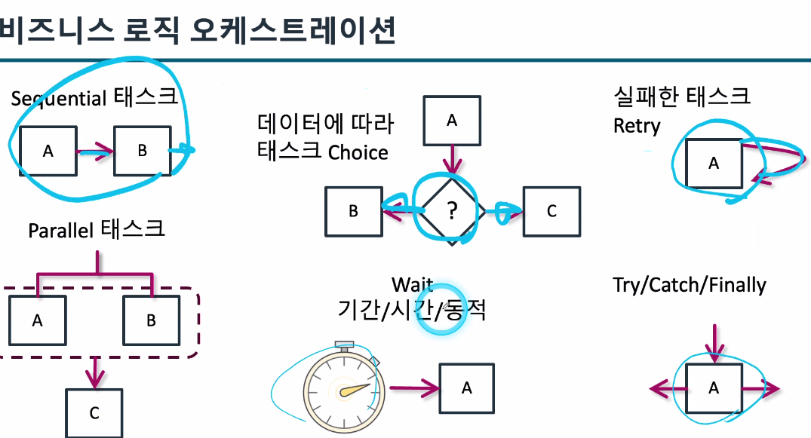

### 3일차

### API 관리 [모듈10]

### API GateWay
>  REST, HTTP 및 WebSocket API를 생성, 게시, 유지 관리, 
모니터링 및 보호하는 AWS 서비스입니다. API Gateway를 사용하여 AWS 
서비스나 타사 서비스에 액세스합니다. 

### MAS[모듈11]

### Interaction 패턴

- API 기반
    - 동기식 처리
    - 애플리케이션과 서비스는 API 통해 연결되고 통신
        - AWS 서비스는 서비스 aPI를 제공
    - HTTP 및 s 통신 프로토콜

- 이벤트 기반
    - 비동기식 처리
    - 상황이 발생했음을 알리는 메시지
    - AWS 리소스는 상태 변경 시 이벤트를 생성할 수 있음
    - 소비자가 이벤트를 구독
    - 공급자가 이벤트를 생성

### 모놀리스 애플리케이션 디커플링

- 분리에 적합한 작은 서비스부터 소규모로 시작
- 모놀리스에 대한 종속성 최소화
- 복잡한 종속성은 초기에 분리
- 자주 변경되는 기능 분리하기

ex) 스트랭글러(목졸리기) 설계 패턴
- 단계적 접근 방식
- 지곤 기능을 점진적으로 마이크로서비스로 교체

---

### AWS Step Funtions를 통한 오케스트레이션 
> 람다를 처리할때 중간에서 스무스하게 작동하게 하기 위해 조정을 해주는것

- `시각적 워크플로`를 사용하여 분산 애플리케이션의 구성요소를 조정한다.

#### 워크 플로관리:
- 병렬화
- 장애
- 재시도
- 서비스 통합
- 관찰 기능

### 비지니스 로직 오케스트레이션

---

### 애플리케이션의 사용자에게 엑세스 권한 부여하기(로그인)[모듈12]

### AWS Cognito
> 애플리케이션의 인증 및 권한 부여를 해결하는 솔루션

[인증]
- 사용자의 신원 확인
    - HTTP 인증
    - 로그인 프롬프트
    - 사용자 지정 방법
[권한부여]
- 원하는 작업을 사용자가 수행할 수 있는지 확인
    - 엑세스 제어
    - 권한 도구
    - 데이터 및 운영보호

> 소셜 로그인 : 코그니토에서 이것 또한 기능 제공을 한다.

---

### 애플리케이션 배포 [모듈13]

### 배포 계획 수립 및 방식

DevOps 문화 
> 보통 CI/CD만 알고 있는데 사실상 권력 분산이 매우 중요하다 -> 데이터를 흐르게 하는데 이것은 git으로 기록을 남기는것이다.
-> 이런 문화를 남겨야함

DevOps 프로세스
: 코드 -> 구축 -> 테스트 -> 프로비저닝 -> 배포 -> 모니터링
  
CI -> 지속적인 통합 (코드-> 구축-> 테스트)

지속적 전달(devlivery) -> (배포전 결제)

지속적인 배포(deployment) -> (모니터링까지 쭉 이어지는것)

### 다시 서버리스로 포커스를 맞추면 
> SAM 이란? : 서버리스 애플리케이션을 배포하는데 사용되는 오픈 소스 프레임 워크

사실 CloudFormaition의 기능임

### SAM 리소스
[gateway]
AWS::Serverless::Api
AWS::Serverless::HttpApi

[lambda]
AWS::Serverless::Function
AWS::Serverless::LayerVersion

[db]
AWS::Serverless::SimpleTable

[step function]
AWS::Serverless::StateMachine