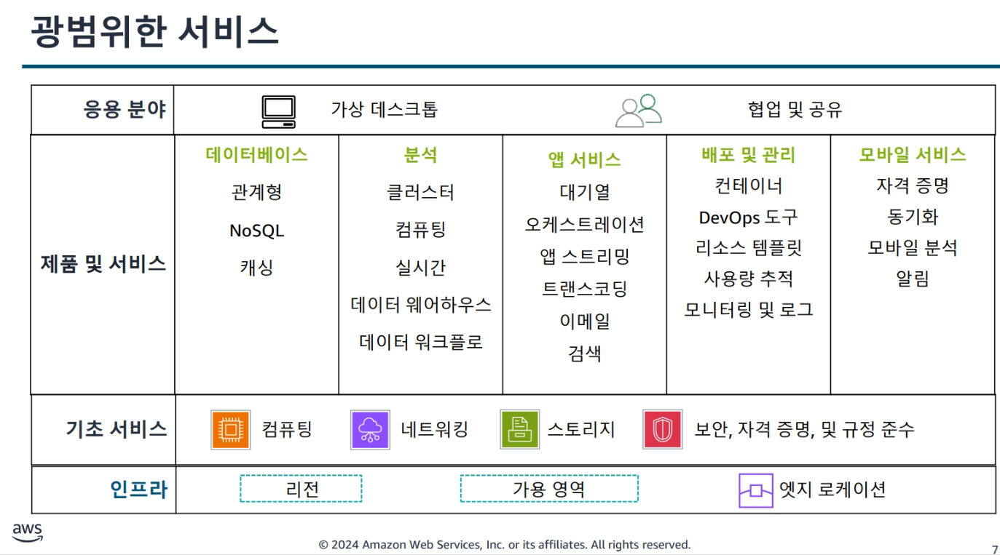
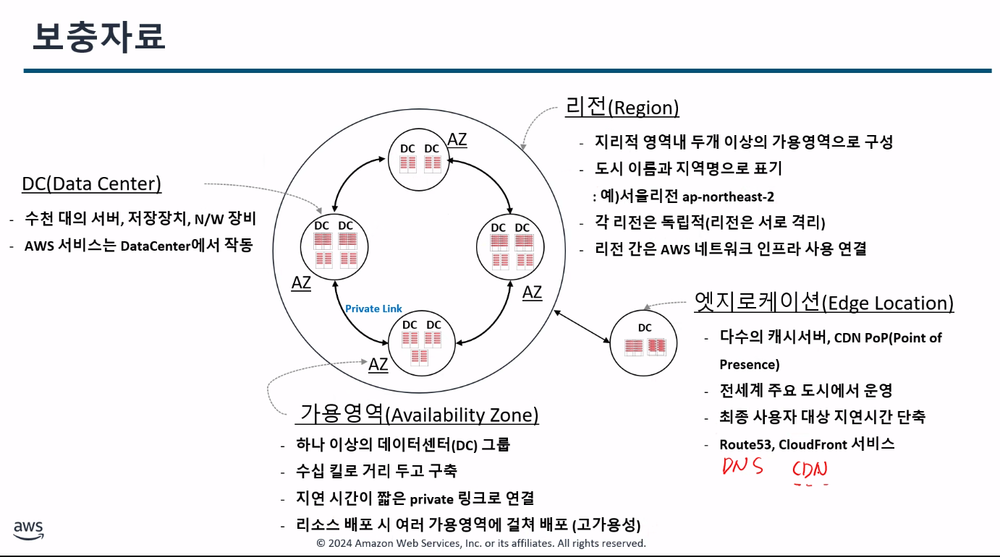
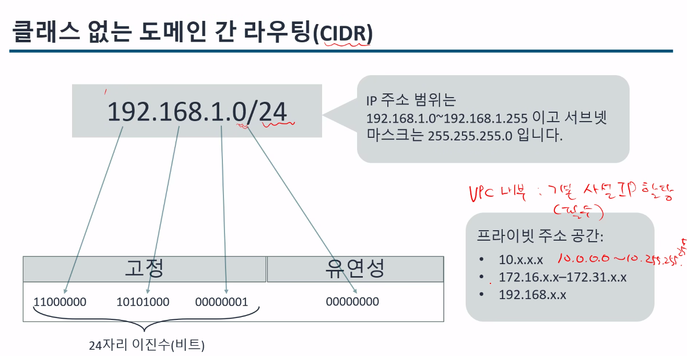
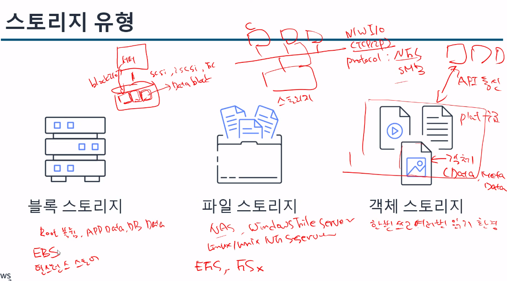

# AWS_Thechnical_essential
**:book: Contents**
* [Cloud](#클라우드-컴퓨팅)
* [이점](#클라우드-컴퓨팅의-이점)
* [AWS서비스](#aws의-다양한-서비스)
* [IAM](#iamaws-identiy-and-access-management)
* [EC2개념](#ec2의-개념)
* [네트워킹](#aws-네트워킹)
---
### 클라우드 컴퓨팅
> 클라우드 컴퓨틩은 종량제 요금으로 인터넷을 통해 IT 리소스를 온디맨드로 제공하는것
조금 더 쉽게 이야기하자면 사용자가 EC2를 통해 여러가지 방법(ex)콘솔(GUI),명령어)을 가지고 Data Center에 접근하여 프로비저닝(=배포)하여 그 사용한 만큼만 요금을 지불하는것

이런 클라우드 컴퓨팅 서비스중 하나는 `AWS`가 있는 것

* 찾아보기 : 온프레미스 환경, 온디맨드 / 솔직히 걍 클라우드 컴퓨팅에 대한 블로그글 찾아봐야할듯..

### 클라우드 컴퓨팅의 이점
- 종량제 : 내가 사용한 만큼만 비용지불
- 거대한 규모의 경제로 얻게 되는 이점
- 용량 추정 불필요
- 속도 및 민첩성 향상
- 비용 절감 목표 실현
- 몇 분 만에 전 세계에 배포

#### [용어정리1]  
1) 온디맨드(On-Demand) : <u>`사용자가 특정 서비스를 요구할 때 그 서비스를 바로 제공받을 수 있는 것`</u>
eX) 카카오택시를 예로 사용자가 택시 호출 서비스를 요구하면 택시 호출 서비스를 바로 제공받아 택시를 타는 것

2) 온디맨드 서비스 : `사용자가 필요할 때 즉시 자원을 요청하고, 그만큼 비용을 지불하는 방식의 클라우드 컴퓨팅 모델` 
-> 여기서 자원이란 `클라우드 환경에서  사용할 수 있는 다양한 컴퓨팅 리소스를 의미
aws와 같은 클라우드 서비스 제공자는 고객이 필요에 따라 컴퓨티 자원을 할당하고 사용할 수 있도록 지원하며 이 자원들은 여러 유형으로 구분된다.
- 컴퓨팅 파워 (EC2 인스턴스)
- 스토리지 (S3, EBS, EFS 등)
- 네트워크 자원 (VPC, Route 53, Elastic Load Balance)

3) 온프레미스(On-Premises) : 먼저 쉽게 말해 클라우드의 반대 개념
> 서버나 네트워크, 스토리지 등의 IT 인프라를 기업(혹은 개인)이 직접 소유하고 운영하는 환경
ex) 데이터 센터나 사무실 안에 직접 서버를 구매하여 설치하고 모든것을 관리

---

### AWS의 다양한 서비스
> 클라우드 컴퓨팅 서비스중 AWS는 광범위한 서비스를 제공해준다.


---

###  AWS GLobal Infrastructure
> 데이터 센터, 네트워킹 연결 등의 인프라는 모든 클라우드 애플리케이션의 기초가 되는요소입니다. 이러한 물리적 인프라로 구성되어 있는 AWS의 인프라가 AWS Global Infrastructure입니다. 여기에는 `리전,가용 영역, 엣지 로케이션이` 포함됩니다.

### 보충자료



### 배포시 리전 선택
- 리전 : 가용 영역 클러스터이다.
- 지연시간 : 가능한 고객의 위치와 가까운 리전을 선택 -> 빠르게 컨텐츠 제공
- 요금 : 나라마다 비용이 다르기때문에 리전별로 비용이 상이
- 서비스 가용성 : 일부 리전에서만 사용 가능한 AWS 서비스도 존재
- 데이터 규정 준수 : 법적요건, 나라,회사의 규정등을 따라야한다.

`위 항목들을 고려하여 리전을 선택하여야한다.`

### 가용영역
- 가용용역 : 1개 이상의 데이터 센터로 구성된다.
### 엣지 로케이션
CDN 서비스 -> cloud Front
DNS -> Route53
보안(Ant:DDos) -> shield

---
### AWS 접근 방법
- AWS Management Console (AWS 관리 콘솔) - Id/Password
- AWS Command Line Interface (AWS 명령줄 인터페이스, AWS CLI) - Access Key ID/ secret AccessKey
- AWS software development kit (AWS 소프트웨어 캐발 키트, AWS SDK) - Java,파이썬

### 공동 책임 모델 다이어그램
> 고객이 AWS 제품 및 서비스를 사용할 때 보안을 책임지는 주체는
AWS회사와 고객 둘다인데 관련하여 아래 사진을 참고 하면 좋을것 같다.


---

### IAM(AWS Identiy and Access Management)
* [참고]
* IAM은 앞서 말한 공동 책임 모델 다이어그램을 통해 알 수 있듯 책임을 나눠야하기 때문에 존재

### IAM 기능
- 전세계에서 사용가능
- AWS서비스와 통합됨
- AWS 계정에 대한 공유 엑세스 (멀티 계정)
- Multi-Factor Authentication(MFA)
- 자격 증명 연동
- 무료로 사용


### IAM 역할


---
### AWS 컴퓨팅 서비스
> 이는 앞서 배운 온디맨드 서비스 방식 중 컴퓨팅 자원을 제공해주는 것으로 총 3가지 방식으로 나뉜다.
- 인스턴스
- 컨테이너
- 서버리스

-> 여기서 의문점이 있었음 `왜 인스턴스를 올릴 때 컨테이너가 포함이 될수도 있는데 이 개념을 설명할 때는 3가지로 나누는거지?`
> 알고보니 3가지로 나누는 이유는 물리적으로 포함 관계에 있어서가 아니라, 관리 책임과 자동화 수준이 다르기 때문
즉, 인스턴스는 모든것을 올리는데 이 모든것을 관리받고 싶을 때 사용하고, 컨테이너 부분만 관리 받고 싶을때는 ESC와 같은걸로 그 부분만 관리 받기 때문에 나눈것이라 인지하면 됨


### EC2의 개념
> 인스턴스의 한 종류로 AWS가 제공하는 "가상머신(Virtual Machine)" 이다.
운영체제(OS)부터 애플리케이션까지 모두 사용자가 직접 관리해야한다.

요약 : EC2는 `서버 1대를 통째로 빌려 자유롭게 쓰는 방식` (컨테이너를 올릴 수도 있고 안올릴 수 도있음)
-> 아! 오히려 통째로 빌려서 사용자가 관리하는 구조네

### AMI 개념
> EC2 인스턴스를 시작할 때 먼저 AMI(Amazon Machine Iamge)를 선택해야만 한다.
즉, 인스턴스를 만들기 위한 템플릿(이미지 파일)
ex) 컨테이너에서의 이미지
1) AWS 제공 : Quick Start
2) Marketplace
3) 사용자가 만든 

### AMI과 docker에서 image의 차이점
| 비교 항목 | Docker Image | AMI (Amazon Machine Image) |
|------------|---------------|-----------------------------|
| 가상화 수준 | OS 위의 **애플리케이션 수준 가상화** (경량) | **하이퍼바이저 기반 전체 VM 수준 가상화** (무겁지만 완전) |
| 실행 환경 | **Docker 엔진 위**에서 실행 | **AWS EC2 인프라 위**에서 실행 |
| 부팅 속도 | 매우 빠름 (초 단위) | 느림 (수십 초~분 단위) |
| 목적 | **앱 단위 실행 및 배포용** | **서버 전체 환경 복제 및 배포용** |


### EC2 인스턴스 유형
- 범용 : 인스턴스는 컴퓨팅, 메모리, 네트워킹 리소스를 균형 있게 제공하며 
웹 애플리케이션 서버, 컨테이너식 마이크로서비스, 분산 데이터 저장소, 개발 환경 등의 워크로드에 사용할 수 있습니다
- 컴퓨팅 최적화 : 인스턴스는 고성능 프로세서를 활용하는 컴퓨팅 집약적인 애플리케이션에 적합합니다. 과학 모델링, 배치 프로세싱, 분산 분석, 고성능 컴퓨팅(HPC), 기계 학습 등의 워크로드에 이러한 인스턴스를 사용할 수 있습니다.
- 메모리 최적화 : 인스턴스는 메모리에서 대규모 데이터 집합을 처리하는 워크로드를 위한 빠른 성능을 제공합니다. 이러한 인스턴스는 고성능 데이터베이스, 웹 규모의 분산 인 메모리 캐시, 실시간 빅 데이터 분석 등의 메모리 집약적인 애플리케이션에 사용됩니다.
- 가속 컴퓨팅 : 인스턴스는 하드웨어 액셀러레이터 또는 코프로세서(coprocessor)를 사용하여 부동 소수점 수 계산이나 그래픽 처리,데이터 패턴 일치 등의 기능을 기존 CPU를 사용할 때보다 더 효율적으로 수행합니다. 이러한 기능의 예로는 3D 시각화, 그래픽 집약적 원격 워크스테이션, 3D 렌더링, 애플리케이션 스트리밍, 비디오 인코딩 등이 있습니다
- 스토리지 최적화 : 인스턴스는 로컬 스토리지의 대규모 데이터 집합에 대한 순차적 읽기 및 쓰기 액세스 권한이 필요한 워크로드용으로 설계되었습니다. 스토리지 최적화 인스턴스에 적합한 워크로드의 예로는 NoSQL 데이터베이스, 인 메모리 데이터베이스, 확장 트랜잭션 데이터베이스, 데이터 웨어하우징, Elasticsearch, 분석 등이 있습니다. 
- [참고]

### 인스턴스 수명주기


IP는 공인 IP가 있는데 public이랑 Elatic으로 나뉨 public은 재부팅 시 새로 발급이 됨

### EC2 요금
- AWS 프리티어
- Saving Plans
- 전용 호스트
- 온디맨드 인스턴스
- 예약 인스턴스
- 스팟 인스턴스
> 이렇게 요금을 정할 수 있는 목록들이 있고
상황에 맞추어 사용자가 적절하게 선택하여 사용하면 된다.

### AWS 컨테이너 서비스

### 가상머신과 컨테이너 비교
1. 

2. 운영체제 관리 부분
```
물리 서버 (Host Machine)
 └── 하이퍼바이저 (Hypervisor)
       ├── VM1 (게스트 OS + 애플리케이션)
       ├── VM2 (게스트 OS + 애플리케이션)
       └── VM3 (게스트 OS + 애플리케이션)
```
📌 여기서 중요한 점:
- 각 VM은 자기만의 게스트 OS를 가짐
- 하이퍼바이저가 물리 하드웨어를 나눠서 VM에 할당함

✅ 결론

하이퍼바이저(Hypervisor)는
물리적 서버 위에서 가상머신(EC2)을 여러 개 실행시켜주는 가상화 관리자이고,
각 가상머신은 자신만의 OS를 따로 가지고 동작합니다.

반면 컨테이너는 하이퍼바이저를 쓰지 않고,
하나의 운영체제 커널을 여러 컨테이너가 공유하는 구조입니다.

### AWS 컨테이너 오케스트레이션 서비스
- Amazon ECS(Amazon Elastic Container Service)
    - 컨테이너식 애플리케이션 실행 및 크기 조정
    - API 호출을 사용하여 Docker 지원 애플리케이션 제어
- Amazon EKS(Amazon Elastic Container Service)
    - Kubernetes 애플리케이션 실행 및 크기 조정
    - 패치, 노드 프로비저닝, 업데이트 자동화

### 서버리스 컴퓨팅
- 종류 : AWS Fargate, AWS Lambda

[이점]
- 서버를 프로비저닝 또는 관리할 필요가 없음 (근데 사실 어딘가에는 있을거임 but, 관리를 AWS에서 함)
- 사용량에 따른 크기 조정
- 사용한 리소스만큼 비용만 지불
- 가용성 및 내결함성 기본 제공

### Lambda


- 제한점이 있음 
    - 메모리가 128MB ~ 10GB 
    - 시간 최대 15분 까지 밖에 실행이 안됨
-> cpu는 메모리크기에 준하는 CPU가 자동으로 할당 됨

### Fargate
// TODO : 찾아봐야함

ECS 랑 Fargate 차이
 MicroVM 환경에서 돌아감
 ECS는 EC2 위에서 돌아가는데 기본 가상머신 위에서 돌아감

---

### AWS 네트워킹

### Amazon VPC [Amazon Virtual Private Cloud]
> VPC(Virtual Private Cloud) 는
AWS 클라우드 안에서 내가 직접 만드는 **“나만의 네트워크 공간”**입니다.
즉,지금까지 배운 EC2, ECS, Lambda 같은 컴퓨팅 자원들은 VPC 안에서 동작하는 것

> VPC를 사용하면 데이터 센터의 기존 네트워크와 유사하게 AWS 클라우드에서 AWS 리소스를 위한 가상 네트워크를 정의하고 프로비저닝할 수 있습니다.

#### 추가 첨언
```
지금까지 배운 건 “컴퓨팅 자원” 이었어요.
(서버, 컨테이너, 코드 실행 등등)

그런데 서버가 있다면 반드시 “네트워크 안” 에 있어야겠죠?
- 어떤 IP 주소를 갖는지
- 누가 접근할 수 있는지
- 같은 리전에 있는 다른 인스턴스랑 통신 가능한지
이런 네트워크 환경을 설정해주는 역할이 바로 VPC입니다.

즉, EC2 같은 컴퓨팅 자원들이 동작할 수 있는 “가상 네트워크 공간”을 제공하기 위해
VPC(Virtual Private Cloud) 가 나오는 겁니다.
```
---
#### 들어가기전
### 🌎 3️⃣ AWS 전체 구조를 위에서 아래로 정리하면

| **계층** | **설명** | **예시** |
|-----------|-----------|-----------|
| **Region (리전)** | 물리적 위치 (예: 서울, 도쿄, 오하이오) | ap-northeast-2 |
| **Availability Zone (가용 영역)** | 리전 내 독립된 데이터센터 | ap-northeast-2a, 2b, 2c |
| **VPC (Virtual Private Cloud)** | 리전 내부에서 사용자가 정의하는 가상 네트워크 | 나만의 가상망 (IP, 서브넷, 라우팅, 보안그룹 등 설정) |
| **Subnets** | VPC 안의 세부 네트워크 구역 (공용/사설 구분) | Public / Private Subnet |
| **컴퓨팅 리소스** | VPC 안에서 실제 실행되는 자원 | EC2, ECS, Lambda 등 |

> 💡 **리전**과 **가용영역**은 물리적 위치 개념이며,  
> **VPC**는 그 안에서의 **네트워크 논리 구조 개념**입니다.

---

### 🧩 4️⃣ 비유로 정리해볼게요

| **현실 세계 비유** | **AWS 개념** |
|----------------------|---------------|
| 🏙️ 도시 | 리전 (Region) |
| 🏢 건물 여러 개 | 가용영역 (Availability Zone, AZ) |
| 🧱 내 건물 내부의 내부망 | VPC |
| 🖥️ 각 사무실에 있는 컴퓨터들 | EC2, ECS, Lambda 등 |

> 🗒️ 정리  
> - 리전은 **위치(서울)**  
> - 가용영역은 **건물**  
> - VPC는 **건물 안의 사설 네트워크**  
> - EC2는 **그 안에서 돌아가는 컴퓨터**

---

### ✅ 5️⃣ 한 문장 요약

> **VPC**는 AWS 클라우드 안에서 내가 직접 설정하는 **“가상의 네트워크망”**이며,  
> 그 안에 **EC2·ECS·Lambda** 같은 컴퓨팅 리소스들이 존재합니다.  
>
> 즉, **“VPC는 컴퓨팅 리소스가 돌아가는 공간(그릇)”**이라고 보면 됩니다.
---

### VPC 생성 방법 및 서브넷
- 리전 생성
- VPC 이름
- VPC의 IP 주소 범위


* 사이더 범위? 를 지정해주어야함

###### 서브넷
> VPC 안의 또 다른 범위? 

- 프라이빗 서브넷 / 퍼블릭 서브넷
> 이 둘은 개념의 차이임
    - 퍼블릭 서브넷 : 사설 IP(내부통신) 범위, 공인(외부통신) IP를 모두 할당 받아야함
    - 프라이빗 서브넷 : 사설 IP(내부통신)만 할당되어 저장하는 서브넷

### 클래스 없는 도메인 간 라우팅(CIDR)
> 서브넷(Subnet) 은 “공간(네트워크 구역)”이고,
라우팅(Route) 은 “그 공간들 사이를 연결하고, 데이터가 어느 길로 갈지 결정하는 규칙”


### 네트워크 액세스


### 네트워크 엑세스 제어목록 (NACL)


### 보안 그룹 : EC3 인스턴스에 연결된 가상 방화벽
상태저장의 특징이 있음 NACL과의 차이
-> 인/아웃 바운드 규칙에 의해 허용된 세션의 정보를 저장해서 그에 상응하는 리턴 트래픽은 자동으로 허용

### 흐름 로그
VPC 흐름로그 
- 설정을 통한 시간단위로 캡쳐를 함 
- 보여주는 방법이 IP Packet을 잡아줌
- 정말 간단한 트래픽 상황만을 보여줌

---

### AWS 스토리지

### [들어가기전]
### ☁️ 1️⃣ 스토리지는 인스턴스·컨테이너·서버리스가 사용하는 저장공간입니다

즉,  **스토리지는 컴퓨팅 자원(EC2, ECS, Lambda)** 이  
데이터를 “저장하거나 불러오기 위해 사용하는 물리적 공간”.

---

| **컴퓨팅 서비스** | **사용하는 스토리지** | **역할** |
|--------------------|------------------------|-----------|
| **EC2 (인스턴스)** | **EBS (Elastic Block Store)** | EC2의 하드디스크 역할 (OS, 파일 저장) |
| **ECS/EKS (컨테이너)** | **EFS** 또는 **S3** | 여러 컨테이너가 공유하거나 파일 업로드용 |
| **Lambda (서버리스)** | **S3** | 함수 코드 저장, 결과물 저장 등 |

---

즉,  **스토리지는 파일, 이미지, 로그, 코드 등을 저장하는 기반 저장소**이고,  
**인스턴스나 컨테이너가 동작하려면 결국 이런 스토리지를 필요로 합니다.**

---

📦 **비유하자면:**  
- **인스턴스(EC2)** → 컴퓨터 본체  
- **스토리지** → 그 안의 **SSD나 USB 저장장치** 같은 개념.

---

### 유형
- 블록 스토리지
- 파일스토리지 
- 객체 스토리지

### 💾 AWS 스토리지의 3가지 유형

| **스토리지 유형** | **AWS 서비스 예시** | **주요 사용 대상** | **저장 방식 요약** |
|--------------------|----------------------|--------------------|--------------------|
| **블록 스토리지 (Block Storage)** | **EBS (Elastic Block Store)** | EC2 인스턴스 | 하드디스크처럼 “블록 단위”로 데이터를 저장 |
| **파일 스토리지 (File Storage)** | **EFS (Elastic File System)** | 여러 EC2, 컨테이너 | 폴더/파일 구조로 저장 (공유 파일 시스템) |
| **객체 스토리지 (Object Storage)** | **S3 (Simple Storage Service)** | 전역 파일 저장, 서버리스 | 파일을 ‘객체’ 단위로 저장 (메타데이터 + 내용) |

---

### 🔹 블록 스토리지 (EBS)

> 데이터를 **작은 블록 단위**로 나눠 저장하는 방식 —  
> 하드디스크처럼 OS가 직접 읽고 쓰는 형태

| 항목 | 설명 |
|------|------|
| **속도** | 매우 빠름 (OS 직접 접근) |
| **구조** | 블록(조각) 단위 저장, 파일시스템(OS)이 관리 |
| **용도** | OS, DB, 트랜잭션 등 고성능 입출력(IO) 필요할 때 |
| **접근 방식** | EC2 인스턴스에 **직접 연결(Attach)** 해야 접근 가능 |
| **비유** | 💽 컴퓨터의 SSD 또는 HDD 디스크 |

---

### 🔹 파일 스토리지 (EFS)

> 데이터를 **“폴더/파일 구조”**로 저장하는 방식 —  
> 여러 서버가 동시에 같은 파일 시스템을 공유 가능

| 항목 | 설명 |
|------|------|
| **구조** | 디렉터리(폴더) + 파일 계층 구조 |
| **공유성** | 여러 인스턴스에서 동시 접근 가능 |
| **용도** | 애플리케이션 로그, 컨테이너 공유 파일, 코드 저장 등 |
| **프로토콜** | NFS (Network File System) 기반 |
| **비유** | 🗂️ 회사 내 **공유 네트워크 드라이브 (NAS)** |

---

### 🔹 객체 스토리지 (S3)
: 여기서 버킷이라는 개념이 나오는데 S3에서 버킷은 폴더 같은 존재
> 데이터를 **객체(Object)** 단위로 저장 —  
> 파일 데이터 + 메타데이터 + 고유 ID로 관리 (전 세계 어디서든 접근 가능)

| 항목 | 설명 |
|------|------|
| **구조** | 파일이 아닌 “객체” 단위 (데이터 + 메타데이터 + ID) |
| **접근성** | 인터넷을 통한 API 호출 (HTTP, REST API 등) |
| **확장성** | 매우 큼 (수조 개 파일 저장 가능) |
| **용도** | 이미지, 동영상, 백업, 정적 웹, Lambda 코드 저장 등 |
| **비유** | ☁️ **Google Drive / Dropbox** 같은 클라우드 저장소 |

### 🔐 Amazon S3의 보안 구조

이제 버킷은 **“누구나 접근 가능한 인터넷 저장소”** 가 될 수 있기 때문에,  
AWS에서는 **보안을 매우 중요하게 다룹니다.**

---

### 🔸 S3 접근 제어 3단계 정책

| **구분** | **설명** | **적용 대상** |
|-----------|-----------|----------------|
| **IAM 정책** | 사용자·그룹·역할 단위로 접근 제어 | **AWS 계정 수준** |
| **버킷 정책 (Bucket Policy)** | 버킷 전체에 대한 접근 권한 지정 | **버킷 수준** |
| **ACL (Access Control List)** | 개별 객체 단위 접근 제어 | **객체 수준** |

---

### 🔸 추가 보안 기능

- **S3 Block Public Access** → 공개 차단 설정  
- **S3 암호화 (Encryption)**  
  - 서버 측 암호화 (Server-side encryption)  
  - 클라이언트 측 암호화 (Client-side encryption)

---

### 🧠 요약

> **S3는 인터넷과 직접 연결되는 서비스이기 때문에,**  
> 버킷이 곧 “인터넷에 노출될 수도 있는 데이터 저장소”가 됩니다.  
>  
> 따라서 **IAM 정책 + 버킷 정책 + ACL + 암호화** 등  
> **보안 설정이 필수적으로 따라옵니다.**

---

### 🧠 세 가지 스토리지 비교 요약

| **구분** | **블록 (EBS)** | **파일 (EFS)** | **객체 (S3)** |
|-----------|----------------|----------------|----------------|
| **데이터 구조** | 블록 단위 | 폴더/파일 구조 | 객체(데이터 + 메타데이터) |
| **접근 방식** | OS 직접 (Attach) | 파일 경로 기반 | API/URL 기반 |
| **공유 가능성** | 단일 인스턴스만 | 여러 인스턴스 가능 | 전 세계 어디서나 가능 |
| **속도** | 🔥 매우 빠름 | ⚙️ 보통 | ☁️ 느리지만 확장성 최고 |
| **대표 사용처** | OS, DB 저장용 | 컨테이너 공유 파일 | 이미지, 백업, 웹 정적 파일 |
| **예시 서비스** | EBS | EFS | S3 |

---

### ✅ 한 문장 요약

> **블록 스토리지(EBS)** → “하드디스크처럼 사용”  
> **파일 스토리지(EFS)** → “공유 네트워크 드라이브처럼 사용”  
> **객체 스토리지(S3)** → “클라우드 파일 저장소처럼 사용”  

💾 블록 = 속도 중심  
📂 파일 = 공유 중심  
📦 객체 = 확장 중심
---
### DB
-> 학습목표
- AWS에서 제공하는 DB 사용 시 이점
- 데이터베이스 유형
- Amazon Relational Database Service(Amazon RDS)
- Dynamo DB

### 이점
-  AWS 제공하는 데이터 베이스는 MySQL, PostgreSQL 보다 5배, 3배많은 처리량이 제공 됨
- 서버 프로비저닝,패치적용,구성및 백업과같은 DB 작업을 AWS에서 관리함
    - 서버프로비저닝 : `서버를 사용할 수 있도록 자동으로 준비`하는 과정
        - eX) OS 설치부터 ~ 소스코드 배포 서비스 실행까지 : 이 전체 과정을 서버 프로비저닝이라함

### 유형 
> AWS DB 에는 (관계형,키-값,인-메모리,문서,와이드컬럼,그래프,시계열,원장)과 같은 여러 No-sql,sql 형의 서비스를 제공함

- 관계형 : RDS 
    - 주로 AuraDB를 사용 성능은 앞서 말해 기존 MySql보다 5배 성능이 좋다
- 다중 RDS
    - 데이터베이스를 이중으로 만들어 다른 가용영역에 보조 사본을 생성

그러나, 사실상 거의 많이 쓰는건 DynamoDB로 키-값 형태를 많이 씀 또한, DynamoDB는 서버리스에서 매우 유리함

-> 이 관계형에 대해서는 [aws_developing_3]에서 주로 다룸

---

### 모니터링 및 로드 벨런싱 및 크기 조정
-> 학습목표
- Amazon CloudWatch 모니터링 기능
- Elastic Load Balancing
- Amazon Elastic Compute Cloud(EC2) Auto Scaling

### 모니터링
> AWS 리소스의 사용량과 운영 상태에 대한 데이터를 수집 및 분석하는 프로세스
수집 되는 각 리소스 지표를 사용하여 실시간 처리

### CloudWatch 
> 모니터링 및 관찰 웹 서비스

실시간 데이터와 실행가능한 인사이트가 제공되어 애플리케이션을 모니터링하고 시스템 전반의 성능 변화에 대응할 수 있음
또한 리소스 사용량을 최적화 하고 통합해서 확인 가능

CloudWatch는 온프레미스 리소스에서 모니터링 데이터를 `지표,로그 및 이벤트 형식`으로 수집한다.
수집 된 데이터를 분석 후 자동으로 이상 동작을 해결하는 경보를 설정할 수도 있다.


### 로드 벨런싱
[배경]
```
로드 벨런싱이란 앱이 온라인 상태가 되어 고객들이 사용할 때 사용자가 많아지면 트래픽 또한 증가하는데 
하나의 EC2인스턴스에 배포한 경우, 인스턴스 응답 시간이 줄어들거나 응답하지 않으면 크나큰 타격으로 돌아온다. 
```
-> 위와 같은 상황을 해결하기 위해 AWS에는 Elatic Load Balancing 서비스를 제공함

### ELB
> 가용성과 확장성이 뛰어난 AWS 서비스인 ELB는 수신되는 애플리케연 트래픽을 
여러 대상으로 자동 분산한다. 대상은 `(인스턴스,컨테이너,IP 주소, Lambda함수 등)`일 수 있으며 
가용역역 하나에 있을 수 도 있고 여러개 일 수 도 있다.

따라서 ELB를 사용하면 인스턴스를 2개 이상사용하게 된다.

### ELB 이점
- 고가용성 및 탄력성
- 보안 
- 기능 적용 범위
- 강력한 모니터링을 통해 상태 파악
- 간편통합 및 전 세계 어디서든 사용가능
### ELB 유형
- Application Load Balancer
    - HTTP 및 HTTPS 트래픽의 로드 밸런싱에 적합한 요청수준(계층7)에서 작동하며 요청에 따라 (인스턴스,컨테이너,IP,Lambda함수 등)의 대상으로 트래픽을 라우팅함
- NetWork Load Balancer
    - TCP 및 UDP 트래픽의 로드 밸런싱에 적합. 연결수준(계층4)에서 작동하며 IP 프로토콜을 기준으로 VPC의 대상으로 연결 라우팅함
- GateWay Load Balancer
    - 서드파티 가상어플라이언스를 배포 및 관리하고 크기 조정할 수 있음
    즉, 제3자와 같은 정상상태의 복제 환경을 미리 놓는다.
- Classic Load Balancer
    - EC2-Classic용으로 구축된 애플리케이션이다.
        - 여러 EC2 인스턴스에 걸친 로드밸런싱 기능을 제공
** 용어 **
서드파티 : 제3자

### 크기 조정
- 수직적 크기 조정 : 크기를 줄이거나 늘리는 유형

- 수평적 크기 조정 : 인스턴스를 확장하거나 줄이는 유형


[보충자료]

### Auto Scailing
> 사실상 위 모든 조정하는걸 자동으로 해주는것


sdfsdfsdfsdf