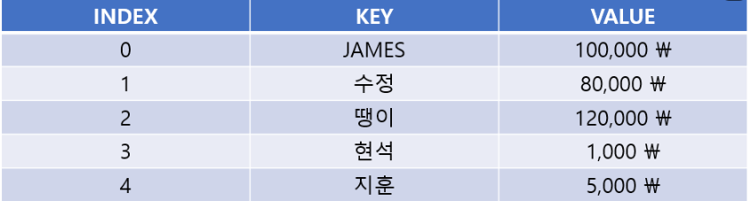
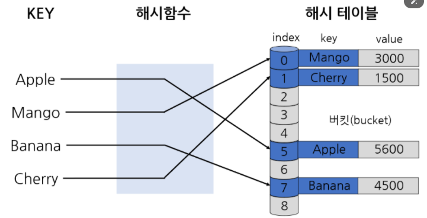
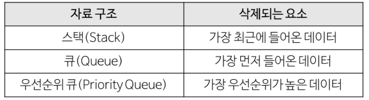
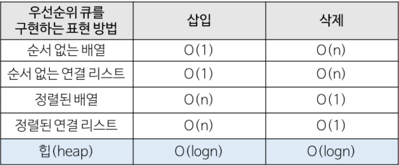
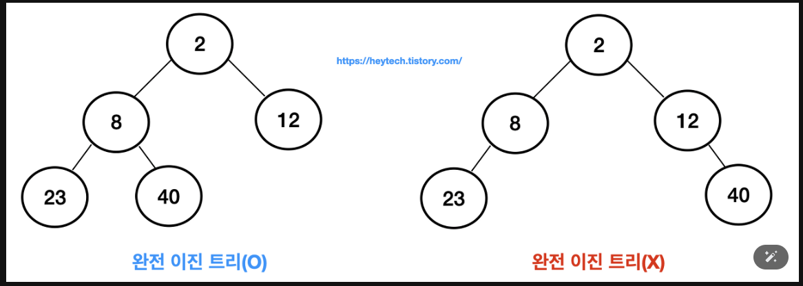
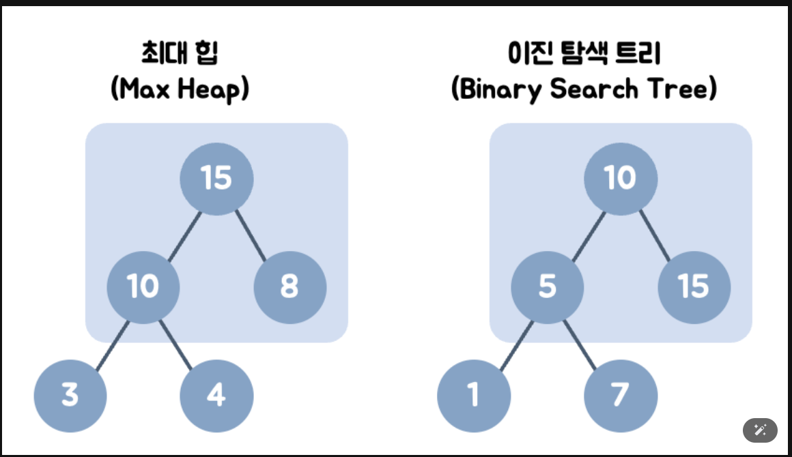

### 자료구조 심화 학습 내용

* [해시](#해시-심화)
* [개념](#개념)
* [용어](#용어정리)
* [장/단점](#해시-자료구조의-장-단점과-용도)
* [충돌](#충돌)
* [궁금증](#학습-하면서-궁금했던-점)
* [모의면접1](#면접내용-1)
* [Heap&트리](#heap과-tree-심화)
* [들어가기전](#들어가기전)
* [Heap](#힙heap-이란)
* [vs](#힙-vs-이진-탐색-트리)
* [의문](#heap을-공부하며-생긴-의문)
- 해시 심화: 해시 함수/로드 팩터/체이닝 vs 오픈 어드레싱, hashCode()/equals() 규약
- Heap에 대하여
- Tree: BST 불균형 문제, Red-Black/AVL 회전, Heap 응용(상위 K, 다중 병합)
- Graph: BFS/DFS 구현 숙달, 최단경로(다익스트라), 위상정렬, 최소신장트리(Kruskal/Prim)
---
### 해시 심화
> :arrow_double_up:[Top](#자료구조-심화-학습-내용)   :leftwards_arrow_with_hook:[Back](https://github.com/wnsur1234/CS-TIL#CS)   :information_source:[Home](https://github.com/wnsur1234/CS-TIL)

이전 시간에 Map과 Set에 대해 공부를 하였는데
단순히 Map과 Set의 구현체에는 
(HashSet,HashMap,LinkedHashSet,LinkedHashMap) 이렇게 있다 정도만 숙지를 하였다.
하지만 Hash에 대해서 정확한 숙지가 필요 하다 생각하여 공부해 보았다.

### 개념
> :arrow_double_up:[Top](#자료구조-심화-학습-내용)   :leftwards_arrow_with_hook:[Back](https://github.com/wnsur1234/CS-TIL#CS)   :information_source:[Home](https://github.com/wnsur1234/CS-TIL)
- 해시(Hash)는 입력 데이터를 고정된 길이의 데이터로 변환된 값을 말합니다. 
  다른 말로는 '해시 값(Hash value), 해시 코드, 체크섬' 이라고도 합니다. 
  이러한 해시는 뒤에서 알아볼 '해시 함수'에 의해서 얻게 됩니다. 
- 간단하게 말하자면, `데이터의 KEY 값이 해시 함수를 통해서 변환된 간단한 정수입니다.` 
  이렇게 정수로 변환된 해시는 배열의 인덱스, 위치, 데이터 값을 저장하거나 검색할 때 활용됩니다.

### 용어정리
> :arrow_double_up:[Top](#자료구조-심화-학습-내용)   :leftwards_arrow_with_hook:[Back](https://github.com/wnsur1234/CS-TIL#CS)   :information_source:[Home](https://github.com/wnsur1234/CS-TIL)
1) 해시 함수(Hash Function)
- 해시 함수(Hash function)는 입력받은 데이터를 해시 값으로 출력시키는 알고리즘을 말합니다.
즉, 위에 해시의 개념을 수행하는 함수

2) 해시 테이블(Hash Table)
- 해시 테이블(Hash table)은 키와 값을 함께 저장해 둔 데이터 구조입니다. 
이는 데이터가 행과 열로 구성된 표에 저장되는 것과 유사합니다. 
테이블에 데이터를 저장할 때 위치는 무작위로 지정되어 작성됩니다. 따라서 중간에 여유 공간이 발생할 수 있습니다.


3) 해싱(Hashing)
해싱은 해시 함수에서 해시를 출력하고, 해시 테이블에 저장하는 과정까지의 행위를 말합니다.


### 해시 자료구조의 장, 단점과 용도
> :arrow_double_up:[Top](#자료구조-심화-학습-내용)   :leftwards_arrow_with_hook:[Back](https://github.com/wnsur1234/CS-TIL#CS)   :information_source:[Home](https://github.com/wnsur1234/CS-TIL)
1) 장점
    - 데이터 저장 / 일기 속도가 빠름 ( 검색 속도가 빠름)
    - 해시는 키에 대한 데이터가 있는지 확인이 쉬움

2) 단점
    - 일반적으로 저장공간이 많이 필요
    - 여러 키에 해당하는 주소(인덱스)가 동일한 경우 충돌을 해결하기 위한 별도 자료구조 필요

3) 주요 용도
    - 검색이 많이 필요한 경우
    - 저장, 삭제, 읽기가 빈번한 경우
    - 캐쉬 구현

참고 : JAVA 에서는 주로 HashMap 클래스를 사용합니다.
`→ 해시 테이블 구조를 활용하여 구현된 JAVA Collection Framework에 속한 클래스`

### 로드펙터
- 정의: 저장된 데이터 개수 / 버킷(배열) 크기
- 의미: 해시 테이블이 얼마나 차 있는지를 나타냄.
- 예시: capacity 16, 데이터 12개 → load factor = 0.75
- 기본값: Java HashMap에서는 0.75 (75% 차면 resize 발생).
➡️ Load Factor가 높아지면 충돌이 많아지고 성능 저하 → 따라서 일정 수준 이상 차면 배열 크기를 2배로 늘려서 rehashing 합니다.

- 로드 팩터(load factor) = (저장된 엔트리 수) / (버킷 개수)
- 버킷이 10개인데 7개 채워졌으면 load factor = 0.7

### 충돌
> :arrow_double_up:[Top](#자료구조-심화-학습-내용)   :leftwards_arrow_with_hook:[Back](https://github.com/wnsur1234/CS-TIL#CS)   :information_source:[Home](https://github.com/wnsur1234/CS-TIL)
- 위에서 작성한 코드는 해시의 기본 원리를 이해하기 위해 작성된 방법입니다.
Hash function 부분을 보면, 입력받은 키의 첫 번째 문자를 배열의 크기로 나눈 나머지를 인덱스로 사용하는데요.
만약 다른 키가 있는데 이 키의 첫 번째 문자가 동일하다면, 인덱스는 동일하게 반환될 것입니다. 그럼 배열에서 같은 장소에 저장되고, 이전에 저장된 정보는 사라질 것입니다. 이를 충돌이 발생했다고 하는데요. 또는 Collision이라고 합니다.

### 해결 방안
- Chaining 기법
    - 개방 해싱 또는 Open Hashing 기법 중 하나 : 해시 테이블 저장공간 외의 공간을 활용하는 기법
    - 충돌이 발생했을 때, 연결 리스트(Linked List) 자료구조를 사용해서 해결하는 방법

| Chaining 기법으로 충돌 해결하기

---

## 학습 하면서 궁금했던 점
1. 내가 알고 있는건 HashCode()가 변환 하는 역할이라 알고 있었는데
Hash와는 다른건지 
2. HashTable도 나오는데 공식문서상 Map이나 Set에서는 설명을 찾을 수 없었음

위 두가지 질문에 대한 답변
1. 답변
- HashCode()는 Java에서 쓰이는 개념이고 반환 값은 int형 해시 값
- equals()와 함께 동작해야 컬랙션(Map,Set 등)에서 정상 작동
즉, Hash는 개념적 용어이고 HashCode()는 java에서의 메서드

2. 답변
- 요즘은 HashTable 대신 HashMap,LinkedHashMap,ConcuurentHashMap 등을 주로 사용
- HashTable은 레거시로 분류되어 새 문서에는 잘 안다룸

추가)
equals()와 함께 동작해야한다는 의미 이해가 잘 안갔음
-> Java 기반 해시 컬랙션은 다음 단계를 거침
1. 객체를 넣을 때 **hashCode()**를 먼저 호출해서 버킷(bucket) 이라는 그룹을 정합니다.
- 즉, "이 값은 몇 번 칸에 들어갈까?"를 결정하는 과정입니다.

2. 같은 버킷 안에 여러 객체가 들어올 수도 있으므로, 그때는 **equals()**로 정확히 같은 객체인지 비교합니다.

```
// 예시 코드
import java.util.HashSet;

class Person {
    String name;

    Person(String name) {
        this.name = name;
    }

    @Override
    public int hashCode() {
        return name.hashCode(); // 이름 기반으로 해시값 반환
    }

    @Override
    public boolean equals(Object obj) {
        if (this == obj) return true;
        if (obj == null || getClass() != obj.getClass()) return false;
        Person person = (Person) obj;
        return name.equals(person.name);
    }
}

public class Main {
    public static void main(String[] args) {
        HashSet<Person> set = new HashSet<>();

        set.add(new Person("Junhyeok"));
        set.add(new Person("Junhyeok")); // 같은 이름

        System.out.println(set.size()); // 1 출력
    }
}
```
---
### 면접내용 1
> :arrow_double_up:[Top](#자료구조-심화-학습-내용)   :leftwards_arrow_with_hook:[Back](https://github.com/wnsur1234/CS-TIL#CS)   :information_source:[Home](https://github.com/wnsur1234/CS-TIL)

1. 해시 관련 질문 : 
- Java에서 hashCode()와 equals() 메서드는 해시 기반 컬렉션(HashMap, HashSet 등)에서 어떤 방식으로 함께 동작하나요?
- 만약 hashCode()만 올바르게 구현하고 equals()를 구현하지 않는다면 어떤 문제가 발생할 수 있나요?

    답변 : 
    Java에서 hashCode()와 equals() 관계
    해시 기반 컬렉션(HashMap, HashSet 등)은 객체를 저장할 때 **hashCode()**를 호출해서 버킷(bucket)을 정합니다.

    같은 버킷 안에 여러 객체가 들어올 수 있으므로, 최종적으로 **equals()**를 호출해서 같은 객체인지 비교합니다.
    hashCode()만 구현하고 equals()를 구현하지 않으면 논리적으로 동일한 객체가 중복 저장될 수 있습니다.

    반대로 equals()만 구현하면 같은 객체라도 다른 버킷에 들어가서 검색 성능이 저하됩니다.

2. 로드 팩터와 성능 질문 :
- 해시 테이블에서 **로드 팩터(load factor)**가 무엇인지 설명하고, 로드 팩터가 지나치게 높거나 낮을 때 각각 어떤 성능 문제가 발생할 수 있는지 설명해주세요.

    답변 :
    로드 팩터(load factor) = (저장된 데이터 개수) / (버킷 개수)
    Java HashMap의 기본 로드 팩터는 0.75입니다.

    로드 팩터가 너무 높으면 충돌이 많이 발생해 검색이 느려집니다. (최악의 경우 O(n))
    로드 팩터가 너무 낮으면 공간 낭비가 발생합니다.
    따라서 성능을 위해 적절한 로드 팩터에서 리사이징(rehashing)을 합니다.

3. 충돌 해결 방식 질문 :
- 해시 충돌(Collision)을 해결하는 방법에는 체이닝(Chaining)과 오픈 어드레싱(Open Addressing) 방식이 있습니다. 두 방법의 차이점과 각각의 장단점을 설명해주세요.

    답변 : 
    체이닝(Chaining): 같은 해시 값이 나오면 연결 리스트(또는 트리)를 사용해 같은 버킷에 여러 데이터를 저장합니다.
    장점: 구현이 단순하고, 테이블이 꽉 차도 삽입 가능
    단점: 충돌이 많으면 O(n)까지 성능이 저하됨

    오픈 어드레싱(Open Addressing): 충돌 시 테이블 내에서 빈 슬롯을 찾아 저장합니다. (선형 탐사, 이차 탐사, 이중 해싱)
    장점: 추가 자료구조 필요 없음
    단점: 테이블이 꽉 차면 삽입 불가능, 삭제 구현이 까다로움

4. Red-Black Tree / AVL Tree 질문 : 
- 이진 탐색 트리(BST)는 불균형 문제가 생기기 쉽습니다. 이를 해결하기 위해 Red-Black Tree와 AVL Tree가 사용되는데, 두 트리의 차이점과 균형을 맞추는 방식(회전)을 설명해주세요.

    답변 :
    **이진 탐색 트리(BST)**는 삽입 순서에 따라 한쪽으로 치우쳐 성능이 O(n)까지 떨어질 수 있습니다.
    이를 해결하기 위해 **스스로 균형을 맞추는 트리(Self-Balancing Tree)**인 AVL Tree와 Red-Black Tree가 있습니다.

    AVL Tree: 삽입/삭제 시마다 높이 균형을 엄격하게 유지합니다. (검색 성능 ↑, 삽입/삭제 비용 ↑)
    Red-Black Tree: 완벽한 균형은 아니지만 색깔 규칙을 통해 대략적인 균형을 유지합니다. (삽입/삭제 성능이   AVL보다 빠름)

    두 트리 모두 회전(Rotation) 연산을 통해 균형을 맞춥니다.

5. 그래프 알고리즘 질문 :
- 위상 정렬(Topological Sort)의 정의와 동작 방식을 설명하고,
어떤 경우에 위상 정렬이 유용하게 사용될 수 있는지 예시를 들어 설명해주세요.

    답변 :
    위상 정렬은 **사이클이 없는 방향 그래프(DAG)**에서 정점을 선행 관계에 맞춰 나열하는 알고리즘입니다.

    동작 방식 :
    진입 차수(indegree)가 0인 노드를 큐에 넣음
    큐에서 꺼내 연결된 간선을 제거
    새롭게 진입 차수가 0이 된 노드를 큐에 삽입 → 반복

    활용 사례 :
    작업 스케줄링 (예: 특정 과목 선수 과목을 이수해야 다음 과목을 들을 수 있는 경우)
    빌드 시스템 (어떤 모듈이 다른 모듈에 의존하는 경우, 빌드 순서 결정)

---
### Heap과 Tree 심화
> :arrow_double_up:[Top](#자료구조-심화-학습-내용)   :leftwards_arrow_with_hook:[Back](https://github.com/wnsur1234/CS-TIL#CS)   :information_source:[Home](https://github.com/wnsur1234/CS-TIL)

### 들어가기전...
- 우선순위 큐: 우선순위의 개념을 큐에 도입한 자료 구조
    - 데이터들이 우선순위를 가지고 있고 우선순위가 높은 데이터가 먼저 나간다.
    - 
    - 우선순위 큐의 이용 사례
        a. 시뮬레이션 시스템
        b. 네트워크 트래픽 제어
        c. 운영 체제에서의 작업 스케쥴링
        d. 수치 해석적인 계산
    - 우선순위 큐는 배열, 연결리스트, 힙 으로 구현이 가능하다. 
      이 중에서 힙(heap)으로 구현하는 것이 가장 효율적이다.
    - 

### 힙(Heap) 이란?
> :arrow_double_up:[Top](#자료구조-심화-학습-내용)   :leftwards_arrow_with_hook:[Back](https://github.com/wnsur1234/CS-TIL#CS)   :information_source:[Home](https://github.com/wnsur1234/CS-TIL)
- 데이터에서 최댓값과 최솟값을 빠르게 찾기 위해 고안된
  `완전 이진 트리(Complete Binary Tree)`의 일종으로 우선순위 큐를 위하여 만들어진 구조이다.
- 힙은 일종의 반정렬 상태(느슨한 정렬 상태) 를 유지한다.
    - 큰 값이 상위 레벨에 있고 작은 값이 하위 레벨에 있다는 정도
    - 간단히 말하면 부모 노드의 키 값이 자식 노드의 키 값보다 항상 큰(작은) 이진 트리를 말한다.
- 힙 트리에서는 중복된 값을 허용한다. (이진 탐색 트리에서는 중복된 값을 허용하지 않는다.)

### 완전 이진 트리란?
> 이진 트리에 노드를 삽입할 때 왼쪽부터 차례대로 삽입하는 트리이다.

(출처: https://heytech.tistory.com/105)

### 힙의 종류
- 최대 힙(max heap)
    - 부모 노드의 키 값이 자식 노드의 키 값보다 크거나 같은 완전 이진 트리
    - `key(부모 노드) >= key(자식 노드)`
- 최소 힙(min heap)
    - 부모 노드의 키 값이 자식 노드의 키 값보다 작거나 같은 완전 이진 트리
    - `key(부모 노드) <= key(자식 노드)`

### 그외 힙에 대하여
> 힙의 구현,삽입,삭제
- 출처 (https://gmlwjd9405.github.io/2018/05/10/data-structure-heap.html)

### 힙 vs 이진 탐색 트리
### 이진 탐색 트리(Binary Search Tree)란?
>이진 탐색과 연결리스트(linked-list)를 결합한 자료구조의 일종이다.
이진 탐색의 효율적인 탐색 능력을 유지하면서 빈번한 자료의 입력과 삭제를 가능하도록 한다.
각 노드에서 `왼쪽의 자식 노드는 해당 노드보다 작은 값으로`, `오른쪽의 자식 노드는 해당 노드보다 큰 값으로` 이루어져 있다.

- 공통점
    - 모두 완전 이진트리이다.

- 차이점
    - (최대힙의 경우) 힙은 각 노드의 값이 자식 노드보다 크거나 같다.
    - 이진 탐색 트리는 각 노드의 왼쪽 자식은 더 작은 값으로, 오른쪽 자식은 더 큰 값으로 이루어져있다.
    - 왼쪽 자식 노드 < 부모 노드 < 오른쪽 자식 노드
    - 힙은 왼쪽 노드의 값이 크든 오른쪽 노드의 값이 크든 상관 없다.
    - 힙은 최대/최소 검색을, 이진 탐색 트리는 탐색을 위한 구조이다.


### Heap을 공부하며 생긴 의문
> :arrow_double_up:[Top](#자료구조-심화-학습-내용)   :leftwards_arrow_with_hook:[Back](https://github.com/wnsur1234/CS-TIL#CS)   :information_source:[Home](https://github.com/wnsur1234/CS-TIL)

[의문점]
- 앞서 자료구조 처음을 공부할 때 자료구조는 데이터를 저장하기 위한 알고리즘이고
  데이터를 저장하는데 있어서 메모리(Ram)의 구조에 Heap이 있었다는걸 알 수 있다.
- 그렇다면 이 메모리에서의 Heap은 무엇이고 지금 공부한 Heap은 무엇인건가?
[내용]
📌Heap (메모리 관리에서의 Heap)
- 위치: 프로세스 메모리 영역 중 하나 (Stack, Heap, Data, Code 영역 중 Heap).

- 특징:
    - 동적 할당되는 객체/배열 등이 저장됨.
    - 수명이 불확실 → 개발자가 new로 만들고 GC가 회수함 (Java 기준).
    - Stack보다 접근 속도는 느림.
    - 구조적으로는 그냥 큰 덩어리 메모리 풀(memory pool)일 뿐이지, 트리 구조와는 무관함.
👉 여기서의 Heap은 단순히 **"임의의 공간에 동적 할당하는 저장소"**라는 뜻.

📌 Heap (자료구조에서의 Heap)
- 정의: 완전 이진 트리 기반의 우선순위 큐 구현을 위한 자료구조.
- 특징:
    - 최소 힙: 루트가 최솟값
    - 최대 힙: 루트가 최댓값
    - 삽입/삭제 시 O(log n)
    - 활용: 우선순위 큐, 다익스트라, 힙 정렬, top-k 문제 등.
👉 여기서의 Heap은 **"언덕처럼 위로 큰 값(또는 작은 값)이 쌓여 있는 구조"**라는 의미.

📌 왜 같은 이름일까?
>"heap"의 원래 뜻은 “무더기, 더미(pile)”예요.
메모리 관리에서 → 데이터가 한 군데 무더기로 쌓여 동적으로 쓰인다는 의미.
자료구조에서 → 큰 값이나 작은 값이 꼭대기에 더미처럼 쌓인다는 의미.
그래서 동일한 단어가 다른 맥락에서 쓰일 뿐, 둘은 전혀 다른 개념이에요.

📌 정리
>메모리의 Heap: 런타임 객체가 올라가는 저장 공간.
자료구조의 Heap: 완전 이진 트리 기반의 우선순위 큐 구현 구조.
공통점: 그냥 “heap = 무더기, pile”이라는 말 때문에 이름만 같을 뿐.
차이점: 전혀 별개. 혼동하면 안 됨.
---

## 찐 최종