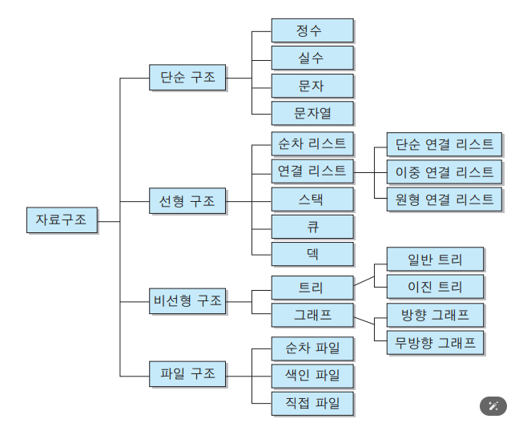

# 1. Data Structure (자료구조)
**:book: Contents**
* [개요](#개요)
* [선형/비선형](#분류-선형-vs-비선형)
* [선형구조](#선형-구조)
* [Array](#array)
* [List](#list)
* [Stack](#stack)
* [Queue](#queue)
* [Deque](#deque)
* [비선형구조](#비선형)
* [Set](#set)
* [Map](#map)
* [Tree](#tree)
* [Graph](#graph)
* [요약표](#요약-표)

---
## 개요
> :arrow_double_up:[Top](#1-data-structure-자료구조)   :leftwards_arrow_with_hook:[Back](https://github.com/wnsur1234/CS-TIL#CS)   :information_source:[Home](https://github.com/wnsur1234/CS-TIL)
### 자료구조란?

- 데이터를 표현·저장·관리·처리하기 위한 구조.
알고리즘은 이 구조를 효율적으로 다루는 절차.

- “어디에 어떻게 담을지(자료구조) + 어떻게 꺼내 쓸지(알고리즘)”

### 학습 목적

- 실행 속도와 메모리 효율을 높이기 위함.

- CPU: 연산/제어. 메모리에 있는 데이터를 읽어 처리한다.

- 메모리(RAM): 실행 중 데이터를 임시 저장. (Stack/Heap 영역 존재)

    - Stack: 함수 호출 프레임(지역변수/매개변수). LIFO, 자동 관리, 매우 빠름.

    - Heap: 동적 할당(객체). 가비지 컬렉션 대상, 비교적 느림.

    - 스토리지(SSD/HDD): 영구 저장. 속도가 느려 실행 시 프로그램/데이터를 메모리로 로드한다.

실행 성능은 결국 메모리 접근 패턴과 자료구조 선택에 크게 좌우된다.

### 자료구조 ↔ 알고리즘

- 자료구조의 알고리즘: 삽입/삭제/탐색/정렬 방식 (예: 해시, 트리 회전, BFS/DFS)

- 자료구조를 이용한 알고리즘: 문제 해결 절차에서 스택/큐/그래프 등을 활용
---
### 자료구조의 분류 정리


### 분류: 선형 vs 비선형
> :arrow_double_up:[Top](#1-data-structure-자료구조)   :leftwards_arrow_with_hook:[Back](https://github.com/wnsur1234/CS-TIL#CS)   :information_source:[Home](https://github.com/wnsur1234/CS-TIL)

- 선형(Linear): 데이터가 한 줄로 나열. 인접 원소 개념이 뚜렷.
예) Array, List(연결리스트), Stack, Queue, Deque

- 비선형(Non-Linear): 계층/망 구조. 하나의 원소가 여러 원소와 연결.
예) Tree, Graph, Set/Map(내부적으로 트리/해시 등으로 구현)

⚠️ “순서를 보장한다”와 “선형이다”는 다릅니다.LinkedHashMap/LinkedHashSet처럼 비선형 분류(연결망/해시 기반)이면서 삽입 순서를 유지하는 컬렉션도 있음.

---
## 선형 구조
### Array
> :arrow_double_up:[Top](#1-data-structure-자료구조)   :leftwards_arrow_with_hook:[Back](https://github.com/wnsur1234/CS-TIL#CS)   :information_source:[Home](https://github.com/wnsur1234/CS-TIL)
- Array
    - 개념: 연속 메모리, 고정 크기, 인덱스 O(1) 접근
    - 언제: 크기가 대략 고정·랜덤접근 잦음·캐시 친화적
    - 복잡도: 접근 O(1), 중간 삽입/삭제 O(n), 끝 삽입(가득차면 재할당) 평균 암ortized O(1).
``` 
int[] arr = {10, 20, 30};
int x = arr[1]; // 20
```
---
### List
> :arrow_double_up:[Top](#1-data-structure-자료구조)   :leftwards_arrow_with_hook:[Back](https://github.com/wnsur1234/CS-TIL#CS)   :information_source:[Home](https://github.com/wnsur1234/CS-TIL)
- List (ArrayList / LinkedList)
    - 개념: 순차 컨테이너(가변 크기).
    - 차이
        - ArrayList: 배열 기반. 랜덤접근 강점, 중간 삽입/삭제 비용 큼.
        - LinkedList: 노드 연결. 중간 삽입/삭제 유리, 랜덤접근 약점.
    - 복잡도(대표)
        - ArrayList: get O(1), add(end) amortized O(1), add/remove(mid) O(n)
        - LinkedList: get O(n), add/remove(node 참조 있으면) O(1)
```
List<String> a = new ArrayList<>();
a.add("A"); a.add("B"); // [A,B]

LinkedList<String> l = new LinkedList<>();
l.addFirst("X"); l.addLast("Y"); // X <-> Y
```
---
### Stack
> :arrow_double_up:[Top](#1-data-structure-자료구조)   :leftwards_arrow_with_hook:[Back](https://github.com/wnsur1234/CS-TIL#CS)   :information_source:[Home](https://github.com/wnsur1234/CS-TIL)
- Stack
    - 개념: LIFO. 함수 호출, 되돌리기(undo), 괄호검사 등.
    - 복잡도: push/pop O(1).
```
Deque<Integer> st = new ArrayDeque<>();
st.push(1); st.push(2);
int top = st.pop(); // 2
```
---
### Queue
> :arrow_double_up:[Top](#1-data-structure-자료구조)   :leftwards_arrow_with_hook:[Back](https://github.com/wnsur1234/CS-TIL#CS)   :information_source:[Home](https://github.com/wnsur1234/CS-TIL)
- Queue
    - 개념: FIFO. 작업 대기열, BFS.
    - 복잡도: offer/poll O(1).
```
Queue<String> q = new ArrayDeque<>();
q.offer("A"); q.offer("B");
String first = q.poll(); // "A"
```
---
### Deque
> :arrow_double_up:[Top](#1-data-structure-자료구조)   :leftwards_arrow_with_hook:[Back](https://github.com/wnsur1234/CS-TIL#CS)   :information_source:[Home](https://github.com/wnsur1234/CS-TIL)
- Deque
    - 개념: 양쪽 입출력. 슬라이딩 윈도우, 모노톤 큐.
    - 복잡도: addFirst/addLast/removeFirst/removeLast O(1).
```
Deque<Integer> d = new ArrayDeque<>();
d.addFirst(1); d.addLast(2); // [1,2]
d.removeLast();              // [1]
```
---
## 비선형
### Set
> :arrow_double_up:[Top](#1-data-structure-자료구조)   :leftwards_arrow_with_hook:[Back](https://github.com/wnsur1234/CS-TIL#CS)   :information_source:[Home](https://github.com/wnsur1234/CS-TIL)
- Set (HashSet / LinkedHashSet / TreeSet)
    - 개념: 중복 없음 집합. contains 효율로 멤버십 테스트에 강함.
    - 차이
        - HashSet: 해시 기반, 평균 O(1). 순서 없음.
        - LinkedHashSet: 해시 + 연결리스트, 삽입 순서 유지.
        - TreeSet: Red-Black Tree, 정렬 순서 유지, O(log n).
```
Set<String> s = new HashSet<>();
s.add("A"); s.add("A"); // 중복 무시
boolean has = s.contains("A"); // true
```
### Map
> :arrow_double_up:[Top](#1-data-structure-자료구조)   :leftwards_arrow_with_hook:[Back](https://github.com/wnsur1234/CS-TIL#CS)   :information_source:[Home](https://github.com/wnsur1234/CS-TIL)
- Map (HashMap / LinkedHashMap / TreeMap)
    - 개념: (키→값) 매핑.
    - 차이
        - HashMap: 평균 O(1), 순서 없음.
        - LinkedHashMap: 삽입/접근 순서 유지. LRU 캐시 구현 시 유용.
        - TreeMap: 정렬 순서 유지, 모든 연산 O(log n). 범위 질의(subMap 등) 강력.
```
Map<String,Integer> m = new LinkedHashMap<>();
m.put("apple", 3); m.put("banana", 1);
for (var e : m.entrySet()) { /* 삽입 순서대로 순회 */ }
```
### Tree
> :arrow_double_up:[Top](#1-data-structure-자료구조)   :leftwards_arrow_with_hook:[Back](https://github.com/wnsur1234/CS-TIL#CS)   :information_source:[Home](https://github.com/wnsur1234/CS-TIL)
- Tree (BST / Heap etc.)
    - 개념: 계층적 구조(루트-자식).
    - 대표
        - BST: 왼<루트<오른. 평균 탐색 O(log n), 편향되면 O(n).
        - Balanced BST (Red-Black, AVL): 항상 O(log n). TreeMap/TreeSet 기반.
        - Heap: 완전이진트리, 최댓값/최솟값 빠른 접근. 삽입/삭제 O(log n).
```
// 최소 힙
PriorityQueue<Integer> minHeap = new PriorityQueue<>();
minHeap.offer(5); minHeap.offer(1); minHeap.offer(3);
int min = minHeap.poll(); // 1
```
### Graph
> :arrow_double_up:[Top](#1-data-structure-자료구조)   :leftwards_arrow_with_hook:[Back](https://github.com/wnsur1234/CS-TIL#CS)   :information_source:[Home](https://github.com/wnsur1234/CS-TIL)
- Graph
    - 개념: 정점(V)과 간선(E). 방향/가중 여부로 다양.
    - 표현
        - 인접 리스트: 희소 그래프에 유리, O(V+E).
        - 인접 행렬: 밀집 그래프/간선 존재 여부 O(1).
    - 탐색: BFS(최단 간선수), DFS(경로/사이클), 다익스트라/벨만-포드/플로이드-워셜 등.
```
Map<Integer, List<Integer>> g = new HashMap<>();
g.put(1, List.of(2,3));
g.put(2, List.of(4));
// BFS
Queue<Integer> q = new ArrayDeque<>();
Set<Integer> vis = new HashSet<>();
q.offer(1); vis.add(1);
while (!q.isEmpty()) {
  int cur = q.poll();
  for (int nxt : g.getOrDefault(cur, List.of())) {
    if (vis.add(nxt)) q.offer(nxt);
  }
}
```
---
### 요약 표
| 구조 | 핵심 장점 | 주의점/제약 | 대표 복잡도(탐색/삽입/삭제) |
|------|-----------|-------------|----------------------------|
| Array | 랜덤접근 O(1), 캐시 친화 | 크기 고정, 중간삽입 비쌈 | - / O(n) / O(n) |
| ArrayList | 가변 크기 + 랜덤접근 | 중간 삽입/삭제 비쌈 | get O(1), add(end) amortized O(1) |
| LinkedList | 중간 삽입/삭제 유리 | 랜덤접근 느림 | 접근 O(n), 삽입(노드참조) O(1) |
| Stack | LIFO | 중간 엑세스 부적합 | push/pop O(1) |
| Queue | FIFO | 중간 엑세스 부적합 | offer/poll O(1) |
| Deque | 양끝 O(1) | 중앙 연산 비효율 | 양끝 연산 O(1) |
| HashSet/Map | 평균 O(1) 탐색 | 해시 품질·충돌 의존, 순서X | contains/get O(1) |
| LinkedHashSet/Map | 삽입/접근 순서 유지 | 약간의 오버헤드 | 평균 O(1) |
| TreeSet/TreeMap | 정렬/범위 질의 | O(log n) 오버헤드 | O(log n) |
| Heap(PQ) | 최댓/최솟 빠른 추출 | 전체 탐색/삭제는 비효율 | push/pop O(log n) |
| Graph | 관계/경로 문제 | 표현·알고리즘 선택 중요 | 탐색 O(V+E) |

---
### 다음 학습 계획
- 해시 심화: 해시 함수/로드 팩터/체이닝 vs 오픈 어드레싱, hashCode()/equals() 규약
- Tree: BST 불균형 문제, Red-Black/AVL 회전, Heap 응용(상위 K, 다중 병합)
- Graph: BFS/DFS 구현 숙달, 최단경로(다익스트라), 위상정렬, 최소신장트리(Kruskal/Prim)


