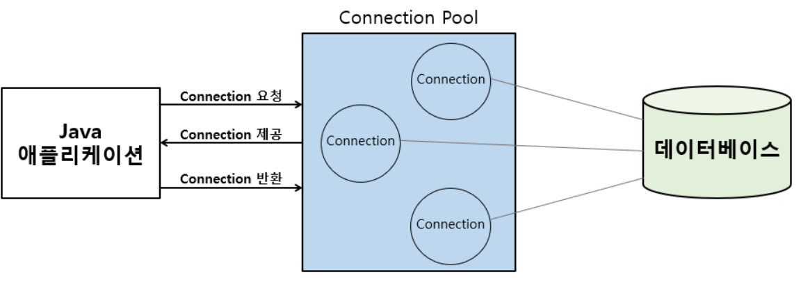

# 커넥션 풀(Connection Pool)이란?

*** 블로그 검색 결과 JDBC에 대해서만 커낵션풀을 다루고있음 ***

### 용어에 대한 기본 개념
> DB 연결(Connection)을 미리 여러개 만들어두고, 요청이 올 때마다 빌려주고 다시 돌려받아 재사용하는 방식

`“DB 연결 = 비싸고 느린 자원”`이라서 서버에서는 거의 필수

### 왜 필요한가
- DB 커넥션을 매 요청마다 만들고 끊으면 아래 비용이 계속 발생
    - TCP 연결/SSL 핸드셰이크(옵션)
    - DB 인증/세션 생성
    - 세션 파라미터 설정(autocommit 등)

> 그래서 미리 만들어 둔 커넥션을 재사용하면 성능과 안정성이 좋아진다

### 동작 방식(흐름)

[그림]



- 서버 시작 시(또는 최초 요청 시) 커넥션을 N개 생성
- 요청이 DB가 필요하면 풀에서 커넥션을 “획득(borrow)”
- 쿼리 실행
- 작업 끝나면 close()를 호출 → 실제로는 연결을 끊는 게 아니라 풀로 “반납(return)”
- 다음 요청이 그 커넥션을 재사용

> 포인트: 애플리케이션 코드에서 close()는 “종료”가 아니라 “반납”인 경우가 빈번하다(풀 사용 시)


### 풀에서 중요한 설정들
- max pool size(최대 커넥션 수)
    - 동시 DB 작업이 많을수록 필요하지만, DB가 감당 가능한 연결 수를 넘기면 역효과.
- min idle(최소 유휴 커넥션 수)
    - 트래픽이 갑자기 늘 때 즉시 대응하려고 어느 정도 미리 유지.
- connection timeout(획득 대기 시간)
    - 풀이 꽉 찼을 때 “얼마나 기다리다 실패할지”. 너무 길면 요청이 쌓여 장애가 커짐.
- idle timeout / max lifetime
    - 오래 놀거나 너무 오래 살아있는 커넥션을 정리(네트워크/NAT/DB 정책으로 죽는 문제 예방).
- validation(유효성 검사)
    - 죽은 커넥션을 빌려주지 않도록 ping/test query로 확인.

### 흔한 장애 3가지
1) 풀 고갈(Connection Pool Exhaustion)
- 증상: “커넥션을 못 얻어서 timeout”
- 원인: 동시 요청 폭증, 풀 크기 너무 작음, 아래 “누수” 발생
- 대응: 풀 크기/쿼리 성능/트래픽 제어(큐잉, rate limit) 같이 봐야 합니다.

2) 커넥션 누수(Connection Leak)
- 증상: 시간이 갈수록 사용 가능한 커넥션이 줄어들어 결국 고갈
- 원인: 예외 상황에서 반납이 안 됨(= close 누락)
- 대응: try-with-resources(자바), finally에서 반납 보장, leak detection 옵션 켜기

3) 느린 쿼리로 인한 점유(커넥션 홀드 시간 증가)
- 증상: 풀은 충분한데도 항상 바쁨
- 원인: 쿼리/트랜잭션이 오래 걸려 커넥션을 오래 잡고 있음
- 대응: 인덱스/쿼리 튜닝, 트랜잭션 범위 축소, 외부 호출을 트랜잭션 안에서 하지 않기

### "커넥션 풀의 크기 조정"
> 무작정 크게 하면 안 된다 

- DB는 커넥션마다 메모리/스레드/락 관리 비용 발생
- 앱 인스턴스가 여러 개면 (풀 크기 × 인스턴스 수) 만큼 DB 연결이 늘어 DB가 먼저 터질 가능성이 있다.
- 보통은 DB가 감당 가능한 최대 연결 수를 기준으로, “앱 인스턴스 수”까지 고려해서 풀 크기를 나눠 잡음

### 한 문장으로 정리
커넥션 풀은 DB 연결을 `캐싱`해서 빌려 쓰고 `반납`하게 만드는 자원 관리 장치이고,
`성능(연결 비용 절감) + 안정성(연결 수 통제)`을 위해 사용한다.


---
<details>
    <summary> 내 프로젝트 확인</summary>

> connection pool을 찾아보고 공부한 결과 "지금까지 프로젝트 진행하면서 저런 코드를 짠적이 없는데?" 라고 생각되어
`cursor`에게 물어보았는데 Spring boot에서는 Connection Pool관리를 자동으로 해준다고함

```
[yml]
 datasource:
    url: ${SPRING_DATASOURCE_URL}
    username: ${SPRING_DATASOURCE_USERNAME}
    password: ${SPRING_DATASOURCE_PASSWORD}
    driver-class-name: org.mariadb.jdbc.Driver
```
위 코드를 통해 DB Connection 설정을 자동으로 하게끔 했던것!!!!

> Spring Boot 2.0 이전 버전에서는 Apche 재단의 오픈 소스인 Apache Commons DBCP를 주로 사용하였지만, 
Spring Boot 2.0 이후에는 HikariCP를 기본 DBCP로 채택하여 사용되

</details>
---