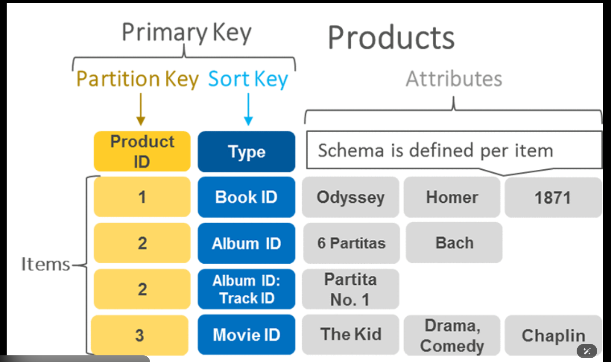
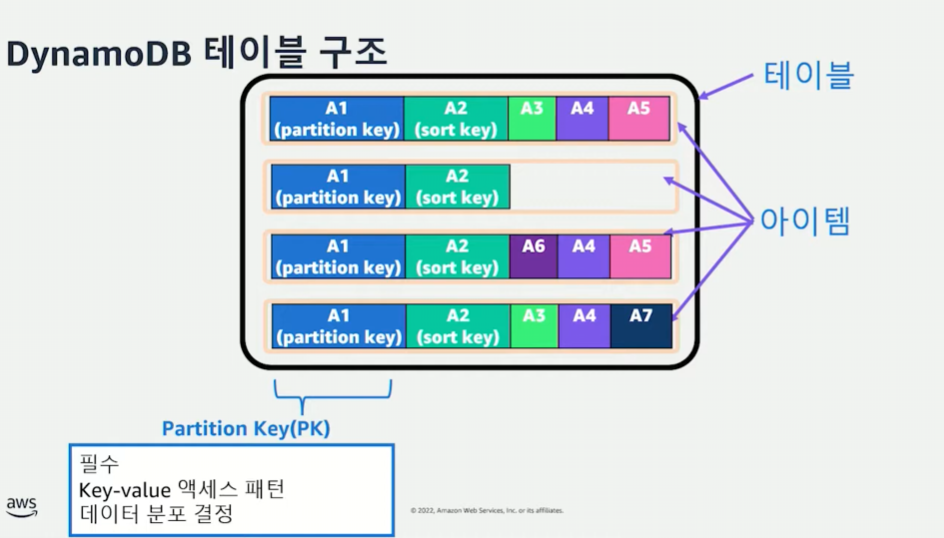
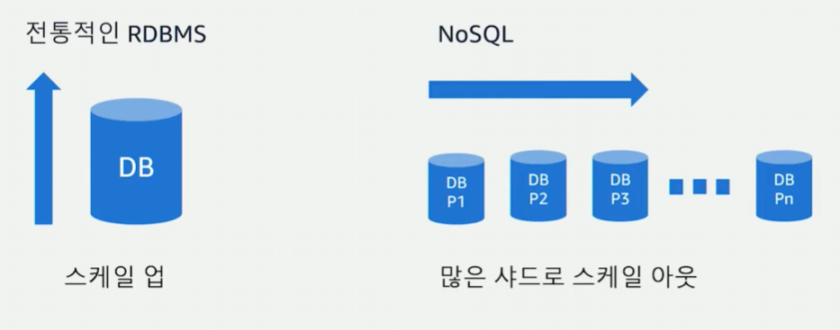
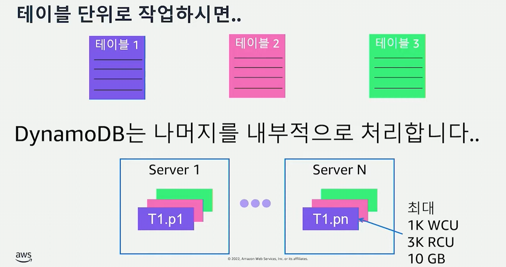

# DynamoDB 

### DynamoDB를 실제로 사용하려고 하니...

``` 
DynamoDB를 실제로 사용하려고하다보니까 
막상 pk는 뭘로 둬야하는거고 sortKey 이런건 어떻게
설계를 해야할지 도저히 감히 잡히질 않는다.
```

# !!!!근데 진짜 개중요!!!!
> 알고보니 Developing_2에 보다 상세하게 나와있었음!!!

바로 가고 싶다면? [참고](../../AWS/developing/aws_developing_2.md) 
여기서 `DynamoDB를 검색해서 쭉 읽어 볼것`

### 나의 요구사항
나는 AIagnet에 정보를 전달하기 위해
1. 프롬프트를 보내야하고 
2. 응답값이 Json형식으로 돌아오는데 이 값을 저장해야한다.

`그렇다면`??

이 두개만 저장하면 되는건지
추가로 저장을 한다면 어떠한 정보를 저장하는게 좋을까??

계획 1, 계획 2, 계획 3... 이렇게 나올꺼고
`[하나의 흐름에서의 추가 프롬프트 질문, 새로운 채팅창같이 새로운 프롬프트 입력]` 들이
나올건데 이런건 어떠한 형식으로 저장되는지 새로운 컬럼으로 생성되어 저장되는건지 등을 
알아보아야겠다.

### DynamoDB 강좌 찾아보기

### 구성요소
- 키
    - PK(Partition key)
        - 파티션을 식별
        - 얘는 항상 `==, <, >, >=, <=` 연산자만 사용가능
    - Sort Key(SK)
        - 동일한 파티션 내에서 항목을 정렬
        - 근데 얘는 굳이 사용하지 않아도 된다고 함 
        - <u>`1:N 관계 모델링 할 수 있음`</u>
        - 얘는 "begins with", "between", 등호연산자를 사용 가능

- 보조인덱스
    - GSI(Global Secondary Index)
        - 전체 데이터를 대상으로
        - 특정 컬럼을 검색하고자 할 때 사용.
        - 얘는 새로운 복합 키를 생성하는것과 같다
        
    - LSI(Local Secondary Index)
        - 동일 파티션 키 내에서 작동        
        - 인덱스와 같다

### Dynamo에서 제공하는 데이터 조회 방법

- 쿼리(Query)
    - 특정 값에 일치하는 항목만 검색합니다.

- 스캔(Scan) : 비용이 많이 듬
    - 테이블의 모든 항목을 검색합니다.

- 여기서 primaryKey의 중요성이 나오는데
  오직 primaryKey(partition key, sort key)로 만 쿼리가 가능하다.

---

```
위에까지 내용은 공통적으로 딱 저기까지만 정보를 제공하는거 같다.
```

### 테이블 구조

- DynamoDB의 가장 큰 구조는 테이블이다.
    - 테이블에는 무한대에 가까운 아이템을 입력할 수 있다.
    - 아이템과 attribute

- attribute = cloum과 같은 개념으로
    - attribute가 모이면 attributes가 된다.

```
ex)
{
  "userId": "U123",  -> 하나하나가 attribute
  "movieId": "M455",
  "rating": 4,
  "createdAt": "2025-12-08"
}
전체가 attributes
```

- 아이템(Row,행) -> 행거
    - attributes가 모여서 아이템이된다.







- 스케일 업 VS 스케일 아웃
> DynamoDB는 스케일 아웃 구조



즉, 다이나모는 `수평으로 무한대에 가능하게 확장이가능`

---

### 그렇다면 내가 `가장` 궁금했던 부분
> Q : 수평으로 확장 가능한 데이터를 설계하는 방법은 무엇이냐?

- 기본적으로 성능이 작은걸 스케일 아웃해나가며 각 머신들을 골구루 사용가능하게해야함

### Dynamo에서 테이블 단위 작업이란...

```
다이나모 디비에서 테이블단위로 데이터를 읽고 쓰는 작업을 하면
논리적인 개념의 테이블 아래에는 실제 물리적인 서버위에 파티션 단위로 컴퓨팅 작업이 이루어진다.

그리고 이 파티션 작업을 관리 하는것은 고객에게 서버노출없이 다이나모db가 알아서 처리한다.

다음 테이블이 만들어져도... 또 만들어져도 동일합니다.
```

각 파티션의 크기는 `초당 천개의 쓰기와 3천개의 읽기 10기가의 저장공간`
이것은 매우 중요한 제약 조건중 하나이다.



---

# 🔥실제 데이터 저장의 흐름
> 매우 어려우니 여기는 주의 깊게 확인 필요

[예시로 시작하면]

```
{
    OrderId : 2 | pk
    CountryCode : 1
    ASIN : [Boo0QVZDJM]
}
-> 동일한 구조의 orderId 와 같이 다른게 쭉있다고 가정
```
사전 작업 : PK의 Hash화

[DynamoDB Table의 저장]
- Orders 테이블
    - Partition A -> orderId : 2인 값 저장
    - Partition B -> orderId : 3인 값 저장
    - Partition C

-> 위의 작업 내용을 간단한 예시로 설명하자면
Order 테이블 = 대학교를 뜻함
Partition A  = 건물(공과, 인문계 ,,,,)
PK(orderId) = 학생 번호

Iten = 학생
Attribute = 학생 정보

---

여기까지의 `매우 매우 중요한 사항`

- 물리적 개념과 논리적 개념이 존재함

일단 위의 {}안의 내용 즉 item의 내용에서의 pk는 `논리적 개념의 pk` 이고

실제 저장되는 Partition A,B는 `물리적 개념의 PK이` 이다.
즉, 사실상 개발자는 물리적 개념의 pk는 생각하지 않아도 됨

그래서 만약 userId, orderId 가 각각 pk라면

자동으로 물리적 개념의 Users,Orders 테이블이 생성되는것이고
거기에서 id값이 논리적 개념의 pk에 따라 물리적 개념의 pk가 자동생성되어 값이 구분되어 저장되는것이다.

---

### 위 정리 내용에 대한 GPT 피드백
> DynamoDB는 “PK 종류에 따라 테이블을 자동 생성해주지 않습니다.”

✔ 정확한 문장

테이블 생성은 개발자가 수행하는 명시적 작업이다.
테이블을 만들고 그 테이블의 PK를 정하는 것 또한 개발자다.

나머지는 맞음 (맞는거 같음)
partition A가 뭐 물리적 공간이아니고 물리적 서버라고했는데
결국 똑같은 말 같음 

7:24분까지 들음
