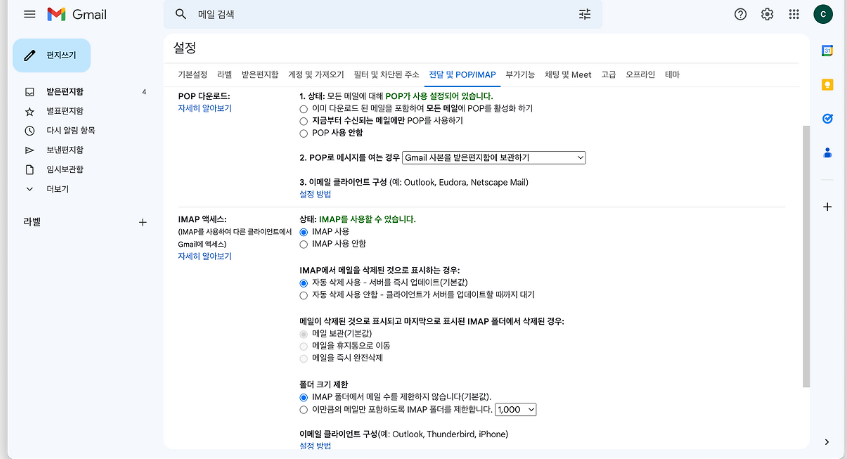

### 이메일 인증 실습

### Step 1
> Gmail 또는 원하는 메일 시스템 -> 설정 -> 앱 비밀번호 생성 -> 해당메일 설정에 전달 POP/IMAP 설정


### Step 2
> 프로젝트 내 환경 설정
1. gradel 의존성 추가
2. yml or properties 추가

```
[gradle 추가]

=> implementation group: 'org.springframework.boot', name: 'spring-boot-starter-mail', version: '3.0.5'

---

spring:
	mail:
    host: smtp.gmail.com
    port: 587
    username: travelwithme.mail@gmail.com
    password: password
    properties:
      mail:
        smtp:
          auth: true
          starttls:
            enable: true
            required: true
          connectiontimeout: 5000
          timeout: 5000
          writetimeout: 5000
    auth-code-expiration-millis: 1800000  # 30 * 60 * 1000 == 30분
```
- host : Gmail의 STMP 서버 호스트 -> 즉, 메일을 보내는 발신 전용 계정
- port: SMTP 서버의 포트 번호. `Gmail SMTP 서버는 587번 포트를 사용`
- username: 이메일을 보내는 용으로 사용되는 계정의 이메일 주소 입력 (= 자신의 gmail주소 사용하면 됨)
- password: 위에서 생성했던 앱 비밀번호 입력 (-> 이것에 대한 비밀번호 .env나 edit config에 넣어놔야함)
- properties: 이메일 구성에 대한 추가 속성
- auth: SMTP 서버에 인증 필요한 경우 true로 지정한다. Gmail SMTP 서버는 인증을 요구하기 때문에 true로 설정해야 한다.
- starttls: SMTP 서버가 TLS를 사용하여 안전한 연결을 요구하는 경우 true로 설정한다. TLS는 데이터를 암호화하여 안전한 전송을 보장하는 프로토콜이다.
- connectiontimeout: 클라이언트가 SMTP 서버와의 연결을 설정하는 데 대기해야 하는 시간(Millisecond). 
                     연결이 불안정한 경우 대기 시간이 길어질 수 있기 때문에 너무 크게 설정하면 전송 속도가 느려질 수 있다.
- timeout: 클라이언트가 SMTP 서버로부터 응답을 대기해야 하는 시간(Millisecond). 서버에서 응답이 오지 않는 경우 대기 시간을 제한하기 위해 사용된다.
- writetimeout: 클라이언트가 작업을 완료하는데 대기해야 하는 시간(Millisecond). 이메일을 SMTP 서버로 전송하는 데 걸리는 시간을 제한하는데 사용된다.
- auth-code-expiration-millis: 이메일 인증 코드의 만료 시간(Millisecond)

### step 3
> DTO를 용도에 맞게 생성한다.

[Request dto 영역]
- SendEmailCodeRequest : 인증 보낼 이메일 용
- VerifyEmailCodeRequest : 인증 이메일이랑 인증 코드 적는 용

[Response dto 영역]
- EmailVerificationResult : 인증 성공 여부 반환하는 dto

### Redis 설정
> 이메일 코드를 Redis에 짧게 보관하기 때문에 Redis 관련 코드를 생성한다.

- RedisService, RedisServiceImpl

### step 4
> 메일 발송 및 인증 서비스

[메일 발송]
- `MailSenderService`를 생성하여 인증을 요청하는 사용자에게 메일을 발송하는 코드를 만든다.

[메일 인증]
- `MailVerificationService` 
    - 메일 요청이 있을 시 랜덤으로 인증번호를 생성하여 해당 메일로 보내는 역할을 하고
    - 그 메일을 입력했을 시 올바른 인증번호인지 확인을 한다.

### step 4
> 컨트롤러 생성
> 지금까지 만든 코드들을 활용하여 인증을 요청하고 인증 하는 api를 만든다.

---

### 구현을 하면서 헷갈렸던, 몰랐던 점

1. TTL 이란?
- TTL은 Time To Live로 `키가 자동으로 만료될 때까지의 시간`
- Redis에 만료시간을 넣어 자동으로 삭제 되도록 한다.
    - ex) app.auth-code-expiration-millis=300000 → 5분 지나면 코드 키가 자동 소멸으로 yml에 설정 해놓았음

2. 