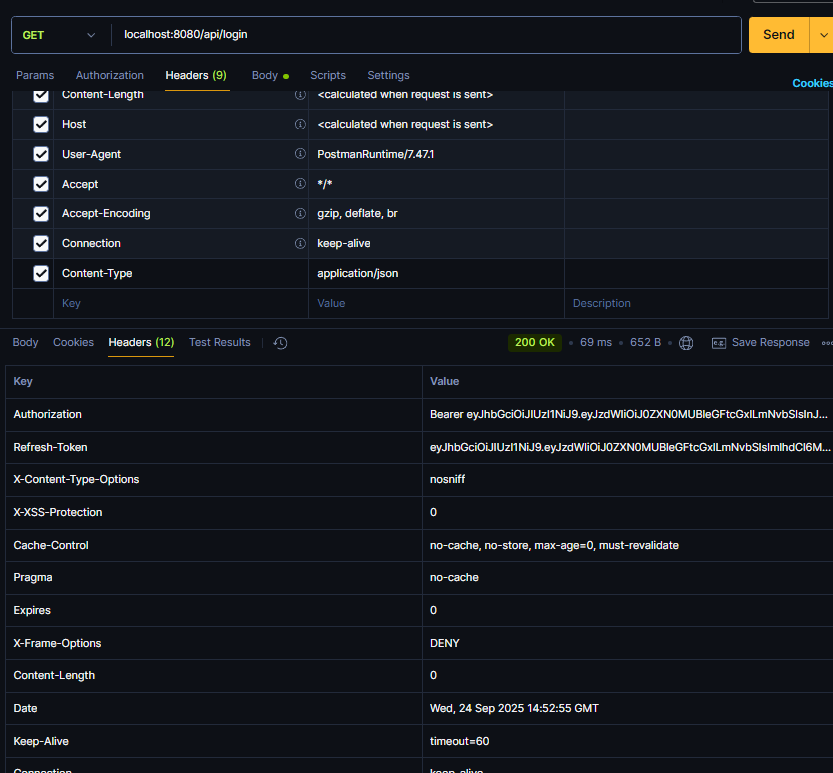

* [들어가기](#배경)
* [구현하기](#구현하기)
### 배경
> 구현하기에 앞서 Security의 버전에 대해서 먼저 확인을해야 했다.
내가 블로그 글을 찾아보면 사실 방식이 다 다르고 코드가 통일성이 없어서 왜그러지를 생각해보았는데
6.0 버전 이후로 방식이 바뀐것이고 lambda 방식으로 바뀐것이라고 한다.

### 구현하기
먼저, RefreshToken의 저장 방법은 서버에 저장하는 방식으로 mariaDB를 사용하여 저장하였습니다.

### 1. AccessToken 과 RefreshToken 의 시간 설정
-> yml 파일에 secretKey와 각 토큰의 시간을 설정합니다.
```
jwt:
  secret: ${JWT_SECRET}
  access-token-expiration: 3600000   # 1시간 (밀리초)
  refresh-token-expiration: 1209600000 # 14일 (밀리초)
```
AccessToken은 탈취의 위험이 있으므로 짧은 유효기간을 가지고 
서버에 저장되는 RefreshToken은 보다 길게 유효기간을 같도록 설정하였습니다.

### 2. RefreshToken 엔티티 & 레포지토리
이후 RefeshToken이 실제 저장될 수 있도록 엔티티와 레포지토리를 생성합니다.
```
# Entity
@Id
    @UuidGenerator
    @Column(updatable = false, nullable = false)
    @Schema(description = "refreshTokenID", example = "550e8400-e29b-41d4-a716-446655440000", requiredMode = Schema.RequiredMode.REQUIRED)
    private UUID id;

    // 실제 어떤 사용자의 토큰인지 확인용
    private String email;
    // 실제 RefreshToken 값
    private String token;

# Repository
public interface RefreshTokenRepository extends JpaRepository<RefreshToken, Long> {
    Optional<RefreshToken> findByEmail(String email);
    void deleteByEmail(String email);
}
```
### 3. JWTUtil (RefreshToken 생성/검증 추가)
역할 : JWTUtil은 여러가지 역할을 하는데
각 accessToken과 refreshToken을 생성하고

refreshToken을 컨트롤러에서 받아오면 검증을 하는 로직을 가지고 있습니다.
또한,getUsername()은 subject를 가져오는 거라 사실상 **사용자 식별자(email)**를 리턴하는 메서드
isExpired()는 단순 만료 체크뿐만 아니라, ExpiredJwtException을 잡아서 true로 처리하는 로직이 들어가 있으니, 만료 토큰을 잡아내는 핵심 메서드의 역할들도 합니다.
```
private final SecretKey secretKey;
    private final long accessTokenExpiration;
    private final long refreshTokenExpiration;

    public JWTUtil(
            @Value("${jwt.secret}") String secret,
            @Value("${jwt.access-token-expiration}") long accessTokenExpiration,
            @Value("${jwt.refresh-token-expiration}") long refreshTokenExpiration
    ) {
        this.secretKey = Keys.hmacShaKeyFor(secret.getBytes(StandardCharsets.UTF_8));
        this.accessTokenExpiration = accessTokenExpiration;
        this.refreshTokenExpiration = refreshTokenExpiration;
    }

    // AccessToken 생성 (짧은 유효기간)
    public String createAccessToken(String email, String role) {
        return Jwts.builder()
                .setSubject(email)
                .claim("role", role)
                .setIssuedAt(new Date())
                .setExpiration(new Date(System.currentTimeMillis() + accessTokenExpiration))
                .signWith(secretKey, SignatureAlgorithm.HS256)
                .compact();
    }

    // RefreshToken 생성 (긴 유효기간)
    public String createRefreshToken(String email) {
        return Jwts.builder()
                .setSubject(email)
                .setIssuedAt(new Date())
                .setExpiration(new Date(System.currentTimeMillis() + refreshTokenExpiration))
                .signWith(secretKey, SignatureAlgorithm.HS256)
                .compact();
    }

    public String getUsername(String token) {
        return Jwts.parserBuilder().setSigningKey(secretKey).build()
                .parseClaimsJws(token).getBody().getSubject();
    }

    public boolean isExpired(String token) {
        try {
            Date expiration = Jwts.parserBuilder()
                    .setSigningKey(secretKey).build()
                    .parseClaimsJws(token).getBody().getExpiration();
            return expiration.before(new Date());
        } catch (ExpiredJwtException e) {
            return true;
        }
    }
```
### 4. JwtAuthenticationFilter
역할 : 로그인 시 AccessToken + RefreshToken 발급을 합니다.
Authentication, 즉 말그대로 인증을 하는 단계로
로그인이 성공하였을 시 권한토큰을 발급하는 역할을 합니다.
```
private final AuthenticationManager authenticationManager;
    private final JWTUtil jwtUtil;
    private final RefreshTokenService refreshTokenService;

    // 로그인 시도 (아이디/비밀번호 확인)
    @Override
    public Authentication attemptAuthentication(HttpServletRequest request, HttpServletResponse response) {
        try {
            ObjectMapper objectMapper = new ObjectMapper();
            LoginRequest loginRequest = objectMapper.readValue(request.getInputStream(), LoginRequest.class);

            UsernamePasswordAuthenticationToken authToken =
                    new UsernamePasswordAuthenticationToken(loginRequest.getEmail(), loginRequest.getPassword());

            return authenticationManager.authenticate(authToken);
        } catch (IOException e) {
            throw new CustomException(ErrorCode.USER_LOGIN_FAILED);
        }
    }

    // 로그인 성공 → AccessToken, RefreshToken 발급
    @Override
    protected void successfulAuthentication(HttpServletRequest request, HttpServletResponse response,
                                            FilterChain chain, Authentication authResult) throws IOException {
        CustomUserDetails principal = (CustomUserDetails) authResult.getPrincipal();

        String accessToken = jwtUtil.createAccessToken(principal.getUsername(), principal.getRole());
        String refreshToken = jwtUtil.createRefreshToken(principal.getUsername());

        // 기존 RefreshToken 삭제 후 새로 저장
        refreshTokenService.saveRefreshToken(principal.getUsername(), refreshToken);

        // 응답 헤더에 담아 보내기
        response.setHeader("Authorization", "Bearer " + accessToken);
        response.setHeader("Refresh-Token", refreshToken);
    }
```
### 5. JwtAuthorizationFilter
역할 : Authroization, 즉 인가(권한)이므로 
절차를 위해 토큰을 검증하고, SecurityContext에 사용자 정보를 등록 하는 역할을 합니다.
앞선 인증자체는 이미 로그인 단계에서 끝났고, 요청이 올때마다 토큰을 확인해 사용자 권한을 부여하는 과정입니다.
```
 private final JWTUtil jwtUtil;
    private final UserDetailsServiceImpl userDetailsService;

    @Override
    protected void doFilterInternal(HttpServletRequest request, HttpServletResponse response, FilterChain chain)
            throws IOException, ServletException {

        String header = request.getHeader("Authorization");
        if (header == null || !header.startsWith("Bearer ")) {
            chain.doFilter(request, response);
            return;
        }

        String token = header.substring(7);
        if (jwtUtil.isExpired(token)) {
            throw new CustomException(ErrorCode.EXPIRED_TOKEN);
        }

        try{
            String username = jwtUtil.getUsername(token);
            UserDetails userDetails = userDetailsService.loadUserByUsername(username);

            UsernamePasswordAuthenticationToken authentication =
                    new UsernamePasswordAuthenticationToken(userDetails, null, userDetails.getAuthorities());

            SecurityContextHolder.getContext().setAuthentication(authentication);
        }catch(JwtException e){
            throw new CustomException(ErrorCode.INVALID_TOKEN);
        }
        chain.doFilter(request, response);
    }
```
### 6. SecurityConfig 연결
역할 : 기본은 security역할을 하는것으로 각 엔드포인트에대한 보안을 설정하고
비밀번호 암호화하는 등 여러가지 역할을 하는데, 여기에 `앞서만든 filter들을 연결해줍니다.`
따라서 .addFilterBefore()을 통해 모든 요청에 대해 토큰 검증을 로그인 인증 필터보다 우선 처리하기 위함입니다.

```
 private final JWTUtil jwtUtil;
    private final UserDetailsServiceImpl userDetailsService;
    private final RefreshTokenService refreshTokenService;

    @Bean
    public AuthenticationManager authenticationManager(
            HttpSecurity http, PasswordEncoder passwordEncoder) throws Exception {
        AuthenticationManagerBuilder authManagerBuilder =
                http.getSharedObject(AuthenticationManagerBuilder.class);

        authManagerBuilder.userDetailsService(userDetailsService)
                .passwordEncoder(passwordEncoder);

        return authManagerBuilder.build();
    }

    @Bean
    public SecurityFilterChain securityFilterChain(HttpSecurity http, AuthenticationManager authenticationManager) throws Exception {
        JwtAuthenticationFilter jwtAuthenticationFilter =
                new JwtAuthenticationFilter(authenticationManager, jwtUtil, refreshTokenService);
        jwtAuthenticationFilter.setFilterProcessesUrl("/api/login"); // 로그인 URL 지정

        return http
                .csrf(AbstractHttpConfigurer::disable)
                .sessionManagement(session -> session.sessionCreationPolicy(SessionCreationPolicy.STATELESS))
                .authorizeHttpRequests(auth -> auth
                        .requestMatchers("/api/member/signup", "/api/login", "/api/token/reissue").permitAll()
                        .anyRequest().authenticated()
                )
                .addFilter(jwtAuthenticationFilter)
                .addFilterBefore(new JwtAuthorizationFilter(jwtUtil, userDetailsService),
                        UsernamePasswordAuthenticationFilter.class)
                .build();
    }

    @Bean
    public PasswordEncoder passwordEncoder() {
        return PasswordEncoderFactories.createDelegatingPasswordEncoder();
    }
```
### 토큰 재발급 API
역할 : 이후 로그인하였을 때 로직이 
AccessToken이 만료되었거나 로그인에 대한 재 요청이 들어왔을 시 
RefreshToken을 확인하여 올바른 사용자라면 AccessToken을 재 발급해주는 역할을 합니다.
```
private final JWTUtil jwtUtil;
    private final RefreshTokenRepository refreshTokenRepository;

    @Override
    public ResponseEntity<BaseResponse<String>> reissue(
            @RequestHeader("Refresh-Token") String refreshToken,
            @RequestHeader(value = "Trace-Id", required = false) String traceId
    ) {
        if (jwtUtil.isExpired(refreshToken)) {
            throw new CustomException(ErrorCode.EXPIRED_REFRESH_TOKEN);
        }

        String email = jwtUtil.getUsername(refreshToken);
        RefreshToken saved = refreshTokenRepository.findByEmail(email)
                .orElseThrow(() -> new CustomException(ErrorCode.INVALID_REFRESH_TOKEN));

        if (!saved.getToken().equals(refreshToken)) {
            throw new CustomException(ErrorCode.INVALID_REFRESH_TOKEN);
        }

        String newAccessToken = jwtUtil.createAccessToken(email, "ROLE_USER");
        return ResponseEntity.ok()
                .body(BaseResponse.success("Bearer " + newAccessToken));
    }
```

이렇게 하면 정상적으로 로그인 시도 시 AccessToken과 RefreshToken을 발급 받는 
Jwt 인증 방식이 구현 됩니다.
