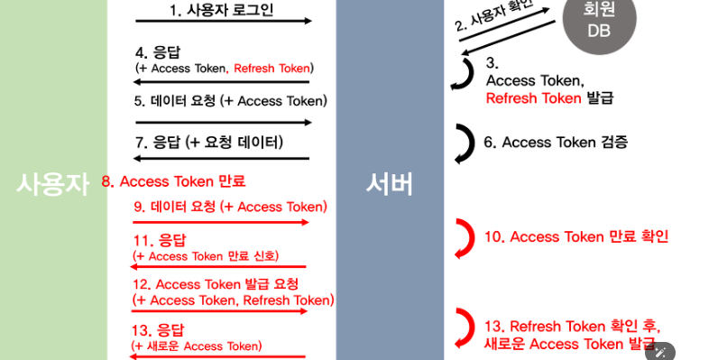
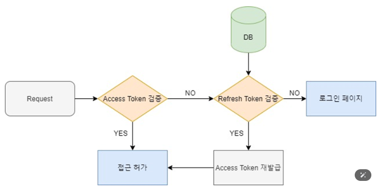

* [들어가기](#jwt-란)
* [구조](#jwt-구조)
* [Signauture](#signature서명)
* [장점/단점](#jwt의-장점과-단점-고려사항)
* [RefreshToken](#refresh-token)
* [구현](#구현하기)
* [로그아웃](#로그아웃)

### JWT 란?
>Json 포맷을 이용하여 사용자에 대한 속성을 저장하는  Claim 기반의 Web Token.
JWT는 토큰 자체를 정보로 사용하는 Self-Contained 방식으로 정보를 안전하게 전달한다.
---
### JWT 구조
> JWT는 `Header,Payload,Signature`의 3부분으로 이루어 지며, 
  각 부분은 Json 형태인 `Base64Url로 인코딩` 되어 표현된다.
  또한 각각의 부분을 이어주기 위해 `구분자`를 사용한다.
* 참고 : Base64Url은 암호화된 문자열이 아니고, `같은 문자열에 대해 항상 같은 인코딩` 문자열을 반환 

### 1) Header(헤더)
> 토큰의 헤더는 typ과 alg 두가지 정보로 구성된다. alg는 헤더(Header)를 암호화 하는 것이 아니고,
Sginature를 해싱하기 위한 `알고리즘을 지정` 하는 것이다.
```
"alg" : "Hs256",
"typ" : JWT
```

### 2) Payload(페이로드)
> 토큰의 페이로드에는 토큰에서 사용할 정보의 조각들인 `클레임(Claim)`이 담겨있다.
* 클레임은 총 3가지로 나뉘며 Json(Key/Value) 형태로 다수의 정보를 넣을 수 있다.

2-1) 등록된 클레임(Registered Claim)
> 등록된 클레임은 토큰 정보를 표현하기 위해 `이미 정해진 종류의 데이터`들로, 모두 선택적으로 작성이 가능하며
  사용 할 것을 권장한다. 또한 JWT를 간결하게 하기 위해 Key는 `모두 길이 3의 String` 이다.
  여기서 subject로는 unuique 한 값을 사용하는데, 사용자 이메일을 주로 사용한다.

- iss : 토큰 발급자(issuer)
- sub : 토큰 제목(subject)
- aud : 토큰 대상자(audience)
- exp : 토큰 만료 시간(expriation), NumericDate 형식으로 되어 있어야함 ex) 14808491417370
- nbf : 토큰 활성 날짜(not Before), 이 날이 지나기 전의 토큰은 활성화 되지 않음
- jat : 토큰 발급 시간(issuedAt), 토큰 발급 이후의 경과 시간을 알 수 있음
- jti : Jwt 토큰 식별자(JWT ID), 중복 방지를 위해 사용하며, `일회용 토큰(Access Token)` 등에 사용

2-2) 공개 클레임(Public Claim)
> 공개 클레임은 `사용자 정의 클레임으로, 공개용 정보를 위해 사용` 충돌 방지를 위해 URI 포맷을 이용
```
"https://localhost:8080/login:ture
```

2-3) 비공개 클레임(Private Claim)
> 비공개 클레임은 `사용자 정의 클레임으로, 서버와 클라이언트 사이 임의 지정한 정보 저장`
```
"token_type" : access
```
---
### Signature(서명)
> 서명(Signature)은 `토큰을 인코딩하거나 유효성 검증을 할 때 사용하는 고유한 암호화 코드`이다.
서명은 위에서 만든 헤더(Header)와 페이로드(Payload)의 값을 각각 BASE64URL로 인코딩하고, 
인코딩한 값을 비밀키를 이용해 헤더에서 정의한 알고리즘으로 해싱하고, 이 값을 BASE64URL로 인코딩하여 생성한다.

* 생성된 토큰은 Http 통신을 할 때 Authrization이라는 key의 value로 사용된다.
일반적으로 value에는 Bearer이 앞에 붙여진다.
```
"Authorization":"Bearer {생성된 토 큰값}"
```
---
### JWT의 장점과 단점, 고려사항
[JWT 장점]
- 서버가 다수 존재하는 환경에서 유용하다. 세션을 사용하면 모든 서버에서 세션 내용을 공유해야하기 때문
- 매 요청시마다 DB 조회를 하지 않고 토큰 자체만으로 사용자의 정보 및 권한을 알 수 있기에 병목현상 방지
//TODO : 병목현상

[JWT 단점 및 고려사항]
- Self-contained : 토큰 자체에 정보를 담고 있으므로 양날의 검이 될 수 있다.
- 토큰 길이 : 토큰의 페이로드(Payload)에 3 종류의 클레임을 저장하기 때문에, 정보가 많아질수록 토큰의 길이가 길어져 네트워크에 부하를 줄 수 있다.
- Payload 인코딩 : 페이로드(Payload) 자체는 암호화 된 것이 아니라, BASE64Url로 인코딩 된것이므로
중간에 탈취를 당하면 디코딩으로 데이터를 볼 수 있고, JWE로 암호화 하거나 Payload에 중요 데이터를 넣지 않아야한다.
- Stateless : JWT는 상태를 저장하지 않기 때문에 한번 만들어지면 제어가 불가능하다.
즉, 토큰을 임의로 삭제하는 것이 불가능하므로 토큰 만료 시간을 꼭 넣어주어야 한다.
- Tore Token : 토큰은 클라이언트 측에서 관리해야 하기 때문에, 토큰을 저장해야한다.
---
### Refresh Token
> 앞서 JWT의 특성에 대해 살펴 보았듯, `JWT는 토큰자체에 정보를 담고 있어 보안이 매우 취약하다.`
만약 JWT 토큰을 탈취당하게 되면 사용자의 권한과 정보를 모두 빼앗기게 된다.

이를 보안하기 위해서 `Refresh Token`의 개념이 사용되었다.
- Access Token의 유효기간은 매우 짧게
- Refresh Token의 유효기간은 길게
해주는 것이 포인트다.

즉
- Access Token을 통해서만 자원에 접근이 가능, But 유효기간이 매우 짧음(탈취를 당해도 이미 사용할 수 없는 상태)
- Refresh Token은 유효기간이 길기에 탈취당할 수도 있지만 Refresh Token은 `오직` Access 토큰을 재발급 하는 용도 (Referesh Token 자체로는 별 쓸모가 없음)



더 간단한 흐름도로 보면 다음과 같음


<u>Refresh Token을 사용하여 다음과 같은 이득을 얻을 수 있다.</u>
- Access Token의 유효기간을 짧게 하여 탈취 방지!
    - (Access Token이 탈취당하더라도 유효기간이 짧아 사용할 수 있는 기간이 줄어들어 탈취방지 효과)
- Access 토큰의 유효기간이 짧음에도 불구하고 Refresh Token이 만료될때까지 `추가적인 로그인을 하지 않아도 됨`
    - 마치 Session(세션)이 유지되는 것 같은 효과가 있음
---

### 구현하기
* [▶️답변내용](./jwt_practice.md)

---
### 로그아웃
* 출처 : https://upcurvewave.tistory.com/611

