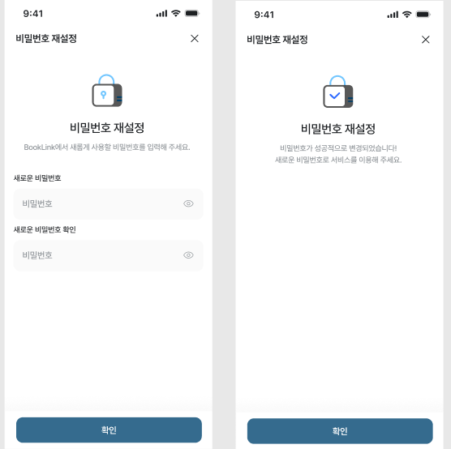
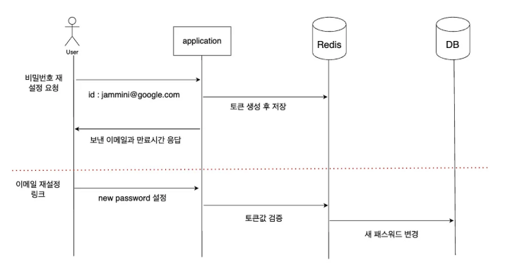

### 비밀번호 변경
> JWT를 이용하여 Token인증 방식을 사용할때 비밀번호 변경 시 알아야할 점들이 있다.

### 들어가면서...
> 먼저 나는 비밀번호 변경이라 함은 단순히 사용자로부터 payload를 받아 
PasswordEncodeder을 한 뒤 repository를 통해 update만 실행하면 되는거 아닌가? 라는 생각을 했었다.

B . U . T,

일반 적인 경우(하나의 브라우저 내에서 진행되는)는 방금 위의 방법 대로 해도 상관이 없다.
어차피 로그인이 된 채로 같은 화면에서 CustomUserDetails의 user 정보를 확인하여 진행 하면 되는데

보통 애플리케이션의 흐름 -> 비밀번호 변경을 하기 위해서는 이메일을 통한 재설정 링크를 들어가
-> 비밀번호 변경을 진행 하게 된다.
--> 이렇게 할 경우 사용자가 모바일을 통한 앱을 실행하다 비밀번호 변경을 이메일로 진행하기위에 컴퓨터로 즉, 다른기기로 이메일링크를 통한 접속한경우
또는 크롬이라는 브라우저에서 비밀번호를 재설정하는데 다른 브라우저(InternetEx 등)으로 접속한 경우
---> 이러한 경우 사용자가 로그인한 로그인 정보가 남아 있지를 않는다는것이다. => 이 말은 CustomUserDetails에서 user정보를 가져오지 못한 다는 뜻이다.

### 실전 들어가기
> 그렇다면 다른 브라우저나 다른 기기의 환경에서 들어가도 로그인한 사용자인것을 어떻게 확인 할 수 있을까? 
그 방법에 대해 알아보자.

### [비밀번호 찾기 설계]
- 사용자가 이메일 입력 후 비밀번호 재설정 요청
- 서버가 1회용 토큰을 생성해 저장
- 토큰이 포함된 재설정 링크를 이메일로 발송
- 사용자가 링크 클릭 → 새 비밀번호 입력 화면으로 이동
- 서버가 토큰 검증 후 비밀번호 변경 완료
---

### [다이어그램]

---

### [토큰 설계](Redis VS DB)

방식 장점 단점
| 구분 | 장점 | 단점 |
|------|------|------|
| **DB** | 감사·리보크 용이 | 테이블 증가·I/O 부담 |
| **Redis** | 속도 우수·TTL 자동 만료 | 유실 시 복구 어려움 |

-> 나는 이 중 Redis를 선택하였고 다음과 같은 이유로 선택하였다.

1. 성능 및 확장성
- Redis는 메모리 기반 키·값 저장소이기 때문에, DB에 비해 읽기·쓰기 속도가 매우 빠르다.
- 비밀번호 재설정 같은 “발급 → 검증 → 삭제” 패턴이 매우 빈번히 일어나므로, 딜레이 없이 응답을 주기 위해 인메모리 저장소가 유리하다.
2. TTL(자동 만료) 관리 편의성
- Redis는 TTL을 이용하면 저장한 값을 지정된 시간 후에 자동으로 삭제를 해준다.
- DB를 쓰게되면 별도의 스케줄러로 만료된 레코드를 지우거나, 애플리케이션 레벨에서 만료 로직을 추가해야 하지만, Redis는 이 과정을 완전히 자동화해준다.
3. 1회용 토큰 보장 & 운영 부하 절감
- 비밀번호 재설정 토큰은 “한 번만 쓰이고 바로 무효화”되어야 하는데, Redis에서는 GET 후 DEL을 단일 트랜잭션으로 처리할 수 있다.
- DB를 이용한다면 I/O 부담과 별도의 테이블을 만들어야 하는 문제가 있고, 만료 레코드 정리 작업이 별도로 필요하게 된다.