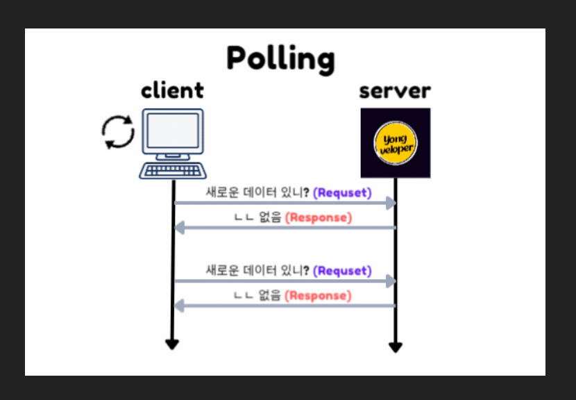
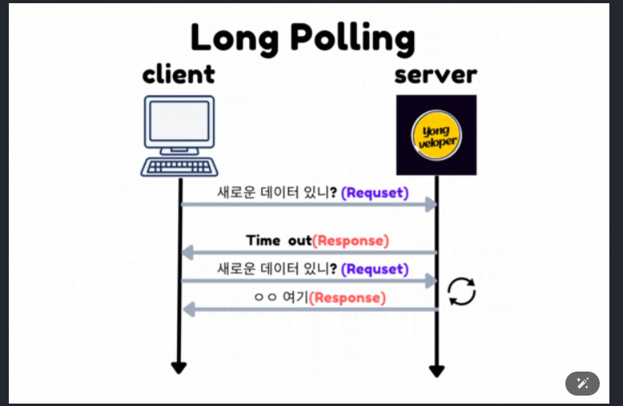
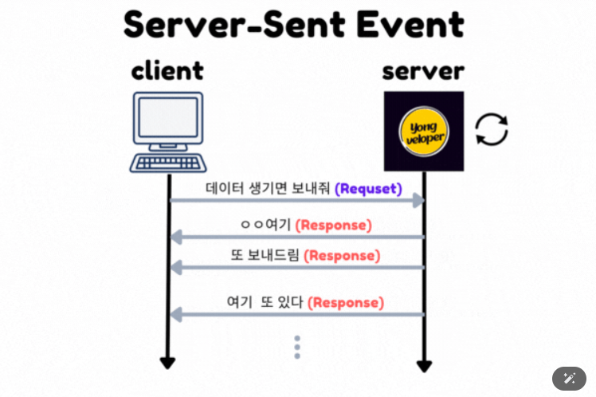
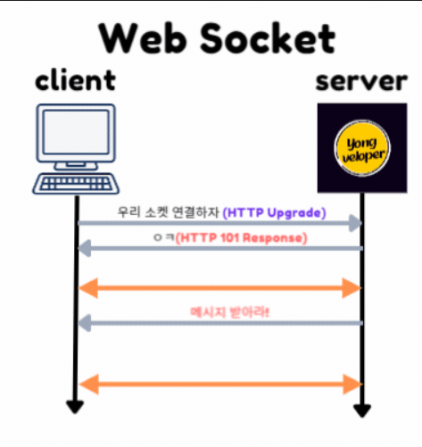

* [웹소켓의 배경](#들어가기)
* [이전 방식](#1-1-웹소켓-이전의-통신-방식)
    - [폴링](#1-1-1-폴링polling)
    - [롤 폴링](#112-롤-폴링long-polling)
    - [SSE](#1-1-3-서버-센트-이벤트server-sent-event)
* [웹소켓](#그렇다면-웹소켓이란)
* [한계](#웹-소켓web-socket의-한계점)
* [웹소켓의 실제 활용](#websocket의-실제-활용-방식)

### 들어가기
## 1. 웹소켓의 등장배경
> 초기의 인터넷 통신 방식은 HTTP를 이용한 클라이언트(요청)- 서버(응답) 모델을 통해 진행 되었다.
즉, 클라이언트가 서버에 요청(Request)를 보내면,
서버가 응답(Response)하는 반이중 통신 방식을 따릅니다.

이 작업은 `<u>실시간으로 데이터를 주고 받는데에는 한계가 존재</u>`
왜냐하면 클라이언트가 서버에게 요청하지 않는 이상 서버는
클라이언트에게 먼저 데이터를 보낼 수 없기 때문

이 특징으로 실시간 데이터를 주고 받는 상황을 구현하기 위해
클라이언트는 항상 새로운 데이터가 있는 지 확인하기 위해
서버에 지속적인 요청을 보내야했음.

-> 이로인하여 `트래픽을 불필요하게 증가` 시키고,
`서버의 비용이 증가`될 뿐더러 `요청과 응답사이의 지연시간`이 있기 때문 실시간 통신의 효율성이 매우 저하 되었습니다.

### 1-1. 웹소켓 이전의 통신 방식
> <u>그렇다면, 웹소켓이 등장하기 전 HTTP 프로토콜 기반 실시간 통신 방식은 어떤게 있었을까??</u>

### 1-1-1. 폴링(Polling)

> 클라이언트가 주기적으로 서버에 요청을 보내는 방식
`즉, 일정 시간을 정해 놓고 새로운 데이터가 있는지 요청을 보내 확인`

이때, <u>새로운 데이터가 없더라도 서버는 응답</u>을 보냅니다.

그래서 클라이언트는 응답을 받으면 처리하고 `일정 시간후에 다시요청을 보내는 과정을 <u>반복</u>` 하게 됨

```
폴링의 간단한 예시)
setInterval(function(){
    fetch('/server').then(function(response){
        console.log(response);
    });
}, 5000); // 5초마다 서버에 요청

// 서버 (Node.js)
app.get('/server', function(req, res){
    res.send('새로운 데이터');
});
출처: https://yong-nyong.tistory.com/90 [💻용뇽 개발 노트💻:티스토리]
```
-> 장점으로는 간단한 매커니즘으로 구현이 쉬움
하지만, 단점으로는
- 불필요한 요청수 -> 서버비용 증가
- 요청과 응답 사이의 지연시간 발생

---

### 1.1.2 롤 폴링(Long Polling)

> 롤 폴링이란 폴리에서 `조금 더 개선된 방식`으로
동일하게 클라이언트는 서버에게 요청을 보내지만
서버는 새로운 데이터가 없다면 일정 시간동안 응답을 하지 않고 새로운 데이터가 있을 때까지 기다린다.

만약 일정 시간 동안 데이터가 없다면 Time Out이 발생, 서버는 TimeOut 응답보냄
반면, 새로운 데이터가 있다면 그 즉시 새로운 데이터응답 반응

-> 이는 폴링에 비해 불필요한 요청 수가 줄어들게 되지만,
폴링에 비해 줄어든것이지 `불필요한 요청은` <u>`계속 진행`</u> 된다.

---

### 1-1-3 서버 센트 이벤트(Server-Sent Event)

> 서버센트 이벤트 방식은 앞서 말한 폴링관련 방식과는 다르게 동작하는데
클라이언트는 `최초로 한 번 서버에 연결을 요청`합니다.
그럼 서버는 요청을 받고, 이후 `새로운 데이터가 생길 때마다 적절히 처리하여 클라이언트에게 응답`

### 즉, <u>HTTP 통신을 종료하지 않고 연결을 유지</u>하는 방식
```
예시)
const source = new EventSource("/server");
source.onmessage = function(event) {
    console.log(event.data);
};

// 서버 (Node.js)
app.get('/server', function(req, res){
    res.setHeader('Content-Type', 'text/event-stream');
    setInterval(function(){
        res.write('data: 새로운 데이터\n\n');
    }, 5000); // 5초마다 데이터 전송
});
출처: https://yong-nyong.tistory.com/90 [💻용뇽 개발 노트💻:티스토리]
```
> SSE를 사용하여 실시간으로 클라이언트에게 응답을 보낼 수 있고
이벤트 기반으로 서버에서 보낸 메세지에 대해 이벤트 처리가 가능하다.
연결이 끊어진 경우에도 SSE는 자동으로 재연결을 시도한다.

하지만 이 방식은 클라이언트 `최초 요청 이후` `<u>서버만 일반적으로 응답</u>`한다.
즉, 우리가 "청취하는 라디오와 같은 방식이다."

이렇게 HTTP 통신으로 실시간 통신 방식을 구현할 수 있지만
단지 실시간 통신을 구현하기 위한 방법일 뿐, 완벽한 실시간 통신을 보장하지는 않는다.

그래서 이 문제를 해결하기 위해 존재하는게 바로 `웹 소켓(Web Socket)`의 등장이다.

---

## 2. 그렇다면 웹소켓이란???

> 웹 소켓은 `HTML5`에 등장 실시간 웹 애플리케이션을 위해 설계된 통신 프로토콜이며,
`TCP(Transmission Control Protocal)을 기반`으로 한다.
TCP를 기반으로 한 웹소켓은 신뢰성 있는 데이터 전송을 보장하며, 메세지 경계를 존중하고,
순서가 보장된 `양방향 통신`을 제공할 수 있다.

HTTP와 다르게 클라이언트와 서버간에 `최초연결이 이루어지면`, 이 연결을 통해 `양방향 통신`을 <u>지속적으로</u>할 수 있다.
### 즉, 전화 통화와 같이 양쪽 모두에서 정보를 주고 받는다는 의미

이렇게 양방향 통신을 하는데 있어
데이터는 `'패킷(packet)`형태로 전달되며, 전송은 연결 중단과 추가 HTTP 요청 없이 양방향으로 이루어짐

💡 패킷 이란? : 네트워크 통신에서 데이터를 작은 조각으로 나눠 전송하는 단위

웹소켓을 연결하려면 new WebSocket을 호출하면 되는데, 이때 ws 라는 특수 프로토콜을 사용한다.

📒 ws 말고 wss:// 라는 프로토콜도 존재하며, 두 프로토콜의 관계는 HTTP와 HTTPS의 관계와 유사

소켓이 정상적으로 생성되면 아래 네 개의 이벤트를 사용할 수 있게 됩니다.

- open – 연결이 성공적으로 되었을 때 발생
- message – 데이터를 수신하였을 때 발생
- error – 연결 상 에러가 생겼을 때 발생
- close – 연결이 종료되었을 때 발생

추가 속성은 [공식 문서](https://developer.mozilla.org/ko/docs/Web/API/WebSocket) 에서 확인해 주세요.

출처: https://yong-nyong.tistory.com/90 [💻용뇽 개발 노트💻:티스토리]

---

### 2-1. 웹소켓 핸드셰이크(handshake)
new WebSocket(url)을 호출해 소켓을 생성하면 즉시 연결이 시작된다.

웹소켓은 HTTP 기반으로 초기 handshake를 수행한다.
이후, 데이터 전송은 `웹소켓 프로토콜`을 이용하여 통신

new WebSocket("wss://api/booklink/socket")을 호출해 최초 요청을 전송했다 가정하에
이때의 요청(Request) 헤더를 살펴보면
```
GET /socket
Host: yong-nyong-tistory.com
Origin: https://yong-nyong-tistory.com
Connection: Upgrade
Upgrade: websocket
Sec-WebSocket-Key: Ivyio/9s+lYongNyongczP8Q==
Sec-WebSocket-Version: 13
```
- Origin – 클라이언트 origin을 나타냅니다.
- Connection: Upgrade – 클라이언트 측에서 프로토콜을 바꾸고 싶다는 신호를 보냈다는 것을 나타냅니다. (https ➡️ wss)
- Upgrade: websocket – 클라이언트 측에서 요청한 프로토콜은 'websocket’이라는 것을 의미합니다. (https ➡️ wss)
- Sec-WebSocket-Key – 보안을 위해 브라우저에서 생성한 키로, 서버가 웹소켓 프로토콜을 지원하는지를 확인하는 데 사용됩니다.
- Sec-WebSocket-Version – 웹소켓 프로토콜 버전을 나타냅니다.

다음으로는 서버가 해당 요청을 받으면 웹소켓 연결을 수락하는 응답을 보내는데
해당 응답에는 `'101 Switching Protocols'` 상태 코드와 함계 응답한다.

```
101 Switching Protocols
Upgrade: websocket
Connection: Upgrade
Sec-WebSocket-Accept: hsBYongNyong24s99EO10UlZ22C2g=
```

이 과정을 통해 클라이언트와 서버 간 실시간 통신이 가능한 통로가 열리게 됨
이렇게 웹소켓 연결이 성립되면, 클라이언트와 서버간에 실시간 양방향 통신이 가능해진다.

---

### 웹 소켓(Web Socket)의 한계점
뭐든지 장점이 있으면 단점이 있기 마련인데
웹 소켓도 단점이 존재할까? 그렇다면 무엇이 있을까?

- 브라우저 지원 : 웹소켓은 `HTML5`사양의 일부이다. 즉, HTML5를 지원하지 않는 브라우저에서는 사용 불가
- 서버 비용 : 웹 소켓은 지속적인 연결을 유지하므로, 많은 수의 웹소켓 연결을 동시에 관리해야 하는 경우 `서버의 부하가 증가`할 수 있다.
- 다양한 에러처리 : 만약 연결이 끊어졌을 시 어떤 이유에서 연결이 끊어졌는지와 같은
상세한 `에러 처리에 대한 한계`가 있다.(연결이 끊긴 정확한 이유를 알수는 없음)
- 재연결 처리 : 알 수 없는 에러로 인해 연결이 끊어지면 지속적인 연결을 해야하는 웹소켓 특성상 재연결을 할 수 있도록 구현해야한다. `웹소켓은 자동으로 재연결을 하지 않음`(이건 SSE와 상반되네?!)

---

// TODO 
TCP의 정확한 개념 알아보기 
지금은 인터넷 연결을 하는데 신뢰할 수 있는? 연결을 보장해준다?!정도

---
### WebSocket의 실제 활용 방식

1. 단순 WebSocket 활용

2. Stomp방식의 연결
* [실습](./webSocket_stomp.md)

3. Redis or Kafka 방식의 연결